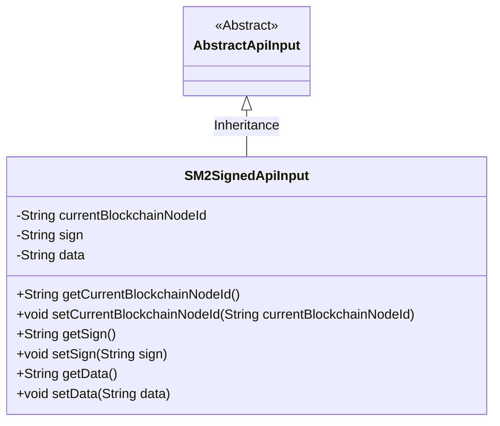
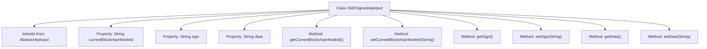

# Basic Information

|      |      |
|------|------|
| Name | SM2SignedApiInput |
| Language | .java |
| Code Path | WeFe/union/union-service/src/main/java/com/welab/wefe/union/service/dto/common/SM2SignedApiInput.java |
| Package Name | com.welab.wefe.union.service.dto.common |
| Dependencies | ['com.welab.wefe.common.web.dto.AbstractApiInput'] |
| Brief Description | SM2 Signature API input class, including blockchain node ID, signature and data fields, along with their getter and setter methods. |

# Description

The SM2SignedApiInput class inherits from AbstractApiInput and contains three private string properties: currentBlockchainNodeId represents the current blockchain node ID, sign stores the signature information, and data holds the data to be processed. Each property is equipped with corresponding getter and setter methods for accessing and modifying its value. This class is primarily used to encapsulate the input parameters of the SM2 signature API.

# Class Summary

| Name   | Type  | Description |
|-------|------|-------------|
| SM2SignedApiInput | class | SM2 Signature API input class, containing the current blockchain node ID, signature and data fields, along with their getter and setter methods. |

## Class SM2SignedApiInput

|      |      |
|------|------|
| Access Modifier | public |
| Type | class |
| Name | SM2SignedApiInput |
| Description | SM2 Signature API input class, containing the current blockchain node ID, signature and data fields, along with their getter and setter methods. |

### UML Class Diagram

This code demonstrates an SM2-signed API input class SM2SignedApiInput, which inherits from the abstract class AbstractApiInput. The class contains three private string attributes: currentBlockchainNodeId (current blockchain node ID), sign (signature), and data (data), along with public getter and setter methods for each attribute. The class diagram clearly illustrates the inheritance relationship and the structure of class members, embodying the object-oriented design principles of encapsulation and inheritance.

### Internal Method Call Graph

This flowchart illustrates the structure of the SM2SignedApiInput class, which inherits from AbstractApiInput and contains three String properties (currentBlockchainNodeId, sign, and data) along with their corresponding getter and setter methods. Each property has an independent method pair for retrieving and setting values, reflecting the standard JavaBean design pattern. The class inheritance relationship is clear, method mappings are accurate, and the overall structure is concise and well-organized.

### Field List

| Name  | Type  | Description |
|-------|-------|------|
| sign | String | The private string variable sign. |
| currentBlockchainNodeId | String | The private string variable of the current blockchain node ID. |
| data | String | Private string type variable data. |

### Method List

| Name  | Type  | Description |
|-------|-------|------|
| setData | void | Set string data to the current object. |
| setCurrentBlockchainNodeId | void | The method to set the current blockchain node ID assigns the parameter value to the class member variable `currentBlockchainNodeId`. |
| getSign | String | Method to obtain the sign string. |
| getCurrentBlockchainNodeId | String | Methods to obtain the current blockchain node ID, returns the node ID as a string type. |
| setSign | void | This is a Java method used to set the value of the class's sign attribute. The method takes a string parameter named sign and assigns it to the sign member variable of the current object. |
| getData | String | Method to obtain data, returns the value of the string-type variable data. |

