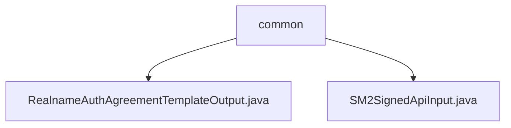

# Basic Information

|      |      |
|------|------|
| Name | common |
| Language | .java |
| Code Path | WeFe/union/union-service/src/main/java/com/welab/wefe/union/service/dto/common |
| Package Name | docs.union.union-service.src.main.java.com.welab.wefe.union.service.dto.common |
| Brief Description | The RealnameAuthAgreementTemplateOutput class contains template file ID and name attributes along with corresponding methods. The SM2SignedApiInput class inherits from AbstractApiInput and includes node ID, signature, data attributes, and methods. |

# Description

## Overview  
The core responsibility of this module is to encapsulate the input/output data of real-name authentication agreement templates and SM2 signature APIs. The interface specification includes standard Java Bean design, exposing attributes through getters/setters. For example, RealnameAuthAgreementTemplateOutput manages file IDs/names, while SM2SignedApiInput handles blockchain node IDs/signatures/data. Key data structures include template file identifiers, SM2 signature parameter sets, etc. The only external dependency is the Java standard library.  

## Primary Business Scenarios  
It primarily supports the transfer of metadata for real-name authentication agreement files (e.g., interaction of template file IDs and filenames) and the processing of SM2 signature requests (similar to an encryption gateway pattern). Typical applications include encapsulating blockchain node signature data and transmitting authentication agreement template information. The API types are all DTO-layer data containers, with integration examples visible in scenarios such as file metadata returns and encrypted API parameter reception.

### Package Internal Structure View

This flowchart illustrates the structural relationships within the common directory under the union-service module of the WeFe project. The parent node "common" contains two DTO class files: RealnameAuthAgreementTemplateOutput.java handles real-name authentication agreement template output, while SM2SignedApiInput.java encapsulates input parameters for the SM2 signature API. The entire structure clearly demonstrates the organization of data transfer objects at the service layer.

# File List

| Name   | Type  | Description |
|-------|------|-------------|
| [RealnameAuthAgreementTemplateOutput.java](RealnameAuthAgreementTemplateOutput.md) | file | This is a real-name authentication protocol template class, which includes the template file ID and file name attributes along with their corresponding getter and setter methods. |
| [SM2SignedApiInput.java](SM2SignedApiInput.md) | file | SM2 Signature API Input Class, containing blockchain node ID, signature and data fields along with their getter and setter methods. |

