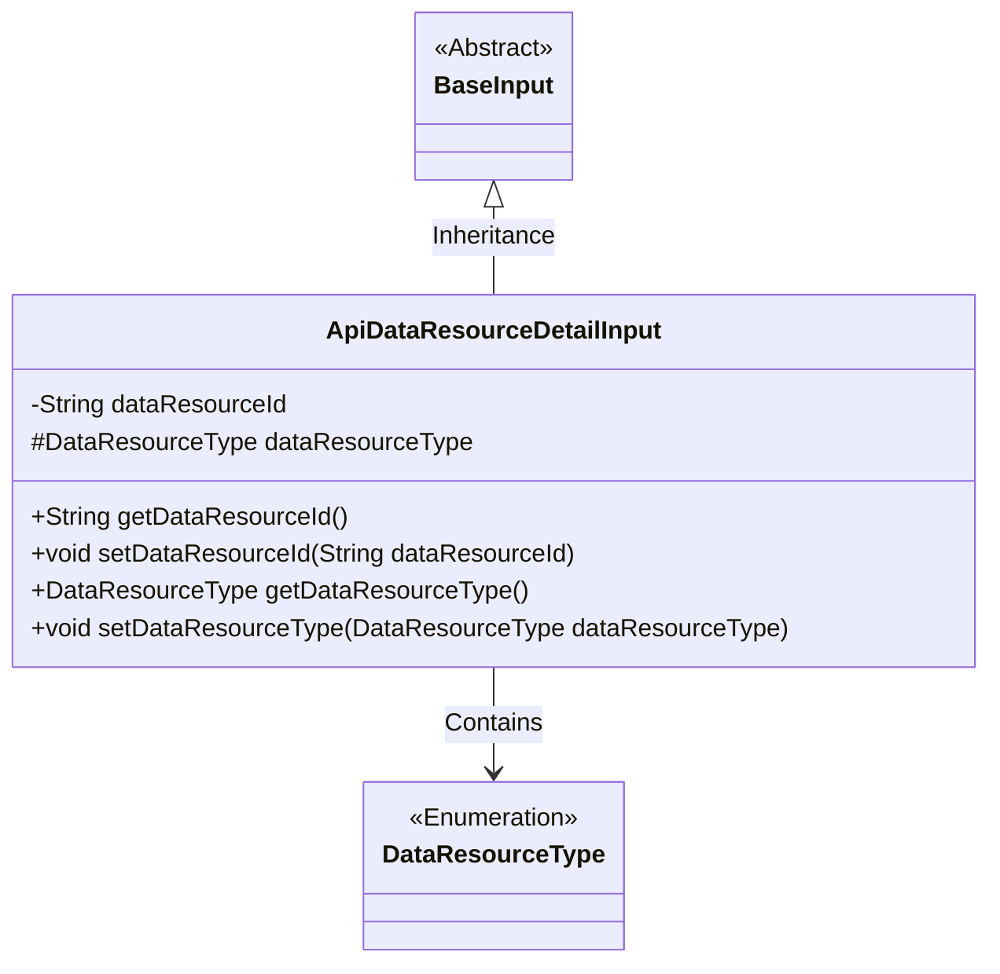
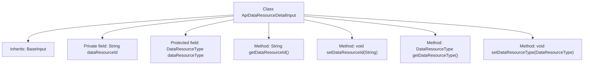

# Basic Information

|      |      |
|------|------|
| Name | ApiDataResourceDetailInput |
| Language | .java |
| Code Path | WeFe/union/union-service/src/main/java/com/welab/wefe/union/service/dto/dataresource/ApiDataResourceDetailInput.java |
| Package Name | com.welab.wefe.union.service.dto.dataresource |
| Dependencies | ['com.welab.wefe.common.fieldvalidate.annotation.Check', 'com.welab.wefe.common.wefe.enums.DataResourceType', 'com.welab.wefe.union.service.dto.base.BaseInput'] |
| Brief Description | The ApiDataResourceDetailInput class inherits from BaseInput, containing the required fields dataResourceId and dataResourceType, and provides getter and setter methods. |

# Description

The `ApiDataResourceDetailInput` class inherits from `BaseInput` and includes two required fields: `dataResourceId` (of type String) and `dataResourceType` (of type `DataResourceType`). These fields are marked as mandatory using the `@Check(require=true)` annotation. The class provides standard getter and setter methods for accessing and modifying the values of these two fields. The `dataResourceType` field is declared with `protected` visibility.

# Class Summary

| Name   | Type  | Description |
|-------|------|-------------|
| ApiDataResourceDetailInput | class | The ApiDataResourceDetailInput class inherits from BaseInput, containing mandatory fields dataResourceId and dataResourceType, and provides getter and setter methods. |

## Class ApiDataResourceDetailInput

|      |      |
|------|------|
| Access Modifier | public |
| Type | class |
| Name | ApiDataResourceDetailInput |
| Description | The ApiDataResourceDetailInput class inherits from BaseInput, containing mandatory fields dataResourceId and dataResourceType, and provides getter and setter methods. |

### UML Class Diagram

This class diagram illustrates that the `ApiDataResourceDetailInput` class inherits from the abstract `BaseInput` class and contains a `DataResourceType` enumeration. The `ApiDataResourceDetailInput` class has two main attributes: a private `String dataResourceId` and a protected `DataResourceType` enum `dataResourceType`, along with corresponding getter and setter methods. The class utilizes the `@Check` annotation to enforce non-null validation on fields, reflecting the design intent of data validation.

### Internal Method Call Graph

This code defines a class named `ApiDataResourceDetailInput` that inherits from `BaseInput`. The class contains two properties with validation annotations: `dataResourceId` and `dataResourceType`, representing the data resource ID and type respectively. Standard getter and setter methods are provided to access and modify these properties. The flowchart clearly illustrates the class inheritance relationship and internal structure, including property declarations and method definitions.

### Field List

| Name  | Type  | Description |
|-------|-------|------|
| dataResourceType | DataResourceType | Required field, data type is DataResourceType. |
| dataResourceId | String | Required field dataResourceId |

### Method List

| Name  | Type  | Description |
|-------|-------|------|
| getDataResourceId | String | Methods to obtain the data resource ID, returns a string-type dataResourceId. |
| setDataResourceId | void | The method to set the data resource ID assigns the input parameter to the class member variable `dataResourceId`. |
| getDataResourceType | DataResourceType | Methods for obtaining the data resource type, returns dataResourceType. |
| setDataResourceType | void | The method for setting the data resource type, with the parameter of type DataResourceType, assigns the value to the dataResourceType property of the current object. |

