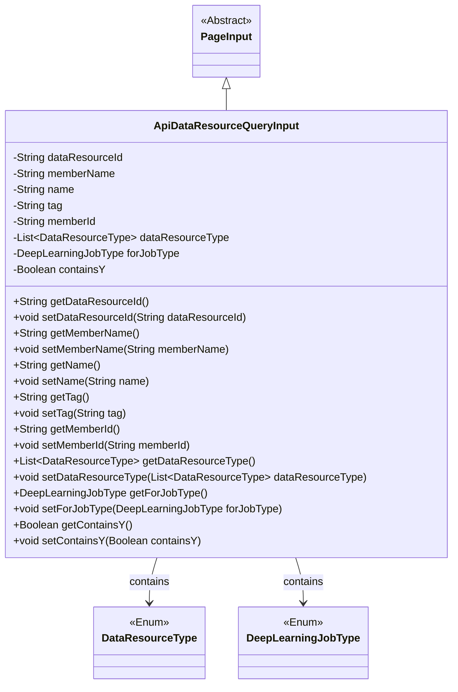

# Basic Information

|      |      |
|------|------|
| Name | ApiDataResourceQueryInput |
| Language | .java |
| Code Path | WeFe/union/union-service/src/main/java/com/welab/wefe/union/service/dto/dataresource/ApiDataResourceQueryInput.java |
| Package Name | com.welab.wefe.union.service.dto.dataresource |
| Dependencies | ['com.welab.wefe.common.wefe.enums.DataResourceType', 'com.welab.wefe.common.wefe.enums.DeepLearningJobType', 'com.welab.wefe.union.service.dto.base.PageInput', 'java.util.List'] |
| Brief Description | The `ApiDataResourceQueryInput` class inherits from `PageInput` and includes fields such as data resource ID, member name, name, label, member ID, resource type list, deep learning task type, and whether it contains Y, along with their corresponding getter/setter methods. |

# Description

The `ApiDataResourceQueryInput` class inherits from `PageInput` and is used to encapsulate the input parameters for API data resource queries. It includes the following fields: `dataResourceId` represents the resource ID, `memberName` and `memberId` denote the member name and ID respectively, `name` and `tag` are used for name and tag filtering, `dataResourceType` is a list of resource types, `forJobType` specifies the deep learning task type, and `containsY` is a boolean flag. Each field has corresponding getter and setter methods.

# Class Summary

| Name   | Type  | Description |
|-------|------|-------------|
| ApiDataResourceQueryInput | class | The ApiDataResourceQueryInput class inherits from PageInput and includes fields such as data resource ID, member name, name, label, member ID, etc. It supports query conditions like data type list, deep learning task type, and whether it contains Y. |

## Class ApiDataResourceQueryInput

|      |      |
|------|------|
| Access Modifier | public |
| Type | class |
| Name | ApiDataResourceQueryInput |
| Description | The ApiDataResourceQueryInput class inherits from PageInput and includes fields such as data resource ID, member name, name, label, member ID, etc. It supports query conditions like data type list, deep learning task type, and whether it contains Y. |

### UML Class Diagram

This class diagram illustrates that ApiDataResourceQueryInput inherits from the abstract class PageInput and contains multiple string-type fields along with two enum-type fields. The class provides standard getter/setter methods for managing input parameters of data resource queries, including attributes such as resource ID, member name, tags, etc., while supporting pagination functionality. The enum types DataResourceType and DeepLearningJobType represent resource types and deep learning job types respectively.

### Internal Method Call Graph

```mermaid
graph TD
    A["Class ApiDataResourceQueryInput"]
    B["Inherits from: PageInput"]
    C["Property: String dataResourceId"]
    D["Property: String memberName"]
    E["Property: String name"]
    F["Property: String tag"]
    G["Property: String memberId"]
    H["Property: List<DataResourceType> dataResourceType"]
    I["Property: DeepLearningJobType forJobType"]
    J["Property: Boolean containsY"]
    K["Method: getDataResourceId()"]
    L["Method: setDataResourceId(String)"]
    M["Method: getMemberName()"]
    N["Method: setMemberName(String)"]
    O["Method: getName()"]
    P["Method: setName(String)"]
    Q["Method: getTag()"]
    R["Method: setTag(String)"]
    S["Method: getMemberId()"]
    T["Method: setMemberId(String)"]
    U["Method: getDataResourceType()"]
    V["Method: setDataResourceType(List<DataResourceType>)"]
    W["Method: getForJobType()"]
    X["Method: setForJobType(DeepLearningJobType)"]
    Y["Method: getContainsY()"]
    Z["Method: setContainsY(Boolean)"]

    A --> B
    A --> C
    A --> D
    A --> E
    A --> F
    A --> G
    A --> H
    A --> I
    A --> J
    A --> K
    A --> L
    A --> M
    A --> N
    A --> O
    A --> P
    A --> Q
    A --> R
    A --> S
    A --> T
    A --> U
    A --> V
    A --> W
    A --> X
    A --> Y
    A --> Z
```

This code defines a class named `ApiDataResourceQueryInput`, which inherits from `PageInput` and contains multiple properties along with their corresponding getter/setter methods. The properties include string types such as `dataResourceId`, `memberName`, `name`, `tag`, `memberId`, as well as complex types like `dataResourceType`, `forJobType`, and `containsY`. Each property has corresponding getter and setter methods for retrieving and setting property values. This class is likely used to encapsulate API query input parameters, supporting paginated queries and various filtering conditions.

### Field List

| Name  | Type  | Description |
|-------|-------|------|
| containsY | Boolean | Boolean variable indicating whether Y is included. |
| tag | String | Declare a protected string variable tag. |
| name | String | Declare a protected string-type variable named name. |
| memberName | String | Declare a protected string-type member variable named memberName. |
| dataResourceId | String | Declare a protected string variable dataResourceId to store the data resource identifier. |
| memberId | String | Member ID string protection field |
| dataResourceType | List<DataResourceType> | List of private data resource types. |
| forJobType | DeepLearningJobType | Private deep learning task type variable forJobType. |

### Method List

| Name  | Type  | Description |
|-------|-------|------|
| setDataResourceType | void | The method for setting data resource types, which accepts a DataResourceType list parameter and assigns it to the dataResourceType property of the current object. |
| setDataResourceId | void | The method to set the data resource ID assigns the parameter value to the class member variable `dataResourceId`. |
| getDataResourceType | List<DataResourceType> | The method returns a list of data resource types. |
| getTag | String | This is a Java method that returns the value of the member variable `tag` of type String. |
| getDataResourceId | String | Methods to obtain the data resource ID, where the return value is dataResourceId. |
| getMemberId | String | The method to obtain the member ID, which returns a string-type memberId. |
| setTag | void | Set the label property value of the object. |
| setMemberId | void | The method to set the member ID assigns the parameter memberId to the memberId property of the current object. |
| setMemberName | void | The method to set the member name assigns the input parameter to the member variable memberName. |
| getName | String | This is a Java method that returns the value of the string variable named "name". |
| setName | void | The method to set the object name is to assign the parameter 'name' to the 'name' property of the object. |
| getMemberName | String | This is a Java method that returns the value of the member variable memberName. The method is named getMemberName, takes no parameters, and has a return type of String. |
| getForJobType | DeepLearningJobType | Methods for obtaining deep learning job types, returning the value of the forJobType field. |
| setForJobType | void | The method for setting the type of deep learning task involves assigning parameters to class member variables. |
| getContainsY | Boolean | This is a Java method that returns a boolean variable named containsY. |
| setContainsY | void | This is a Java method used to set the value of a boolean variable named containsY. The method is called setContainsY and accepts a Boolean parameter. |

