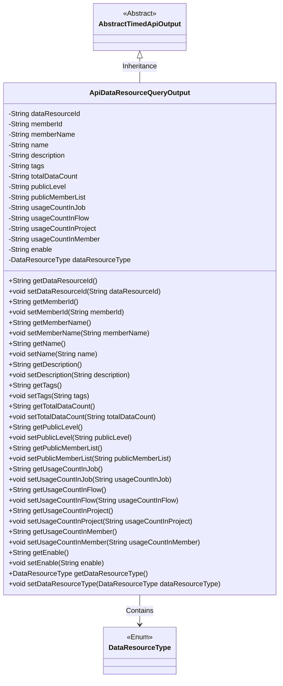

# Basic Information

|      |      |
|------|------|
| Name | ApiDataResourceQueryOutput |
| Language | .java |
| Code Path | WeFe/union/union-service/src/main/java/com/welab/wefe/union/service/dto/dataresource/ApiDataResourceQueryOutput.java |
| Package Name | com.welab.wefe.union.service.dto.dataresource |
| Dependencies | ['com.welab.wefe.common.web.dto.AbstractTimedApiOutput', 'com.welab.wefe.common.wefe.enums.DataResourceType'] |
| Brief Description | The `ApiDataResourceQueryOutput` class inherits from `AbstractTimedApiOutput` and includes attributes such as data resource ID, member information, name, description, tags, data volume, public level, usage statistics, and their corresponding getter/setter methods. |

# Description

The `ApiDataResourceQueryOutput` class inherits from `AbstractTimedApiOutput` and contains detailed information about data resource query outputs. Key attributes include the data resource ID, member ID and name, resource name, description, tags, total data volume, public level, list of public members, usage counts in jobs/flows/projects/members, enabled status, and data resource type. Each attribute has corresponding getter and setter methods for access and modification.

# Class Summary

| Name   | Type  | Description |
|-------|------|-------------|
| ApiDataResourceQueryOutput | class | The ApiDataResourceQueryOutput class inherits from AbstractTimedApiOutput and includes attributes such as data resource ID, member information, name, description, tags, data volume, public level, usage statistics, along with their corresponding getter/setter methods. |

## Class ApiDataResourceQueryOutput

|      |      |
|------|------|
| Access Modifier | public |
| Type | class |
| Name | ApiDataResourceQueryOutput |
| Description | The ApiDataResourceQueryOutput class inherits from AbstractTimedApiOutput and includes attributes such as data resource ID, member information, name, description, tags, data volume, public level, usage statistics, along with their corresponding getter/setter methods. |

### UML Class Diagram

Class Diagram Description: The ApiDataResourceQueryOutput class inherits from the AbstractTimedApiOutput abstract class and includes private fields such as data resource ID, member information, name, description, tags, data statistics, public level, usage counts, along with corresponding getter and setter methods. This class has an association with the DataResourceType enum class, representing the data resource type. The overall structure demonstrates the complete attribute set and type relationships of data resource query output.

### Internal Method Call Graph

```mermaid
graph TD
    A["Class ApiDataResourceQueryOutput"]
    B["Inherits from: AbstractTimedApiOutput"]
    C["Property: String dataResourceId"]
    D["Property: String memberId"]
    E["Property: String memberName"]
    F["Property: String name"]
    G["Property: String description"]
    H["Property: String tags"]
    I["Property: String totalDataCount"]
    J["Property: String publicLevel"]
    K["Property: String publicMemberList"]
    L["Property: String usageCountInJob"]
    M["Property: String usageCountInFlow"]
    N["Property: String usageCountInProject"]
    O["Property: String usageCountInMember"]
    P["Property: String enable"]
    Q["Property: DataResourceType dataResourceType"]
    R["Getter/Setter method group"]

    A --> B
    A --> C
    A --> D
    A --> E
    A --> F
    A --> G
    A --> H
    A --> I
    A --> J
    A --> K
    A --> L
    A --> M
    A --> N
    A --> O
    A --> P
    A --> Q
    A --> R
```

This code defines an ApiDataResourceQueryOutput class that inherits from the AbstractTimedApiOutput base class. The class contains 15 private properties primarily describing data resource information, such as resource ID, member details, name, description, tags, total data volume, public level, usage statistics, etc. Each property is paired with corresponding getter and setter methods to encapsulate property access and modification. This represents a typical Data Transfer Object (DTO) design for passing structured data between different system layers.

### Field List

| Name  | Type  | Description |
|-------|-------|------|
| enable | String | Define a private string variable enable. |
| name | String | Private string type variable name. |
| memberName | String | The member variable is named memberName, and its type is String. |
| usageCountInMember | String | Member usage count statistics field. |
| usageCountInProject | String | Usage count statistics variable in the project. |
| description | String | Private string type variable description. |
| dataResourceId | String | The private string-type variable `dataResourceId` is used to identify the data resource. |
| tags | String | Private string variable `tags`, used for storing tag information. |
| dataResourceType | DataResourceType | Private data resource type variable. |
| usageCountInJob | String | Private string variable to record the number of usage times in the job. |
| memberId | String | Member ID string type private variable. |
| usageCountInFlow | String | The private string variable `usageCountInFlow` is used to record the number of uses within the flow. |
| publicMemberList | String | The private string variable publicMemberList is used to store the public member list. |
| totalDataCount | String | The private string variable totalDataCount is used to store the total data count. |
| publicLevel | String | The private string variable publicLevel is used to store public level information. |

### Method List

| Name  | Type  | Description |
|-------|-------|------|
| setName | void | The method to set the object name assigns the input parameter `name` to the `name` property of the object. |
| getMemberId | String | Methods to obtain member ID, returns the member ID string. |
| getDataResourceType | DataResourceType | Methods for obtaining data resource types, returns a dataResourceType object. |
| setEnable | void | This is a Java method used to set the value of the member variable `enable`. The method takes a string parameter `enable` and assigns it to the class's member variable of the same name. |
| getEnable | String | Public method to get the enable value, returns a string type. |
| getName | String | Methods to retrieve the object name, returning the string-type value of the name attribute. |
| setDataResourceType | void | The method for setting the data resource type takes a parameter of type DataResourceType and assigns it to the class member variable dataResourceType. |
| setPublicLevel | void | Method for setting the public level, which assigns the input parameter to the public level property of the class. |
| getTags | String | The method getTags returns the value of the string variable tags. |
| setTags | void | This is a Java method used to set the value of the tags property of an object. The method takes a string parameter tags and assigns it to the tags field of the current object. |
| getTotalDataCount | String | This is a Java method that returns the value of the string-type variable totalDataCount. |
| setUsageCountInProject | void | Set a public method for the usage count within the project, with the parameter being of string type. |
| setTotalDataCount | void | This is a Java method used to set the value of the totalDataCount property. The method takes a string parameter and assigns it to the class's member variable totalDataCount. |
| setPublicMemberList | void | The method for setting the public member list assigns the input string to the class member variable `publicMemberList`. |
| setDataResourceId | void | The method to set the data resource ID assigns the input parameter to the class member variable `dataResourceId`. |
| getPublicLevel | String | The method getPublicLevel returns the publicLevel string value. |
| getUsageCountInFlow | String | Get the usage count in the process. |
| getPublicMemberList | String | The method to obtain the public member list returns a string-type variable named publicMemberList. |
| setMemberName | void | The method to set the member name assigns the input parameter to the member variable `memberName`. |
| getUsageCountInProject | String | Get the string method for counting usage within a project. |
| setMemberId | void | Java Method: Set member ID, with parameter as string memberId, assigned to the memberId property of the current object. |
| getUsageCountInMember | String | The method to retrieve the member's usage count returns the string-type value of `usageCountInMember`. |
| getUsageCountInJob | String | This is a Java method that returns the value of the string-type variable `usageCountInJob`. |
| getDescription | String | Methods for obtaining descriptive information, returning the description content as a string type. |
| getDataResourceId | String | Methods to obtain the data resource ID, which returns a string-type value `dataResourceId`. |
| setDescription | void | This is a Java method used to set the description property of an object, assigning the passed string to the member variable description. |
| getMemberName | String | This is a Java method that returns the value of the member variable memberName. |
| setUsageCountInJob | void | This is a Java method used to set the value of the usage count property in a job. The method accepts a string parameter and assigns it to the class member variable `usageCountInJob`. |
| setUsageCountInFlow | void | Method for setting string values of usage counts within a process. |
| setUsageCountInMember | void | A public method for setting the usage count within a member, with a parameter of string type `usageCountInMember`, which is assigned to the class member variable. |

