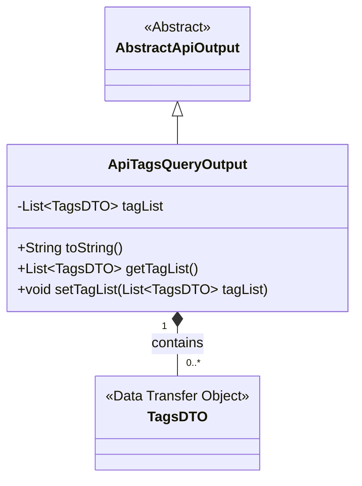
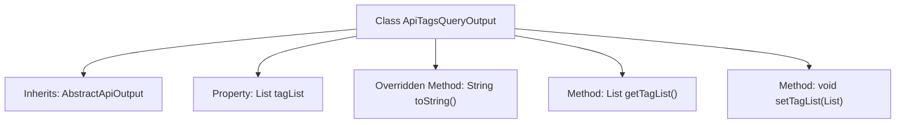

# Basic Information

|      |      |
|------|------|
| Name | ApiTagsQueryOutput |
| Language | .java |
| Code Path | WeFe/union/union-service/src/main/java/com/welab/wefe/union/service/dto/dataresource/ApiTagsQueryOutput.java |
| Package Name | com.welab.wefe.union.service.dto.dataresource |
| Dependencies | ['com.welab.wefe.common.web.dto.AbstractApiOutput', 'java.util.List'] |
| Brief Description | The ApiTagsQueryOutput class extends AbstractApiOutput, includes the tagList property along with its getter/setter methods, and overrides the toString method. |

# Description

The `ApiTagsQueryOutput` class inherits from `AbstractApiOutput` and includes a private member variable `tagList`, which is a list of `TagsDTO` objects. It provides a `toString` method that returns a string representation containing `tagList`, as well as getter and setter methods for accessing and modifying `tagList`. This class is primarily used to encapsulate the output results of API queries for tag lists.

# Class Summary

| Name   | Type  | Description |
|-------|------|-------------|
| ApiTagsQueryOutput | class | The ApiTagsQueryOutput class extends AbstractApiOutput, includes the tagList property and corresponding getter/setter methods, and overrides the toString method. |

## Class ApiTagsQueryOutput

|      |      |
|------|------|
| Access Modifier | public |
| Type | class |
| Name | ApiTagsQueryOutput |
| Description | The ApiTagsQueryOutput class extends AbstractApiOutput, includes the tagList property and corresponding getter/setter methods, and overrides the toString method. |

### UML Class Diagram

This code demonstrates an inheritance relationship where the `ApiTagsQueryOutput` class inherits from the abstract class `AbstractApiOutput` and contains a list of `TagsDTO` objects. `ApiTagsQueryOutput` provides getter and setter methods for `tagList`, as well as overrides the `toString()` method for outputting object content. `TagsDTO`, as a data transfer object, is contained by `ApiTagsQueryOutput` through a composition relationship. This design encapsulates and manipulates tag data, reflecting the inheritance and composition features of object-oriented programming.

### Internal Method Call Graph

This flowchart illustrates the structure of the `ApiTagsQueryOutput` class, which inherits from `AbstractApiOutput`. It includes a `tagList` property of type `List<TagsDTO>` and provides an overridden `toString()` method, along with `getTagList()` and `setTagList()` methods. The arrows denote the hierarchical relationships between the class and its members, clearly presenting the inheritance hierarchy and functional composition of the class.

### Field List

| Name  | Type  | Description |
|-------|-------|------|
| tagList | List<TagsDTO> | Private tag list, which is a collection of TagsDTO objects. |

### Method List

| Name  | Type  | Description |
|-------|-------|------|
| toString | String | Override the toString method in Java to return a string containing the tagList. |
| getTagList | List<TagsDTO> | This is a Java method that returns a tag list object. The method is named getTagList, with a return type of List<TagsDTO>, and directly returns the member variable tagList. |
| setTagList | void | Java Method: Set tag list, parameter is a list of TagsDTO. |

