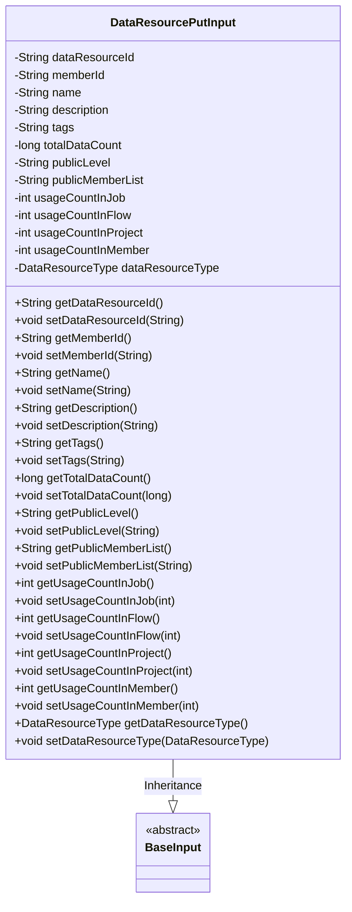

# Basic Information

|      |      |
|------|------|
| Name | DataResourcePutInput |
| Language | .java |
| Code Path | WeFe/union/union-service/src/main/java/com/welab/wefe/union/service/dto/dataresource/DataResourcePutInput.java |
| Package Name | com.welab.wefe.union.service.dto.dataresource |
| Dependencies | ['com.welab.wefe.common.fieldvalidate.annotation.Check', 'com.welab.wefe.common.wefe.enums.DataResourceType', 'com.welab.wefe.union.service.dto.base.BaseInput'] |
| Brief Description | The DataResourcePutInput class inherits from BaseInput and includes attributes such as data resource ID, member ID, name, description, tags, total data volume, public level, public member list, various usage counts, and resource type. Among these, the data resource ID and type are mandatory fields. |

# Description

The DataResourcePutInput class inherits from BaseInput and contains multiple attributes to describe a data resource. Required fields include dataResourceId and dataResourceType, while other optional fields include memberId, name, description, tags, totalDataCount, publicLevel, publicMemberList, as well as usage counts in different scenarios (usageCountInJob, usageCountInFlow, usageCountInProject, usageCountInMember). Each attribute has corresponding getter and setter methods for accessing and modifying.

# Class Summary

| Name   | Type  | Description |
|-------|------|-------------|
| DataResourcePutInput | class | The DataResourcePutInput class inherits from BaseInput and includes fields such as data resource ID, member ID, name, description, tags, total data count, public level, public member list, various usage counts, and resource type. Among these, the data resource ID and type are mandatory fields. |

## Class DataResourcePutInput

|      |      |
|------|------|
| Access Modifier | public |
| Type | class |
| Name | DataResourcePutInput |
| Description | The DataResourcePutInput class inherits from BaseInput and includes fields such as data resource ID, member ID, name, description, tags, total data count, public level, public member list, various usage counts, and resource type. Among these, the data resource ID and type are mandatory fields. |

### UML Class Diagram

This code defines a `DataResourcePutInput` class that inherits from the abstract base class `BaseInput`. The class contains multiple protected fields (such as dataResourceId, name, description, etc.) and corresponding getter/setter methods to encapsulate information related to data resources. The dataResourceId and dataResourceType fields are marked as required through the @Check annotation. The class diagram clearly illustrates the inheritance relationship and all member attributes/methods, demonstrating the data encapsulation design pattern.

### Internal Method Call Graph

```mermaid
graph TD
    A["Class DataResourcePutInput"]
    B["Inherits from: BaseInput"]
    C["Property: String dataResourceId"]
    D["Property: String memberId"]
    E["Property: String name"]
    F["Property: String description"]
    G["Property: String tags"]
    H["Property: long totalDataCount"]
    I["Property: String publicLevel"]
    J["Property: String publicMemberList"]
    K["Property: int usageCountInJob"]
    L["Property: int usageCountInFlow"]
    M["Property: int usageCountInProject"]
    N["Property: int usageCountInMember"]
    O["Property: DataResourceType dataResourceType"]
    P["Method: getDataResourceId()"]
    Q["Method: setDataResourceId(String)"]
    R["Method: getMemberId()"]
    S["Method: setMemberId(String)"]
    T["Method: getName()"]
    U["Method: setName(String)"]
    V["Method: getDescription()"]
    W["Method: setDescription(String)"]
    X["Method: getTags()"]
    Y["Method: setTags(String)"]
    Z["Method: getTotalDataCount()"]
    AA["Method: setTotalDataCount(long)"]
    AB["Method: getPublicLevel()"]
    AC["Method: setPublicLevel(String)"]
    AD["Method: getPublicMemberList()"]
    AE["Method: setPublicMemberList(String)"]
    AF["Method: getUsageCountInJob()"]
    AG["Method: setUsageCountInJob(int)"]
    AH["Method: getUsageCountInFlow()"]
    AI["Method: setUsageCountInFlow(int)"]
    AJ["Method: getUsageCountInProject()"]
    AK["Method: setUsageCountInProject(int)"]
    AL["Method: getUsageCountInMember()"]
    AM["Method: setUsageCountInMember(int)"]
    AN["Method: getDataResourceType()"]
    AO["Method: setDataResourceType(DataResourceType)"]

    A --> B
    A --> C
    A --> D
    A --> E
    A --> F
    A --> G
    A --> H
    A --> I
    A --> J
    A --> K
    A --> L
    A --> M
    A --> N
    A --> O
    A --> P
    A --> Q
    A --> R
    A --> S
    A --> T
    A --> U
    A --> V
    A --> W
    A --> X
    A --> Y
    A --> Z
    A --> AA
    A --> AB
    A --> AC
    A --> AD
    A --> AE
    A --> AF
    A --> AG
    A --> AH
    A --> AI
    A --> AJ
    A --> AK
    A --> AL
    A --> AM
    A --> AN
    A --> AO
```

This code defines a class named DataResourcePutInput, which inherits from the BaseInput class. It contains multiple properties such as dataResourceId, memberId, name, etc., along with corresponding getter and setter methods. The dataResourceId and dataResourceType properties are marked with `@Check(require = true)`. This class is primarily used to encapsulate information related to data resources, including resource ID, member ID, name, description, tags, total data count, public level, public member list, and usage counts in jobs, flows, projects, and members. The getter and setter methods allow access and modification of these properties.

### Field List

| Name  | Type  | Description |
|-------|-------|------|
| usageCountInFlow | int | Protected integer variable, recording the number of usage times in the process. |
| publicMemberList | String | Declared a protected string-type member variable publicMemberList. |
| usageCountInMember | int | The member variable `usageCountInMember`, integer type, with protected access. |
| tags | String | The protected string type variable tags. |
| dataResourceType | DataResourceType | The code defines a protected variable `dataResourceType` of type `DataResourceType`, and marks it with the `@Check` annotation to ensure it must be non-null (`require=true`). |
| usageCountInJob | int | Protected integer variable, recording the number of uses in the job. |
| name | String | Declare a protected string variable named name. |
| description | String | Declare a protected string-type variable named description. |
| usageCountInProject | int | Usage counter within the project, integer-protected variable. |
| dataResourceId | String | Required field dataResourceId, protected string type. |
| publicLevel | String | Protect string-type public level variables. |
| totalDataCount | long | A protected long integer variable used to store the total data volume. |
| memberId | String | Member ID String Protection Field |

### Method List

| Name  | Type  | Description |
|-------|-------|------|
| setDataResourceId | void | The method to set the data resource ID assigns the input parameter to the class member variable dataResourceId. |
| setUsageCountInProject | void | The method to set the number of uses within the project, with the parameter being an integer `usageCountInProject`. |
| setDescription | void | The method for setting description information assigns the input parameter to the `description` property of the object. |
| setName | void | This is a Java method used to set the name property of an object, assigning the passed string parameter to the name field of the current object. |
| getPublicLevel | String | Public method to obtain the publicLevel value. |
| getPublicMemberList | String | The method to obtain the public member list returns the value of the publicMemberList variable. |
| setTags | void | This is a Java method used to set the value of the tags property for an object. The method takes a string parameter tags and assigns it to the tags member variable of the current object. |
| getMemberId | String | Methods to obtain the member ID, returns a string-type memberId. |
| getDataResourceId | String | This method returns the data resource ID string. |
| setUsageCountInJob | void | Set the public method for the number of uses within a job, with the parameter being an integer usageCountInJob. |
| setTotalDataCount | void | Method to set the total data count, assigning the input value to the class variable totalDataCount. |
| setUsageCountInFlow | void | Set the public method for the number of uses within the flow, with the parameter as usageCountInFlow. |
| setPublicMemberList | void | The method for setting the public member list assigns the input string to the class's publicMemberList member variable. |
| setPublicLevel | void | Define the public method setPublicLevel to set the value of the publicLevel property. |
| getUsageCountInFlow | int | Number of uses in the method return process. |
| getUsageCountInJob | int | Get the usage count in the task. |
| getName | String | Methods to obtain the object name, returning the value of the name attribute as a string type. |
| getTotalDataCount | long | Method to obtain the total data volume, returns the totalDataCount value. |
| getDescription | String | Methods to obtain descriptive information, returning a string-type description variable. |
| getUsageCountInProject | int | The method returns the number of times it is used in the project. |
| setMemberId | void | The method to set the member ID assigns the passed string parameter to the class's member variable memberId. |
| getUsageCountInMember | int | Method returns the usage count within the member. |
| setUsageCountInMember | void | The method to set the member's usage count assigns the parameter value to the member variable usageCountInMember. |
| getDataResourceType | DataResourceType | Methods for obtaining the data resource type, returns a dataResourceType object. |
| setDataResourceType | void | This method is used to set the data resource type, assigning the passed DataResourceType parameter to the class member variable dataResourceType. |
| getTags | String | The method returns the value of the tags variable, which is of string type. |

