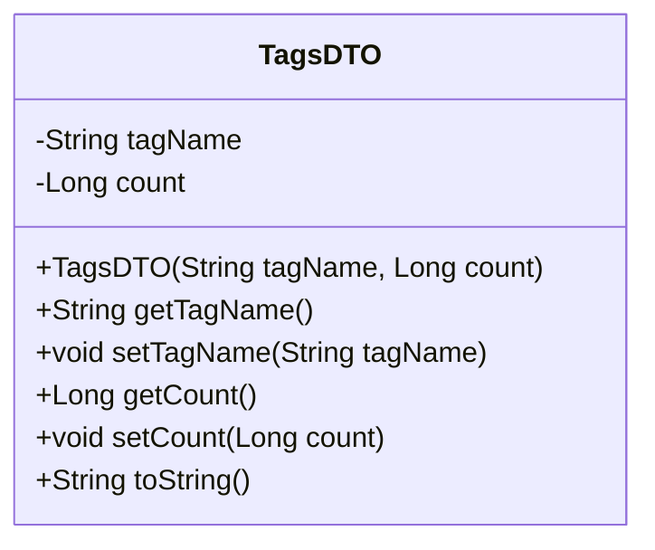
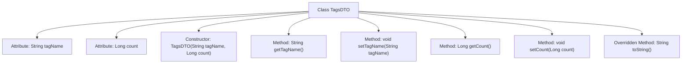

# Basic Information

|      |      |
|------|------|
| Name | TagsDTO |
| Language | .java |
| Code Path | WeFe/union/union-service/src/main/java/com/welab/wefe/union/service/dto/dataresource/TagsDTO.java |
| Package Name | com.welab.wefe.union.service.dto.dataresource |
| Dependencies | [] |
| Brief Description | The TagsDTO class includes the tagName and count attributes, providing a constructor, getter/setter methods, and a toString method. |

# Description

This is a Java class named TagsDTO, used to represent tag data. The class contains two private fields: tagName (String type, representing the tag name) and count (long type, representing the tag count). A parameterized constructor is provided to initialize these two fields, along with corresponding getter and setter methods for each field. Additionally, the toString method is overridden to return a string representation of the object in a specific format. This class is primarily used for encapsulating and manipulating tag-related data.

# Class Summary

| Name   | Type  | Description |
|-------|------|-------------|
| TagsDTO | class | The TagsDTO class includes the tagName and count attributes, providing a constructor, getter/setter methods, and a toString method. |

## Class TagsDTO

|      |      |
|------|------|
| Access Modifier | public |
| Type | class |
| Name | TagsDTO |
| Description | The TagsDTO class includes the tagName and count attributes, providing a constructor, getter/setter methods, and a toString method. |

### UML Class Diagram

This code defines a class named TagsDTO, which encapsulates two attributes: tag name (tagName) and count (count). The class provides a complete constructor, getter/setter methods, and an overridden toString() method, enabling encapsulation and basic operations for tag data. As a Data Transfer Object (DTO), TagsDTO is primarily used to transfer tag-related data between different layers. Its toString() method outputs the object content in JSON format, facilitating debugging and log recording.

### Internal Method Call Graph

This code defines a class named TagsDTO for storing tag names and their corresponding counts. The class contains two private attributes, tagName and count, representing the tag name and count respectively. It provides a constructor, getter and setter methods, as well as an overridden toString method for formatted object output. The flowchart illustrates the class structure and relationships between its methods, clearly reflecting the object-oriented characteristics of data encapsulation and access control.

### Field List

| Name  | Type  | Description |
|-------|-------|------|
| count | Long | private long count; |
| tagName | String | The private string variable tagName is used to store the tag name. |

### Method List

| Name  | Type  | Description |
|-------|-------|------|
| toString | String | Java overrides the toString method to return a string format containing the tagName and count fields. |
| setTagName | void | This is a Java method used to set the value of the tagName property of an object. The method takes a string parameter tagName and assigns it to the property of the same name in the current object. |
| getTagName | String | The method returns the label name of string type. |
| getCount | Long | Methods to obtain the count value, returns a long integer variable count. |
| setCount | void | Methods to set the count attribute, with the parameter being of type Long. |

