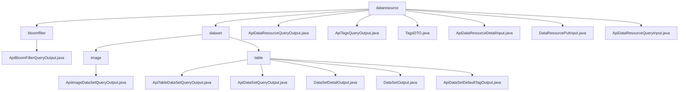

# Basic Information

|      |      |
|------|------|
| Name | dataresource |
| Language | .java |
| Code Path | WeFe/union/union-service/src/main/java/com/welab/wefe/union/service/dto/dataresource |
| Package Name | docs.union.union-service.src.main.java.com.welab.wefe.union.service.dto.dataresource |
| Brief Description | ApiBloomFilterQueryOutput inherits from ApiDataResourceQueryOutput and contains the ExtraData inner class to store hashFunction. ApiDataResourceQueryOutput includes attributes such as resource ID and name. The TagsDTO class encapsulates tag data. Input classes like ApiDataResourceDetailInput contain mandatory fields dataResourceId and dataResourceType. The module provides standardized output for dataset queries and supports federated learning metadata management. |

# Description

## Overview  
The core responsibility of this module is to uniformly manage metadata of data resources in federated learning, including basic attributes, tag systems, and query interactions. The interface specification adopts a hierarchical inheritance design. For example, `ApiBloomFilterQueryOutput` extends `ApiDataResourceQueryOutput` and nests `ExtraData` to store proprietary attributes such as hash functions. Key data structures encompass resource IDs, member information, tag lists (e.g., `TagsDTO`), usage counts, and type identifiers (e.g., `DataResourceType`). External dependencies are limited to foundational classes such as `AbstractTimedApiOutput` and `PageInput`. For instance, `DataResourcePutInput` supports resource updates via the mandatory field `dataResourceId`.

## Key Business Scenarios  
The module supports full lifecycle management of data resources, akin to a CRUD repository pattern. Business processes include: metadata queries (e.g., filtering tags via `ApiDataResourceQueryInput`), detail retrieval (e.g., specifying resource types with `ApiDataResourceDetailInput`), tag statistics (e.g., `ApiTagsQueryOutput` returning counts), and resource maintenance (e.g., updating descriptions with `DataResourcePutInput`). Interactions are implemented through standardized getters/setters, such as `publicLevel` controlling access permissions. Typical applications include resource retrieval (e.g., filtering by task type), tag analysis (e.g., `tagName` aggregation), and status tracking (e.g., `usageCountInJob` statistics). API types cover basic queries, paginated queries, and tag outputs, such as `ApiTableDataSetQueryOutput` extending the base structure to return column features.

### Package Internal Structure View

This flowchart illustrates the hierarchical structure of data resource DTOs in the WeFe project. The top level is the dataresource directory, which contains two subdirectories (bloomfilter and dataset) along with multiple direct files. The bloomfilter subdirectory has one output class, while the dataset subdirectory is divided into image and table subdirectories. The table directory contains the most diverse file types, covering various output/input classes related to dataset queries, details, and tags.

# File List

| Name   | Type  | Description |
|-------|------|-------------|
| [bloomfilter](bloomfilter/_module.md) | package | The ApiBloomFilterQueryOutput class inherits from ApiDataResourceQueryOutput and contains an internal ExtraData class for storing the hashFunction string along with its getter/setter methods. |
| [ApiDataResourceQueryOutput.java](ApiDataResourceQueryOutput.md) | file | The `ApiDataResourceQueryOutput` class inherits from `AbstractTimedApiOutput` and includes attributes such as data resource ID, member information, name, description, tags, data volume, public level, usage statistics, and their corresponding getter/setter methods. |
| [ApiTagsQueryOutput.java](ApiTagsQueryOutput.md) | file | The ApiTagsQueryOutput class extends AbstractApiOutput, includes the tagList property and its getter/setter methods, and overrides the toString method. |
| [TagsDTO.java](TagsDTO.md) | file | The TagsDTO class includes the tagName and count attributes, providing a constructor, getter/setter methods, and a toString method. |
| [ApiDataResourceDetailInput.java](ApiDataResourceDetailInput.md) | file | The `ApiDataResourceDetailInput` class inherits from `BaseInput`, includes the required fields `dataResourceId` and `dataResourceType`, and provides getter and setter methods. |
| [DataResourcePutInput.java](DataResourcePutInput.md) | file | The DataResourcePutInput class inherits from BaseInput and includes attributes such as data resource ID, member ID, name, description, tags, total data volume, public level, public member list, various usage counts, and resource type. Among these, the data resource ID and type are mandatory fields. |
| [ApiDataResourceQueryInput.java](ApiDataResourceQueryInput.md) | file | The ApiDataResourceQueryInput class inherits from PageInput and includes fields such as data resource ID, member name, name, label, member ID, resource type list, deep learning task type, and whether it contains Y, along with their corresponding getter/setter methods. |
| [dataset](dataset/_module.md) | package | ApiImageDataSetQueryOutput inherits from ApiDataResourceQueryOutput and includes a nested class ExtraData, which records task types, labels, annotation statuses, etc. The module provides a unified output structure for dataset queries, supporting federated learning metadata queries such as data preview and access control. |

