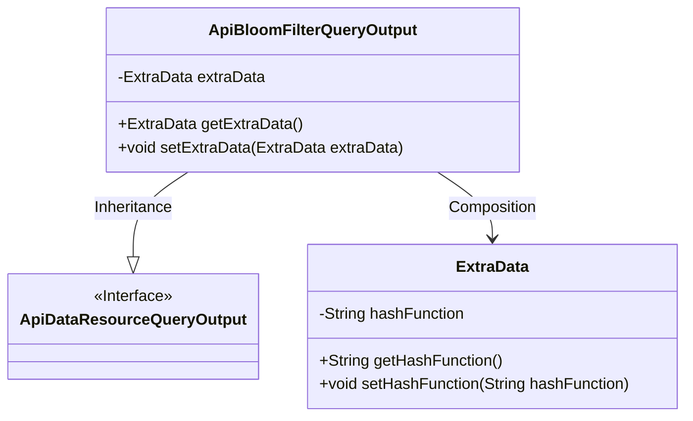
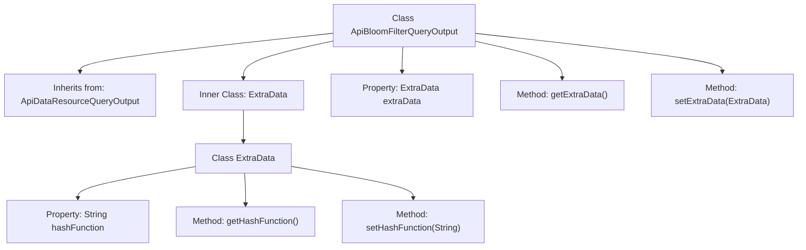

# Basic Information

|      |      |
|------|------|
| Name | ApiBloomFilterQueryOutput |
| Language | .java |
| Code Path | WeFe/union/union-service/src/main/java/com/welab/wefe/union/service/dto/dataresource/bloomfilter/ApiBloomFilterQueryOutput.java |
| Package Name | com.welab.wefe.union.service.dto.dataresource.bloomfilter |
| Dependencies | ['com.welab.wefe.union.service.dto.dataresource.ApiDataResourceQueryOutput'] |
| Brief Description | The ApiBloomFilterQueryOutput class extends ApiDataResourceQueryOutput and includes an inner class ExtraData, which is used to store the hashFunction string along with its getter and setter methods. |

# Description

The `ApiBloomFilterQueryOutput` class inherits from `ApiDataResourceQueryOutput` and includes an inner class called `ExtraData`. The `ExtraData` class has a string property named `hashFunction`, along with corresponding getter and setter methods. The `ApiBloomFilterQueryOutput` class also provides getter and setter methods for the `ExtraData` object, which are used to access and modify the `extraData` field.

# Class Summary

| Name   | Type  | Description |
|-------|------|-------------|
| ApiBloomFilterQueryOutput | class | ApiBloomFilterQueryOutput extends ApiDataResourceQueryOutput and includes the ExtraData inner class, which defines the hashFunction field along with its getter and setter methods. |

## Class ApiBloomFilterQueryOutput

|      |      |
|------|------|
| Access Modifier | public |
| Type | class |
| Name | ApiBloomFilterQueryOutput |
| Description | ApiBloomFilterQueryOutput extends ApiDataResourceQueryOutput and includes the ExtraData inner class, which defines the hashFunction field along with its getter and setter methods. |

### UML Class Diagram

This class diagram illustrates the structural relationship where ApiBloomFilterQueryOutput inherits from the ApiDataResourceQueryOutput interface and contains a nested ExtraData class. As an implementation class, ApiBloomFilterQueryOutput holds an ExtraData object through composition, which encapsulates the hashFunction property and corresponding access methods. The overall design demonstrates a pattern of interface inheritance and object composition, with ExtraData serving as a private inner class to provide extended data storage capabilities.

### Internal Method Call Graph

This code describes an ApiBloomFilterQueryOutput class that inherits from ApiDataResourceQueryOutput, containing an inner class ExtraData for storing hash function information. The flowchart illustrates the class inheritance, inner class structure, and method call chain, clearly presenting data encapsulation and access logic. The ExtraData class provides secure access to the hashFunction property via getter/setter methods, while the main class manages the storage and transfer of ExtraData instances.

### Field List

| Name  | Type  | Description |
|-------|-------|------|
| extraData | ExtraData | The private variable `extraData`, of type `ExtraData`. |

### Method List

| Name  | Type  | Description |
|-------|-------|------|
| getExtraData | ExtraData | The method getExtraData returns the extraData object. |
| setExtraData | void | The method `setExtraData` is used to set the `extraData` property, with the parameter being an object of type `ExtraData`. |

