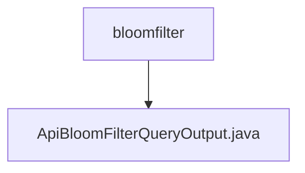

# Basic Information

|      |      |
|------|------|
| Name | bloomfilter |
| Language | .java |
| Code Path | WeFe/union/union-service/src/main/java/com/welab/wefe/union/service/dto/dataresource/bloomfilter |
| Package Name | docs.union.union-service.src.main.java.com.welab.wefe.union.service.dto.dataresource.bloomfilter |
| Brief Description | The ApiBloomFilterQueryOutput class inherits from ApiDataResourceQueryOutput and contains an internal ExtraData class for storing the hashFunction string along with its getter/setter methods. |

# Description

The `ApiBloomFilterQueryOutput` class inherits from `ApiDataResourceQueryOutput` and includes an inner class called `ExtraData`. The `ExtraData` class has a string property named `hashFunction` and provides corresponding getter and setter methods. The `ApiBloomFilterQueryOutput` class also offers getter and setter methods for the `ExtraData` object, which are used to access and modify the `extraData` field.

### Package Internal Structure View

This flowchart illustrates the hierarchical structure under the dataresource/bloomfilter directory in the union-service module of the WeFe project. The bloomfilter serves as the parent directory, containing a subfile named ApiBloomFilterQueryOutput.java. This structure reflects the storage location of DTO classes related to Bloom filter data resources, which are used to handle the output results of Bloom filter queries.

# File List

| Name   | Type  | Description |
|-------|------|-------------|
| [ApiBloomFilterQueryOutput.java](ApiBloomFilterQueryOutput.md) | file | The ApiBloomFilterQueryOutput class extends ApiDataResourceQueryOutput and includes an ExtraData inner class for storing the hashFunction string along with its getter/setter methods. |

