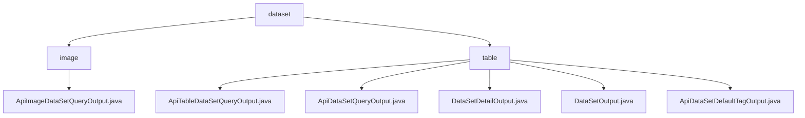

# Basic Information

|      |      |
|------|------|
| Name | dataset |
| Language | .java |
| Code Path | WeFe/union/union-service/src/main/java/com/welab/wefe/union/service/dto/dataresource/dataset |
| Package Name | docs.union.union-service.src.main.java.com.welab.wefe.union.service.dto.dataresource.dataset |
| Brief Description | ApiImageDataSetQueryOutput inherits from ApiDataResourceQueryOutput and includes a nested class ExtraData, which records task types, labels, annotation statuses, etc. The module provides a unified output structure for dataset queries, supporting federated learning metadata queries such as data preview and access control. |

# Description

## Overview  
The core responsibility of this module is to provide standardized output for dataset query results in federated learning, covering basic information, statistical features, and metadata management. The interface specification adopts a layered design. For example, `ApiImageDataSetQueryOutput` inherits from `ApiDataResourceQueryOutput` and extends the `ExtraData` nested class to store additional data such as task types and labels. Key data structures include dataset ID, row/column counts, column/feature name lists (e.g., tabular datasets), label lists, and file sizes (e.g., image datasets). External dependencies are limited to foundational parent classes like `AbstractTimedApiOutput`. For instance, `DataSetDetailOutput` supports debugging by overriding `toString`.

## Key Business Scenarios  
The module serves federated learning for dataset metadata queries and interactions, akin to a catalog service model. Business processes include querying basic information (e.g., row/column counts), retrieving detailed features (e.g., the `containsY` flag), and managing label status (e.g., `labelCompleted`). Interactions are implemented via unified getters/setters, such as accessing nested properties through `extraData`. Typical applications include data previews (e.g., file size statistics), access control (e.g., public levels), and resource tracking (e.g., job usage counts). API types encompass basic output, timestamped output, and label output. For example, tabular datasets return column feature information via `ApiTableDataSetQueryOutput`.

### Package Internal Structure View

This flowchart illustrates the structural relationships within the dataset module of the data resource directory, which includes two subdirectories: image and table. The image directory contains one API output class file, while the table directory comprises five output class files with distinct functionalities, primarily used for querying and output operations of tabular datasets. The entire structure clearly reflects the file organization of the dataset module.

# File List

| Name   | Type  | Description |
|-------|------|-------------|
| [table](table/_module.md) | package | ApiTableDataSetQueryOutput inherits from ApiDataResourceQueryOutput and includes the nested class ExtraData, which records column counts, features, etc. ApiDataSetQueryOutput inherits from AbstractTimedApiOutput and contains basic dataset information and metadata. DataSetDetailOutput inherits from AbstractTimedApiOutput and includes detailed dataset information. DataSetOutput inherits from AbstractApiOutput, with functionality dependent on its parent class. ApiDataSetDefaultTagOutput contains tag IDs and names. |
| [image](image/_module.md) | package | The ApiImageDataSetQueryOutput class inherits from ApiDataResourceQueryOutput and includes the ExtraData inner class, which stores information such as task type, label list, annotation count, completion status, and file size. |

