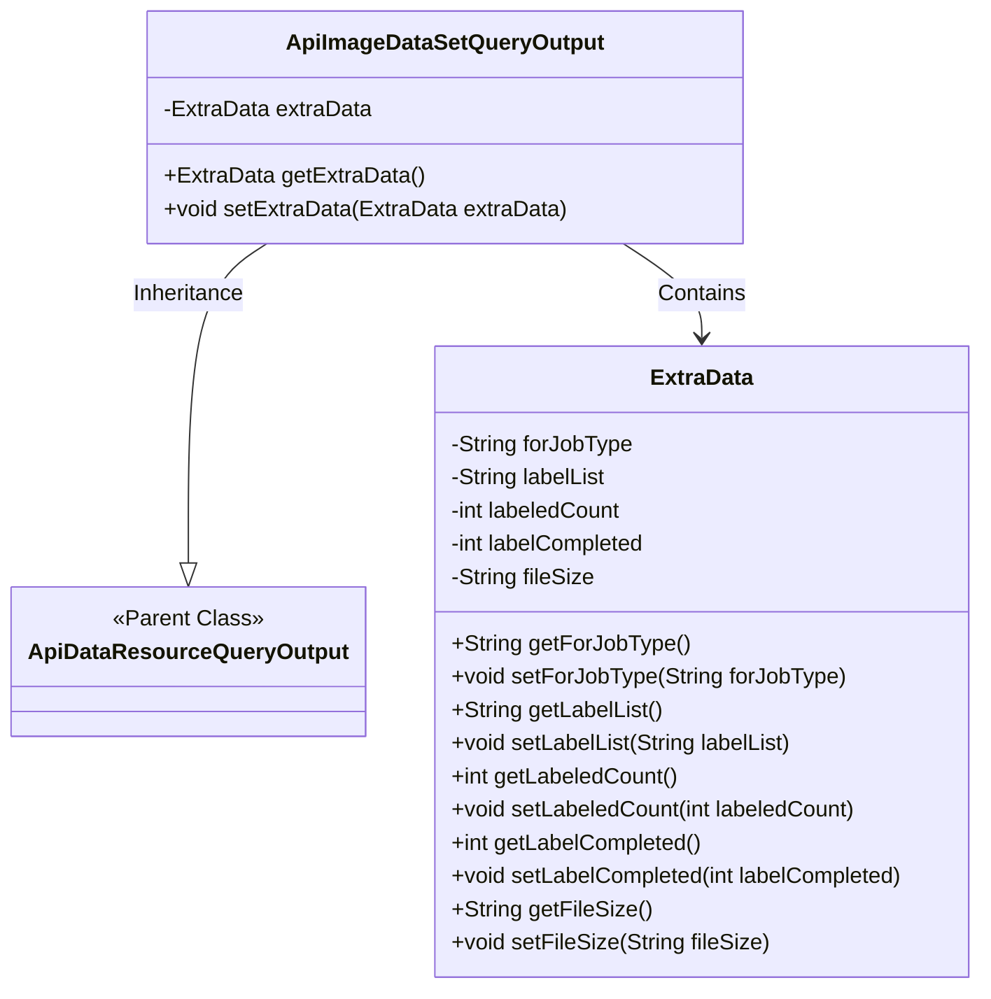

# Basic Information

|      |      |
|------|------|
| Name | ApiImageDataSetQueryOutput |
| Language | .java |
| Code Path | WeFe/union/union-service/src/main/java/com/welab/wefe/union/service/dto/dataresource/dataset/image/ApiImageDataSetQueryOutput.java |
| Package Name | com.welab.wefe.union.service.dto.dataresource.dataset.image |
| Dependencies | ['com.welab.wefe.union.service.dto.dataresource.ApiDataResourceQueryOutput'] |
| Brief Description | The ApiImageDataSetQueryOutput class inherits from ApiDataResourceQueryOutput and includes the ExtraData inner class, which stores information such as task type, label list, annotation count, completion status, and file size. |

# Description

The `ApiImageDataSetQueryOutput` class inherits from `ApiDataResourceQueryOutput` and includes a nested class `ExtraData`. The `ExtraData` class has five attributes: `forJobType` indicates the task type, `labelList` stores the list of labels, `labeledCount` records the number of labeled items, `labelCompleted` represents the labeling completion status, and `fileSize` stores the file size. The main class accesses and modifies the `ExtraData` object through getter and setter methods.

# Class Summary

| Name   | Type  | Description |
|-------|------|-------------|
| ApiImageDataSetQueryOutput | class | ApiImageDataSetQueryOutput inherits from ApiDataResourceQueryOutput and includes the ExtraData inner class, which stores information such as task type, label list, annotation count, completion status, and file size. |

## Class ApiImageDataSetQueryOutput

|      |      |
|------|------|
| Access Modifier | public |
| Type | class |
| Name | ApiImageDataSetQueryOutput |
| Description | ApiImageDataSetQueryOutput inherits from ApiDataResourceQueryOutput and includes the ExtraData inner class, which stores information such as task type, label list, annotation count, completion status, and file size. |

### UML Class Diagram

This code demonstrates an image dataset query output class ApiImageDataSetQueryOutput, which inherits from the parent class ApiDataResourceQueryOutput and contains a nested class ExtraData. The ExtraData class encapsulates metadata related to image labeling tasks, including job type, label list, labeled count, completion status, and file size. The main class manages the ExtraData object through getter/setter methods, forming a clear hierarchical structure suitable for data return scenarios in image labeling systems.

### Internal Method Call Graph

```mermaid
graph TD
    A["Class ApiImageDataSetQueryOutput"]
    B["Inherits from: ApiDataResourceQueryOutput"]
    C["Inner class: ExtraData"]
    D["Property: ExtraData extraData"]
    E["Method: ExtraData getExtraData()"]
    F["Method: void setExtraData(ExtraData extraData)"]
    G["Class ExtraData"]
    H["Property: String forJobType"]
    I["Property: String labelList"]
    J["Property: int labeledCount"]
    K["Property: int labelCompleted"]
    L["Property: String fileSize"]
    M["Method: String getForJobType()"]
    N["Method: void setForJobType(String forJobType)"]
    O["Method: String getLabelList()"]
    P["Method: void setLabelList(String labelList)"]
    Q["Method: int getLabeledCount()"]
    R["Method: void setLabeledCount(int labeledCount)"]
    S["Method: int getLabelCompleted()"]
    T["Method: void setLabelCompleted(int labelCompleted)"]
    U["Method: String getFileSize()"]
    V["Method: void setFileSize(String fileSize)"]

    A --> B
    A --> C
    A --> D
    A --> E
    A --> F
    C --> G
    G --> H
    G --> I
    G --> J
    G --> K
    G --> L
    G --> M
    G --> N
    G --> O
    G --> P
    G --> Q
    G --> R
    G --> S
    G --> T
    G --> U
    G --> V
```

This code defines a class named ApiImageDataSetQueryOutput, which inherits from ApiDataResourceQueryOutput. The class contains an inner class ExtraData, used to store additional information related to image datasets, such as job type, label list, labeled count, labeling completion status, and file size. The ApiImageDataSetQueryOutput class provides getter and setter methods for the ExtraData object, while the ExtraData inner class offers getter and setter methods for all properties to facilitate access and modification of these attributes.

### Field List

| Name  | Type  | Description |
|-------|-------|------|
| extraData | ExtraData | Private additional data objects. |

### Method List

| Name  | Type  | Description |
|-------|-------|------|
| getExtraData | ExtraData | The method getExtraData returns the extraData object. |
| setExtraData | void | The method `setExtraData` takes an `ExtraData` object parameter and assigns it to the `extraData` member variable of the current object. |

