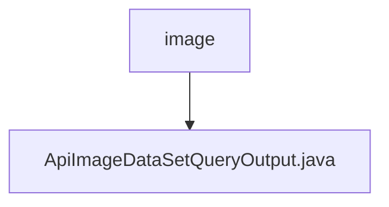

# Basic Information

|      |      |
|------|------|
| Name | image |
| Language | .java |
| Code Path | WeFe/union/union-service/src/main/java/com/welab/wefe/union/service/dto/dataresource/dataset/image |
| Package Name | docs.union.union-service.src.main.java.com.welab.wefe.union.service.dto.dataresource.dataset.image |
| Brief Description | The ApiImageDataSetQueryOutput class inherits from ApiDataResourceQueryOutput and includes the ExtraData inner class, which stores information such as task type, label list, annotation count, completion status, and file size. |

# Description

The `ApiImageDataSetQueryOutput` class inherits from `ApiDataResourceQueryOutput` and contains a nested class `ExtraData`. The `ExtraData` class has five attributes: `forJobType` indicates the task type, `labelList` stores the label list, `labeledCount` records the number of labeled items, `labelCompleted` indicates the labeling completion status, and `fileSize` stores the file size. The main class accesses and modifies the `ExtraData` object through getter and setter methods.

### Package Internal Structure View

This flowchart illustrates the structural relationship of dataset image resources in the WeFe project. The root node "image" represents the image resource directory, which contains a specific output class file "ApiImageDataSetQueryOutput.java" designed to handle query output functionality for image datasets. This structure reflects a typical DTO layer design pattern, centralizing the management of domain-specific output models.

# File List

| Name   | Type  | Description |
|-------|------|-------------|
| [ApiImageDataSetQueryOutput.java](ApiImageDataSetQueryOutput.md) | file | The ApiImageDataSetQueryOutput class inherits from ApiDataResourceQueryOutput and includes the ExtraData inner class, which stores information such as task type, label list, annotation count, completion status, and file size. |

