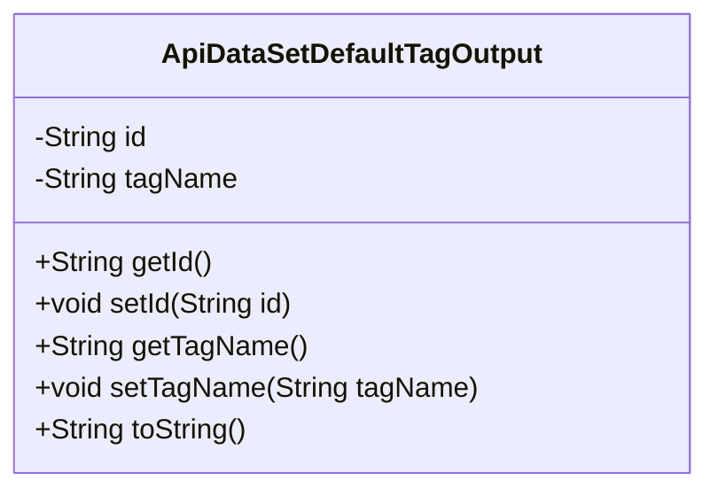
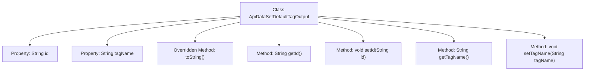

# Basic Information

|      |      |
|------|------|
| Name | ApiDataSetDefaultTagOutput |
| Language | .java |
| Code Path | WeFe/union/union-service/src/main/java/com/welab/wefe/union/service/dto/dataresource/dataset/table/ApiDataSetDefaultTagOutput.java |
| Package Name | com.welab.wefe.union.service.dto.dataresource.dataset.table |
| Dependencies | [] |
| Brief Description | The ApiDataSetDefaultTagOutput class includes id and tagName attributes, provides getter and setter methods, and the toString method returns a string representation of the attribute values. |

# Description

This is a Java class named ApiDataSetDefaultTagOutput, used to represent the default tag output of an API dataset. The class contains two private string fields: id and tagName, which are used to store the unique identifier and name of the tag, respectively. Getter and setter methods are provided for these two fields to retrieve and set their values. Additionally, the toString method is overridden to return a string representation containing id and tagName in a specific format.

# Class Summary

| Name   | Type  | Description |
|-------|------|-------------|
| ApiDataSetDefaultTagOutput | class | The ApiDataSetDefaultTagOutput class includes id and tagName attributes, providing getter/setter methods and toString override. |

## Class ApiDataSetDefaultTagOutput

|      |      |
|------|------|
| Access Modifier | public |
| Type | class |
| Name | ApiDataSetDefaultTagOutput |
| Description | The ApiDataSetDefaultTagOutput class includes id and tagName attributes, providing getter/setter methods and toString override. |

### UML Class Diagram

This code defines a class named `ApiDataSetDefaultTagOutput`, which represents the default tag output of an API dataset. The class contains two private attributes, `id` and `tagName`, used to store the unique identifier and name of the tag, respectively. It provides getter and setter methods for these attributes, as well as an overridden `toString()` method for formatting the object's output. This class is primarily used to encapsulate and transmit tag data, suitable for API interaction scenarios that require handling tag information.

### Internal Method Call Graph

This code defines a class named ApiDataSetDefaultTagOutput, containing two private properties id and tagName, along with their corresponding getter and setter methods. The class overrides the toString() method to format the output of the object's property values. The flowchart illustrates the class structure and the hierarchical relationships between methods, clearly presenting the design pattern of data encapsulation and access control.

### Field List

| Name  | Type  | Description |
|-------|-------|------|
| tagName | String | The private string variable tagName is used to store the tag name. |
| id | String | Declare a private string-type variable id. |

### Method List

| Name  | Type  | Description |
|-------|-------|------|
| toString | String | Rewrite the toString method to return a JSON-formatted string containing id and tagName. |
| getTagName | String | Methods to obtain the tag name, returning the tagName as a string type. |
| setTagName | void | This is a Java method used to set the label name of an object. The method accepts a string parameter tagName and assigns it to the member variable tagName of the object. |
| getId | String | Methods to obtain the ID, returning a string-type id. |
| setId | void | Methods for setting the object ID: Assign the parameter `id` to the `id` property of the current object. |

