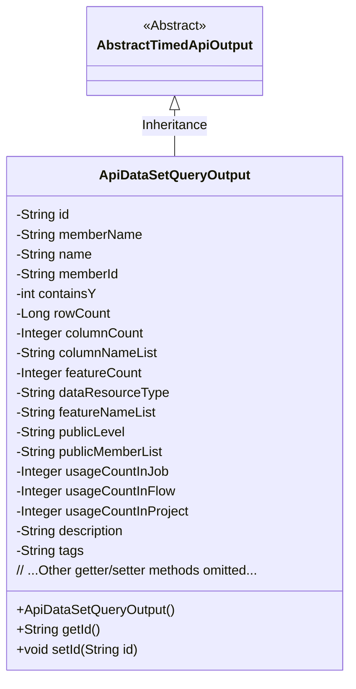

# Basic Information

|      |      |
|------|------|
| Name | ApiDataSetQueryOutput |
| Language | .java |
| Code Path | WeFe/union/union-service/src/main/java/com/welab/wefe/union/service/dto/dataresource/dataset/table/ApiDataSetQueryOutput.java |
| Package Name | com.welab.wefe.union.service.dto.dataresource.dataset.table |
| Dependencies | ['com.welab.wefe.common.web.dto.AbstractTimedApiOutput', 'com.welab.wefe.common.wefe.enums.DataResourceType'] |
| Brief Description | The ApiDataSetQueryOutput class inherits from AbstractTimedApiOutput and includes attributes such as dataset ID, name, member information, row/column counts, feature list, public level, usage statistics, and descriptive tags. |

# Description

The `ApiDataSetQueryOutput` class inherits from `AbstractTimedApiOutput` and is used to represent the output results of a dataset query. This class includes basic information about the dataset, such as its ID, name, member name, and member ID, as well as data features like the number of rows, number of columns, list of column names, and feature count. It also contains metadata such as the data resource type, public access level, list of public members, usage counts in jobs, workflows, and projects, along with descriptions and tags. All fields are provided with corresponding getter and setter methods.

# Class Summary

| Name   | Type  | Description |
|-------|------|-------------|
| ApiDataSetQueryOutput | class | The ApiDataSetQueryOutput class inherits from AbstractTimedApiOutput and includes attributes such as dataset ID, name, row and column counts, feature count, public level, and usage statistics, used for querying dataset information. |

## Class ApiDataSetQueryOutput

|      |      |
|------|------|
| Access Modifier | public |
| Type | class |
| Name | ApiDataSetQueryOutput |
| Description | The ApiDataSetQueryOutput class inherits from AbstractTimedApiOutput and includes attributes such as dataset ID, name, row and column counts, feature count, public level, and usage statistics, used for querying dataset information. |

### UML Class Diagram

This code defines an `ApiDataSetQueryOutput` class that inherits from the abstract class `AbstractTimedApiOutput`. The class is primarily used to encapsulate dataset query results, containing over 20 private fields (such as id, name, rowCount, etc.) and corresponding getter/setter methods. The dataResourceType field has a default value of "TableDataSet", indicating the data resource type. The class diagram clearly illustrates the inheritance relationship and complete attribute structure, demonstrating comprehensive encapsulation capabilities for dataset metadata.

### Internal Method Call Graph

```mermaid
graph TD
    A["Class ApiDataSetQueryOutput"]
    B["Inheritance: AbstractTimedApiOutput"]
    C["Property: String id"]
    D["Property: String memberName"]
    E["Property: String name"]
    F["Property: String memberId"]
    G["Property: int containsY"]
    H["Property: Long rowCount"]
    I["Property: Integer columnCount"]
    J["Property: String columnNameList"]
    K["Property: Integer featureCount"]
    L["Property: String dataResourceType"]
    M["Property: String featureNameList"]
    N["Property: String publicLevel"]
    O["Property: String publicMemberList"]
    P["Property: Integer usageCountInJob"]
    Q["Property: Integer usageCountInFlow"]
    R["Property: Integer usageCountInProject"]
    S["Property: String description"]
    T["Property: String tags"]
    U["Constructor: ApiDataSetQueryOutput()"]
    V["Getter/Setter Methods: All properties"]

    A --|Inherits| B
    A --> C
    A --> D
    A --> E
    A --> F
    A --> G
    A --> H
    A --> I
    A --> J
    A --> K
    A --> L
    A --> M
    A --> N
    A --> O
    A --> P
    A --> Q
    A --> R
    A --> S
    A --> T
    A --> U
    A -.-> V
```

This flowchart illustrates the complete structure of the ApiDataSetQueryOutput class, including its inheritance from AbstractTimedApiOutput, 16 property fields of different data types, a no-argument constructor, and Getter/Setter methods for all properties. This class is primarily used to encapsulate output information for dataset query results, containing metadata such as dataset identifiers, member information, row/column statistics, feature details, usage counts, and descriptive tags. It represents a typical implementation of a Data Transfer Object (DTO).

### Field List

| Name  | Type  | Description |
|-------|-------|------|
| containsY | int | Private integer variable used to determine whether it contains Y. |
| rowCount | Long | Private long integer variable rowCount, used to record the number of rows. |
| name | String | Declare a private string variable named name. |
| usageCountInProject | Integer | Usage count within the project, type is integer, private attribute. |
| featureNameList | String | Defined a private string variable featureNameList to store the list of feature names. |
| memberId | String | Declare a private string type variable memberId. |
| featureCount | Integer | Private integer variable used to record the number of features. |
| usageCountInFlow | Integer | Flow usage counter, recording the number of uses in the process. |
| id | String | Private string type variable id. |
| publicMemberList | String | The private string variable publicMemberList is used to store the public member list. |
| columnCount | Integer | Private integer variable representing the number of columns. |
| usageCountInJob | Integer | Private integer variable, recording the number of usage times in the job. |
| description | String | Private string type variable used to store descriptive information. |
| memberName | String | Declare a private string variable memberName. |
| dataResourceType = DataResourceType.TableDataSet.name() | String | Define a string variable `dataResourceType` with an initial value set to the enumeration name of `DataResourceType.TableDataSet`. |
| tags | String | Private string variable `tags`, used to store tag information. |
| publicLevel | String | The private string variable publicLevel is used to store public level information. |
| columnNameList | String | The field columnNameList is used to store strings of column name lists. |

### Method List

| Name  | Type  | Description |
|-------|-------|------|
| getMemberId | String | The method to obtain the member ID, which returns a string-type memberId. |
| setContainsY | void | Set the value of the containsY variable. |
| setDataResourceType | void | The method for setting the data resource type assigns the input parameter to the class member variable `dataResourceType`. |
| setPublicLevel | void | Define the public method setPublicLevel to set the value of the publicLevel property. |
| getColumnCount | Integer | Methods to obtain the number of columns, returning an integer value columnCount. |
| getContainsY | int | This is a Java method that returns the value of the integer variable containsY. |
| getName | String | The method returns the name attribute value of type string. |
| setFeatureCount | void | Method for setting feature count, assigning the input parameter to the class member variable featureCount. |
| getUsageCountInProject | Integer | Get the integer value of usage count within the project. |
| setId | void | Methods for setting the object ID: Assign the parameter id to the id property of the current object. |
| setDescription | void | The method for setting the object description assigns the input string to the description property of the object. |
| setRowCount | void | Methods for setting the number of rows: assign the parameter rowCount to the class member variable rowCount. |
| getUsageCountInFlow | Integer | Usage count in the acquisition process. |
| setUsageCountInProject | void | The method to set the number of uses within the project, with the parameter being an integer value. |
| getDataResourceType | String | Methods for obtaining the data resource type, returning a string value `dataResourceType`. |
| getTags | String | This is a Java method that returns the value of the member variable `tags` of type String. |
| getPublicMemberList | String | The method to obtain the public member list, which returns a string-type variable `publicMemberList`. |
| setUsageCountInFlow | void | Set the integer value for the number of uses within the process. |
| getMemberName | String | Methods to obtain the member name, returning the value of the member variable memberName. |
| getColumnNameList | String | This method returns a list of column name strings. |
| getUsageCountInJob | Integer | Get the number of uses in the assignment. |
| setUsageCountInJob | void | Set the function for the number of uses in a job, with the parameter being an integer usageCountInJob. |
| setPublicMemberList | void | The method to set the public member list assigns the input string to the class's publicMemberList variable. |
| getFeatureCount | Integer | Method to obtain the number of features, returns the value of the integer variable featureCount. |
| getFeatureNameList | String | The method returns a list string of feature names. |
| setColumnNameList | void | Methods for setting the column name list, assigning the input string to the class's column name list variable. |
| setMemberId | void | The method to set the member ID assigns the input parameter memberId to the memberId property of the current object. |
| setTags | void | Methods for setting label strings. |
| setFeatureNameList | void | This is a Java method used to set the value of the featureNameList property. The method takes a string parameter and assigns it to the class's member variable featureNameList. |
| getPublicLevel | String | The method getPublicLevel returns a publicLevel value of type string. |
| getId | String | Methods to obtain the object ID, returning the ID value as a string type. |
| setMemberName | void | Set the value of the member variable memberName. |
| getRowCount | Long | Methods to obtain the number of rows, returning the value of the long integer variable rowCount. |
| setName | void | The method to set the object name is to assign the parameter `name` to the `name` property of the object. |
| getDescription | String | Methods to obtain description information, returning a string-type description value. |
| setColumnCount | void | Method to set the number of columns, which takes an integer parameter columnCount and assigns it to the class member variable columnCount. |

