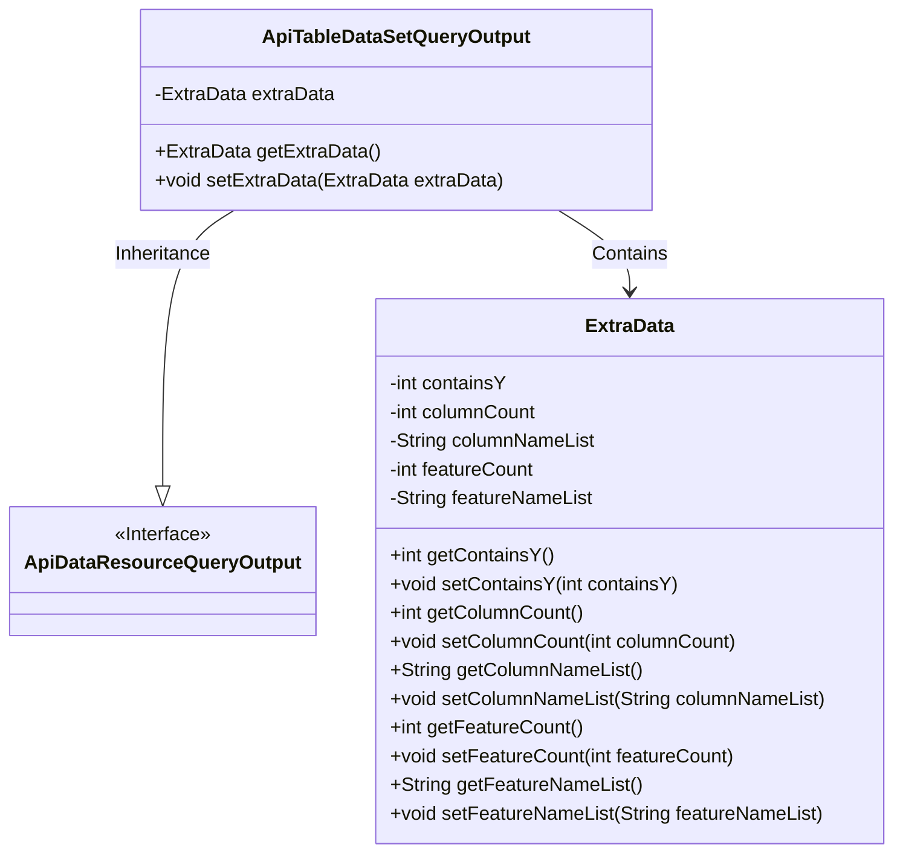
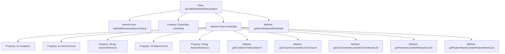

# Basic Information

|      |      |
|------|------|
| Name | ApiTableDataSetQueryOutput |
| Language | .java |
| Code Path | WeFe/union/union-service/src/main/java/com/welab/wefe/union/service/dto/dataresource/dataset/table/ApiTableDataSetQueryOutput.java |
| Package Name | com.welab.wefe.union.service.dto.dataresource.dataset.table |
| Dependencies | ['com.welab.wefe.union.service.dto.dataresource.ApiDataResourceQueryOutput'] |
| Brief Description | ApiTableDataSetQueryOutput inherits from ApiDataResourceQueryOutput and includes the ExtraData inner class, which stores the column count, column name list, feature count, feature name list, and a flag indicating whether it contains Y. |

# Description

The `ApiTableDataSetQueryOutput` class inherits from `ApiDataResourceQueryOutput` and includes a nested class named `ExtraData`. The `ExtraData` class has five attributes: `containsY` indicates whether it contains Y values, `columnCount` records the number of columns, `columnNameList` stores the list of column names, `featureCount` records the number of features, and `featureNameList` stores the list of feature names. Each attribute has corresponding getter and setter methods. The main class also provides getter and setter methods for `extraData`.

# Class Summary

| Name   | Type  | Description |
|-------|------|-------------|
| ApiTableDataSetQueryOutput | class | ApiTableDataSetQueryOutput inherits from ApiDataResourceQueryOutput and includes the ExtraData inner class, which stores the column count, column names, feature count, feature names, and a flag indicating whether it contains Y. |

## Class ApiTableDataSetQueryOutput

|      |      |
|------|------|
| Access Modifier | public |
| Type | class |
| Name | ApiTableDataSetQueryOutput |
| Description | ApiTableDataSetQueryOutput inherits from ApiDataResourceQueryOutput and includes the ExtraData inner class, which stores the column count, column names, feature count, feature names, and a flag indicating whether it contains Y. |

### UML Class Diagram

Class diagram description: This diagram illustrates that the ApiTableDataSetQueryOutput class inherits from the ApiDataResourceQueryOutput interface and contains an internal ExtraData class. The ExtraData class encapsulates additional information for dataset queries, including fields such as column count, feature count, and their corresponding accessor methods. ApiTableDataSetQueryOutput manages an ExtraData instance through an aggregation relationship, forming a two-level data structure.

### Internal Method Call Graph

This code defines an `ApiTableDataSetQueryOutput` class that inherits from `ApiDataResourceQueryOutput`, containing a nested `ExtraData` class for storing additional information about table datasets. The flowchart illustrates the class inheritance, property structure, and method call chain, where the nested `ExtraData` class encapsulates metadata such as Y-flag inclusion, column count, column name list, feature count, and feature name list. The main class manages this data through getter/setter methods.

### Field List

| Name  | Type  | Description |
|-------|-------|------|
| extraData | ExtraData | The private variable `extraData`, of type `ExtraData`. |

### Method List

| Name  | Type  | Description |
|-------|-------|------|
| getExtraData | ExtraData | The method getExtraData returns the extraData object. |
| setExtraData | void | The method `setExtraData` is used to set the `extraData` property of an object, with the parameter being of type `ExtraData`. |

