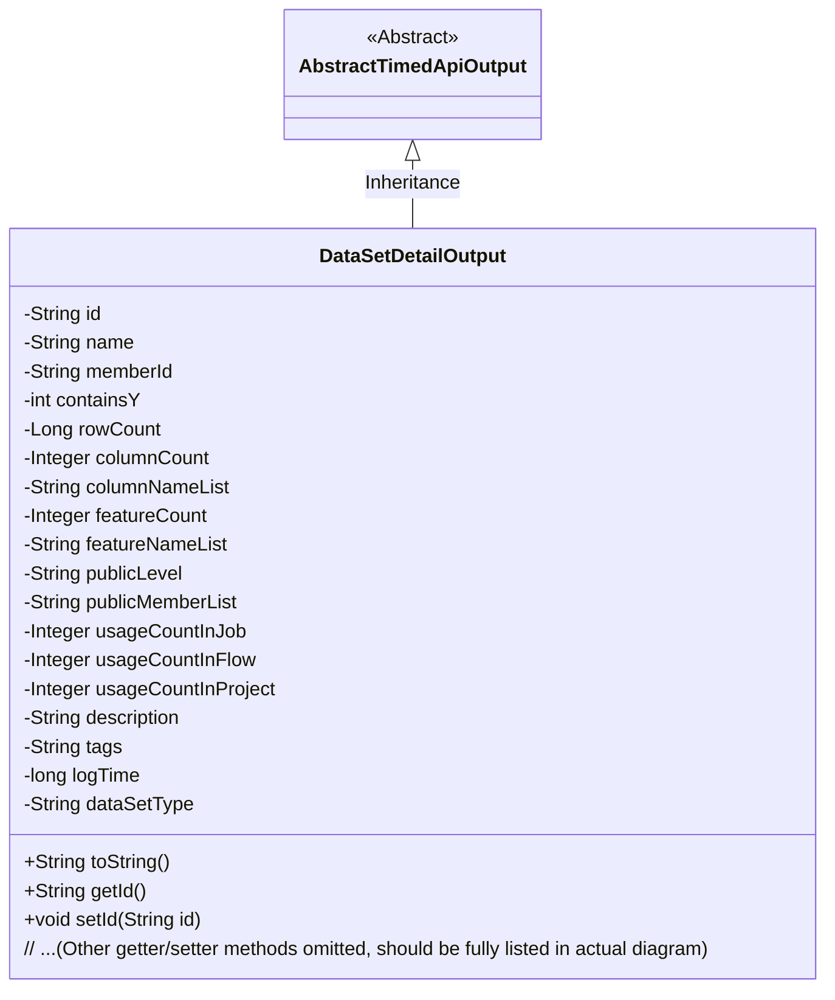

# Basic Information

|      |      |
|------|------|
| Name | DataSetDetailOutput |
| Language | .java |
| Code Path | WeFe/union/union-service/src/main/java/com/welab/wefe/union/service/dto/dataresource/dataset/table/DataSetDetailOutput.java |
| Package Name | com.welab.wefe.union.service.dto.dataresource.dataset.table |
| Dependencies | ['com.welab.wefe.common.web.dto.AbstractTimedApiOutput', 'com.welab.wefe.common.wefe.enums.DataResourceType'] |
| Brief Description | The DataSetDetailOutput class inherits from AbstractTimedApiOutput and includes attributes such as dataset ID, name, member ID, row and column counts, feature list, public level, usage statistics, description, tags, log time, and dataset type. |

# Description

The DataSetDetailOutput class inherits from AbstractTimedApiOutput and is used to represent dataset details. It includes attributes such as dataset ID, name, member ID, whether it contains Y values, row count, column count, column name list, feature count, feature name list, public level, public member list, usage count in jobs, workflows, and projects, description, tags, log time, and dataset type. All attributes have corresponding getter and setter methods, and the toString method is overridden to output all field information.

# Class Summary

| Name   | Type  | Description |
|-------|------|-------------|
| DataSetDetailOutput | class | The DataSetDetailOutput class inherits from AbstractTimedApiOutput and includes attributes such as dataset ID, name, member ID, row and column counts, feature list, public level, usage statistics, description, and labels, used to represent detailed dataset information. |

## Class DataSetDetailOutput

|      |      |
|------|------|
| Access Modifier | public |
| Type | class |
| Name | DataSetDetailOutput |
| Description | The DataSetDetailOutput class inherits from AbstractTimedApiOutput and includes attributes such as dataset ID, name, member ID, row and column counts, feature list, public level, usage statistics, description, and labels, used to represent detailed dataset information. |

### UML Class Diagram

Class diagram description: The DataSetDetailOutput class inherits from the abstract class AbstractTimedApiOutput, representing dataset details. It contains 20+ private fields (e.g., id/name/rowCount) and corresponding getter/setter methods, where dataSetType defaults to TableDataSet.name(). This class overrides the toString() method to output all field values in JSON format, typically used for API response data encapsulation.

### Internal Method Call Graph

```mermaid
graph TD
    A["Class DataSetDetailOutput"]
    B["Inherits: AbstractTimedApiOutput"]
    C["Property: String id"]
    D["Property: String name"]
    E["Property: String memberId"]
    F["Property: int containsY"]
    G["Property: Long rowCount"]
    H["Property: Integer columnCount"]
    I["Property: String columnNameList"]
    J["Property: Integer featureCount"]
    K["Property: String featureNameList"]
    L["Property: String publicLevel"]
    M["Property: String publicMemberList"]
    N["Property: Integer usageCountInJob = -1"]
    O["Property: Integer usageCountInFlow = -1"]
    P["Property: Integer usageCountInProject = -1"]
    Q["Property: String description"]
    R["Property: String tags"]
    S["Property: long logTime"]
    T["Property: String dataSetType = DataResourceType.TableDataSet.name()"]
    U["Overridden Method: String toString()"]
    V["Method: String getId()"]
    W["Method: void setId(String id)"]
    X["Method: String getName()"]
    Y["Method: void setName(String name)"]
    Z["Method: String getMemberId()"]
    AA["Method: void setMemberId(String memberId)"]
    AB["Method: int getContainsY()"]
    AC["Method: void setContainsY(int containsY)"]
    AD["Method: Long getRowCount()"]
    AE["Method: void setRowCount(Long rowCount)"]
    AF["Method: Integer getColumnCount()"]
    AG["Method: void setColumnCount(Integer columnCount)"]
    AH["Method: String getColumnNameList()"]
    AI["Method: void setColumnNameList(String columnNameList)"]
    AJ["Method: Integer getFeatureCount()"]
    AK["Method: void setFeatureCount(Integer featureCount)"]
    AL["Method: String getFeatureNameList()"]
    AM["Method: void setFeatureNameList(String featureNameList)"]
    AN["Method: String getPublicLevel()"]
    AO["Method: void setPublicLevel(String publicLevel)"]
    AP["Method: String getPublicMemberList()"]
    AQ["Method: void setPublicMemberList(String publicMemberList)"]
    AR["Method: Integer getUsageCountInJob()"]
    AS["Method: void setUsageCountInJob(Integer usageCountInJob)"]
    AT["Method: Integer getUsageCountInFlow()"]
    AU["Method: void setUsageCountInFlow(Integer usageCountInFlow)"]
    AV["Method: Integer getUsageCountInProject()"]
    AW["Method: void setUsageCountInProject(Integer usageCountInProject)"]
    AX["Method: String getDescription()"]
    AY["Method: void setDescription(String description)"]
    AZ["Method: String getTags()"]
    BA["Method: void setTags(String tags)"]
    BB["Method: long getLogTime()"]
    BC["Method: void setLogTime(long logTime)"]
    BD["Method: String getDataSetType()"]
    BE["Method: void setDataSetType(String dataSetType)"]

    A --> B
    A --> C
    A --> D
    A --> E
    A --> F
    A --> G
    A --> H
    A --> I
    A --> J
    A --> K
    A --> L
    A --> M
    A --> N
    A --> O
    A --> P
    A --> Q
    A --> R
    A --> S
    A --> T
    A --> U
    A --> V
    A --> W
    A --> X
    A --> Y
    A --> Z
    A --> AA
    A --> AB
    A --> AC
    A --> AD
    A --> AE
    A --> AF
    A --> AG
    A --> AH
    A --> AI
    A --> AJ
    A --> AK
    A --> AL
    A --> AM
    A --> AN
    A --> AO
    A --> AP
    A --> AQ
    A --> AR
    A --> AS
    A --> AT
    A --> AU
    A --> AV
    A --> AW
    A --> AX
    A --> AY
    A --> AZ
    A --> BA
    A --> BB
    A --> BC
    A --> BD
    A --> BE
```

This code defines a class named DataSetDetailOutput, which inherits from AbstractTimedApiOutput and includes multiple properties such as id, name, memberId, etc., along with corresponding getter and setter methods. The class is primarily used to represent detailed information about a dataset, including metadata such as row count, column count, feature count, etc., and provides a toString method for formatted output. The flowchart illustrates the class's inheritance relationship, property definitions, and method invocation relationships, clearly reflecting the class's structure and functionality.

### Field List

| Name  | Type  | Description |
|-------|-------|------|
| name | String | private String name |
| usageCountInJob = -1 | Integer | The private integer variable usageCountInJob has an initial value of -1. |
| publicMemberList | String | private string variable publicMemberList |
| columnCount | Integer | Private integer variable representing the number of columns. |
| tags | String | The private string variable tags defined in the class. |
| columnNameList | String | The private string variable columnNameList is used to store the list of column names. |
| id | String | private string type variable id |
| dataSetType = DataResourceType.TableDataSet.name() | String | Assign the variable `dataSetType` with the string representation of the enum name `DataResourceType.TableDataSet`. |
| rowCount | Long | Private long integer variable, recording the number of rows. |
| usageCountInProject = -1 | Integer | Usage counter within the project, initial value is -1. |
| usageCountInFlow = -1 | Integer | The variable usageCountInFlow is initialized to -1, used to record the number of uses in the flow. |
| containsY | int | The private integer variable containsY. |
| featureCount | Integer | Private integer variable featureCount, used to record the number of features. |
| description | String | Private string type variable description. |
| featureNameList | String | The private string variable featureNameList is used to store the list of feature names. |
| memberId | String | Declare a private string type variable memberId. |
| logTime | long | Log timestamp, recording the time point when an event occurred. |
| publicLevel | String | The private string variable publicLevel is used to store public level information. |

### Method List

| Name  | Type  | Description |
|-------|-------|------|
| getDescription | String | This is a Java method that returns the value of the description attribute of type String. |
| getMemberId | String | The method to obtain the member ID, which returns a string-type memberId. |
| setLogTime | void | The method setLogTime is used to set the value of the logTime attribute, with the parameter being a long integer logTime. |
| getUsageCountInFlow | Integer | Number of uses in the method return process. |
| getLogTime | long | Methods for obtaining log time, returns the value of the long integer variable logTime. |
| getPublicMemberList | String | Methods for obtaining the public member list, returns the publicMemberList string. |
| getColumnCount | Integer | Methods to obtain the number of columns, returning the integer variable columnCount. |
| getFeatureCount | Integer | Method to obtain the number of features, returns the integer variable featureCount. |
| setFeatureNameList | void | This is a Java method used to set the value of the featureNameList property. The method takes a string parameter and assigns it to the member variable of the class. |
| getRowCount | Long | Methods to obtain the number of rows, returning a long integer value rowCount. |
| getId | String | This is a Java method that returns the string-type id attribute value. |
| setName | void | This is a Java method used to set the name property of an object, assigning the passed string parameter to the object's name field. |
| getDataSetType | String | Methods for obtaining the dataset type, returning a string-type dataset type value. |
| getFeatureNameList | String | This is a Java method that returns a string variable named featureNameList. |
| setPublicMemberList | void | Method to set the public member list, which assigns the input string to the class member variable publicMemberList. |
| getName | String | This is a Java method that returns the value of the private variable name. |
| getTags | String | Methods to obtain the tags string. |
| setId | void | Methods for setting the object ID: Assign the parameter id to the id property of the current object. |
| setUsageCountInProject | void | Set a public method for the usage count within the project, with the parameter being an integer. |
| setUsageCountInFlow | void | Common methods for setting the number of uses within a process. |
| setUsageCountInJob | void | This is a Java method used to set the value of the usage count property within a job. The method accepts an integer parameter and assigns it to the class member variable `usageCountInJob`. |
| setPublicLevel | void | This is a Java method used to set the value of the publicLevel property. The method takes a string parameter and assigns it to the publicLevel field of the current object. |
| setFeatureCount | void | Set the feature count method, assign the input parameter to the class variable featureCount. |
| setColumnCount | void | Method to set the number of columns, with the parameter being an integer columnCount, which is assigned to the columnCount property of the current object. |
| setTags | void | Methods for setting label strings. |
| getUsageCountInJob | Integer | Get the usage count in the assignment. |
| getUsageCountInProject | Integer | Get the usage count in the project and return the integer value usageCountInProject. |
| setColumnNameList | void | Methods for setting the column name list, assigning the input parameter to the member variable columnNameList of the class. |
| setRowCount | void | The method for setting the row count attribute assigns the input value to the rowCount member variable of the class. |
| setMemberId | void | This is a Java method used to set the value of the member variable memberId. The method takes a string parameter memberId and assigns it to the memberId property of the current object. |
| getPublicLevel | String | Public method to obtain the publicLevel value. |
| getContainsY | int | The method getContainsY returns the value of the integer variable containsY. |
| getColumnNameList | String | Methods to obtain the column name list, returning a string type `columnNameList`. |
| toString | String | Override the toString method to return a JSON-formatted string containing 16 fields such as id, name, memberId, etc. |
| setDescription | void | This is a Java method used to set the description property of an object. The method is named setDescription, which takes a string parameter description and assigns it to the description member variable of the object. |
| setContainsY | void | This is a Java method used to set the value of the class member variable `containsY`. The method accepts an integer parameter and assigns it to the `containsY` property of the current object. |
| setDataSetType | void | This is a Java method used to set the dataset type property of a class. The method takes a string parameter dataSetType and assigns it to the member variable of the same name in the class. |

