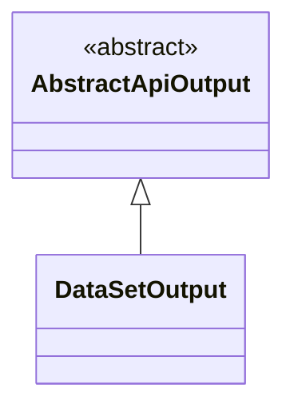
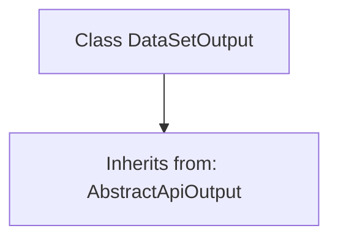

# Basic Information

|      |      |
|------|------|
| Name | DataSetOutput |
| Language | .java |
| Code Path | WeFe/union/union-service/src/main/java/com/welab/wefe/union/service/dto/dataresource/dataset/table/DataSetOutput.java |
| Package Name | com.welab.wefe.union.service.dto.dataresource.dataset.table |
| Dependencies | ['com.welab.wefe.common.web.dto.AbstractApiOutput'] |
| Brief Description | The dataset output class inherits from the abstract API output base class. |

# Description

DataSetOutput is a public class that inherits from AbstractApiOutput, used to represent dataset output. As a concrete implementation of the abstract API output, this class may be employed to encapsulate and handle output operations related to datasets. Since the current class body is empty, its specific functionality and behavior will depend on the definition and implementation of the parent class AbstractApiOutput. This design follows the inheritance principle in object-oriented programming, allowing the creation of subclasses with specific functionalities by extending the base class.

# Class Summary

| Name   | Type  | Description |
|-------|------|-------------|
| DataSetOutput | class | The DataSetOutput class inherits from the AbstractApiOutput base class. |

## Class DataSetOutput

|      |      |
|------|------|
| Access Modifier | public |
| Type | class |
| Name | DataSetOutput |
| Description | The DataSetOutput class inherits from the AbstractApiOutput base class. |

### UML Class Diagram

This class diagram illustrates the inheritance relationship where the `DataSetOutput` class extends the abstract class `AbstractApiOutput`. The `AbstractApiOutput` is marked as an abstract class (`<<abstract>>`), while `DataSetOutput` is depicted as its concrete subclass through a hollow triangular arrow denoting inheritance. This structure indicates that `DataSetOutput` inherits all properties and methods from `AbstractApiOutput`, with the ability to extend or override parent class functionality. It is suitable for scenarios requiring a unified output interface but differing implementation details.

### Internal Method Call Graph

This code demonstrates a simple class inheritance relationship. The DataSetOutput class inherits from the AbstractApiOutput abstract class, indicating that DataSetOutput will possess the basic structure and functionality defined by AbstractApiOutput. Since the current class body is empty, no new features have been extended yet, but it provides a foundational framework for adding dataset output-related methods in the future. This design is commonly used to achieve standardized processing of API response outputs.

### Field List

| Name  | Type  | Description |
|-------|-------|------|

### Method List

| Name  | Type  | Description |
|-------|-------|------|

