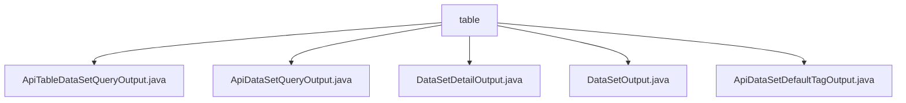

# Basic Information

|      |      |
|------|------|
| Name | table |
| Language | .java |
| Code Path | WeFe/union/union-service/src/main/java/com/welab/wefe/union/service/dto/dataresource/dataset/table |
| Package Name | docs.union.union-service.src.main.java.com.welab.wefe.union.service.dto.dataresource.dataset.table |
| Brief Description | ApiTableDataSetQueryOutput inherits from ApiDataResourceQueryOutput and includes the nested class ExtraData, which records column counts, features, etc. ApiDataSetQueryOutput inherits from AbstractTimedApiOutput and contains basic dataset information and metadata. DataSetDetailOutput inherits from AbstractTimedApiOutput and includes detailed dataset information. DataSetOutput inherits from AbstractApiOutput, with functionality dependent on its parent class. ApiDataSetDefaultTagOutput contains tag IDs and names. |

# Description

## Overview  
The core responsibility of this module is to provide a unified output structure for dataset query results, including basic information, statistical features, and metadata management. The interface specification follows a layered design, achieving standardized output by inheriting `AbstractTimedApiOutput` and `AbstractApiOutput`. For example, `ApiTableDataSetQueryOutput` extends the nested `ExtraData` class to store column and feature information. Key data structures include dataset ID, row/column counts, column/feature name lists, disclosure levels, and usage statistics. External dependencies are limited to base parent classes. For instance, `DataSetDetailOutput` implements debugging support through `toString` override.

## Key Business Scenarios  
The module supports dataset metadata queries in federated learning scenarios, resembling a catalog service model. Business processes include querying basic information (e.g., `ApiDataSetQueryOutput`), retrieving detailed features (e.g., the `containsY` flag), and managing tags (e.g., `ApiDataSetDefaultTagOutput`). Interaction is uniformly handled via getter/setter operations on properties, such as accessing nested features through `extraData`. Typical applications include data previews, access control, and resource statistics, such as tracking dataset usage counts in jobs. API types encompass basic output, timestamped output, and tagged output.

### Package Internal Structure View

This flowchart illustrates the hierarchical relationships of 5 Java files under the table directory. All files are directly subordinate to the table node, including output class files for various functionalities such as dataset query, details, and tags, reflecting the DTO structure related to table datasets in the data resource module.

# File List

| Name   | Type  | Description |
|-------|------|-------------|
| [ApiTableDataSetQueryOutput.java](ApiTableDataSetQueryOutput.md) | file | ApiTableDataSetQueryOutput inherits from ApiDataResourceQueryOutput and includes the ExtraData inner class, which stores the number of columns, column name list, number of features, feature name list, and a flag indicating whether it contains Y. |
| [ApiDataSetQueryOutput.java](ApiDataSetQueryOutput.md) | file | The `ApiDataSetQueryOutput` class inherits from `AbstractTimedApiOutput` and includes attributes such as dataset ID, name, member information, row and column counts, feature list, public level, usage statistics, and descriptive tags. |
| [DataSetDetailOutput.java](DataSetDetailOutput.md) | file | The `DataSetDetailOutput` class inherits from `AbstractTimedApiOutput` and includes attributes such as dataset ID, name, member ID, row and column counts, feature list, public level, usage statistics, description, tags, log time, and dataset type. |
| [DataSetOutput.java](DataSetOutput.md) | file | The dataset output class inherits from the abstract API output base class. |
| [ApiDataSetDefaultTagOutput.java](ApiDataSetDefaultTagOutput.md) | file | The ApiDataSetDefaultTagOutput class contains id and tagName attributes, provides getter and setter methods, and the toString method returns a string representation of the attribute values. |

