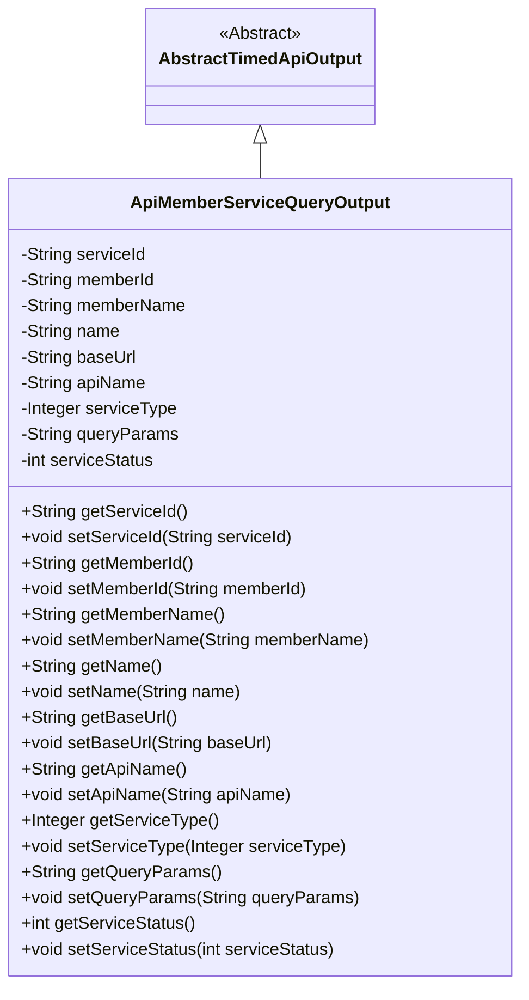

# Basic Information

|      |      |
|------|------|
| Name | ApiMemberServiceQueryOutput |
| Language | .java |
| Code Path | WeFe/union/union-service/src/main/java/com/welab/wefe/union/service/dto/member/ApiMemberServiceQueryOutput.java |
| Package Name | com.welab.wefe.union.service.dto.member |
| Dependencies | ['com.welab.wefe.common.web.dto.AbstractTimedApiOutput'] |
| Brief Description | The ApiMemberServiceQueryOutput class extends AbstractTimedApiOutput and includes attributes such as service ID, member ID, name, base URL, API name, service type, query parameters, and service status, along with their corresponding getter and setter methods. |

# Description

The ApiMemberServiceQueryOutput class inherits from AbstractTimedApiOutput and includes attributes such as service ID, member ID, member name, name, base URL, API name, service type, query parameters, and service status. Each attribute has corresponding getter and setter methods.

# Class Summary

| Name   | Type  | Description |
|-------|------|-------------|
| ApiMemberServiceQueryOutput | class | The ApiMemberServiceQueryOutput class inherits from AbstractTimedApiOutput and includes fields such as service ID, member ID, name, base URL, API name, service type, query parameters, and service status, along with their corresponding getter/setter methods. |

## Class ApiMemberServiceQueryOutput

|      |      |
|------|------|
| Access Modifier | public |
| Type | class |
| Name | ApiMemberServiceQueryOutput |
| Description | The ApiMemberServiceQueryOutput class inherits from AbstractTimedApiOutput and includes fields such as service ID, member ID, name, base URL, API name, service type, query parameters, and service status, along with their corresponding getter/setter methods. |

### UML Class Diagram

This code defines an `ApiMemberServiceQueryOutput` class that inherits from the abstract class `AbstractTimedApiOutput`. The class includes multiple private fields such as `serviceId`, `memberId`, `apiName`, etc., along with corresponding getter and setter methods. These fields are primarily used to store query result information for API member services, including service ID, member details, base URL, service type, and more. Through the inheritance relationship, the class inherits the timed output functionality from its parent class while extending specific properties related to API member service queries.

### Internal Method Call Graph

```mermaid
graph TD
    A["Class ApiMemberServiceQueryOutput"]
    B["Inherits: AbstractTimedApiOutput"]
    C["Property: String serviceId"]
    D["Property: String memberId"]
    E["Property: String memberName"]
    F["Property: String name"]
    G["Property: String baseUrl"]
    H["Property: String apiName"]
    I["Property: Integer serviceType"]
    J["Property: String queryParams"]
    K["Property: int serviceStatus"]
    L["Method: getServiceId/setServiceId"]
    M["Method: getMemberId/setMemberId"]
    N["Method: getMemberName/setMemberName"]
    O["Method: getName/setName"]
    P["Method: getBaseUrl/setBaseUrl"]
    Q["Method: getApiName/setApiName"]
    R["Method: getServiceType/setServiceType"]
    S["Method: getQueryParams/setQueryParams"]
    T["Method: getServiceStatus/setServiceStatus"]

    A --> B
    A --> C
    A --> D
    A --> E
    A --> F
    A --> G
    A --> H
    A --> I
    A --> J
    A --> K
    A --> L
    A --> M
    A --> N
    A --> O
    A --> P
    A --> Q
    A --> R
    A --> S
    A --> T
```

This code defines the ApiMemberServiceQueryOutput class, which inherits from AbstractTimedApiOutput and is primarily used to encapsulate output data for API member service queries. The class contains 9 private properties representing service ID, member ID, member name, name, base URL, API name, service type, query parameters, and service status, with corresponding getter and setter methods provided for each property. The design purpose of this class is to standardize the return data structure for API calls, facilitating unified processing and service status management.

### Field List

| Name  | Type  | Description |
|-------|-------|------|
| serviceType | Integer | The private integer variable serviceType is used to indicate the service type. |
| name | String | Declare a private string variable named name. |
| apiName | String | Private string variable apiName. |
| queryParams | String | The private string variable queryParams is used to store query parameters. |
| serviceStatus | int | Private integer variable indicating the service status. |
| memberId | String | Member ID string variable |
| serviceId | String | Declare a private string variable serviceId. |
| baseUrl | String | Declare a private string variable baseUrl to store the base URL address. |
| memberName | String | The member variable is named memberName, and its type is String. |

### Method List

| Name  | Type  | Description |
|-------|-------|------|
| setName | void | Methods for setting the object name, assigning the input parameter `name` to the `name` property of the object. |
| getMemberName | String | The method to obtain the member name returns the value of the member variable memberName. |
| getName | String | This is a Java method that returns the value of the string-type variable name. |
| getBaseUrl | String | This method returns a string-type baseUrl variable value. |
| getServiceId | String | Common method to obtain the serviceId, returns the serviceId as a string. |
| getServiceType | Integer | Methods to obtain the service type, returns an integer value serviceType. |
| setApiName | void | This is a Java method used to set the apiName property value of a class. The method takes a string parameter apiName and assigns it to the member variable of the same name in the class. |
| setServiceType | void | This is a Java method used to set the serviceType property of a class, which accepts an Integer type parameter. |
| getApiName | String | This is a Java method that returns the apiName property value of string type. |
| setServiceStatus | void | This is a Java method used to set the value of the class's serviceStatus property. The method takes an integer parameter serviceStatus and assigns it to the class's member variable of the same name. |
| setBaseUrl | void | The method to set the baseUrl property assigns the input parameter baseUrl to the class member variable this.baseUrl. |
| setMemberId | void | The method to set the member ID assigns the input parameter to the class's member variable memberId. |
| setServiceId | void | This is a Java method used to set the serviceId property value of a class. The method takes a string parameter serviceId and assigns it to the class's member variable of the same name. |
| getMemberId | String | The method returns the member ID string. |
| setQueryParams | void | This is a Java method used to set the value of the queryParams property of a class. The method takes a string parameter and assigns it to the member variable queryParams of the class. |
| getQueryParams | String | Methods to Obtain Query Parameter Strings. |
| setMemberName | void | Set the value of the member variable memberName. |
| getServiceStatus | int | Methods to obtain the service status, returning the value of the integer variable serviceStatus. |

