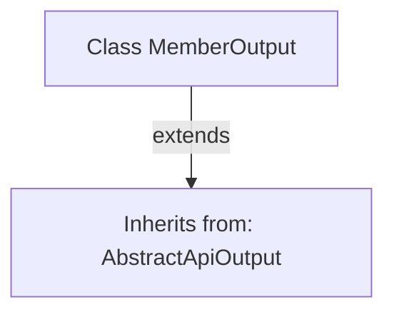

# Basic Information

|      |      |
|------|------|
| Name | MemberOutput |
| Language | .java |
| Code Path | WeFe/union/union-service/src/main/java/com/welab/wefe/union/service/dto/member/MemberOutput.java |
| Package Name | com.welab.wefe.union.service.dto.member |
| Dependencies | ['com.welab.wefe.common.web.dto.AbstractApiOutput'] |
| Brief Description | The MemberOutput class inherits from the AbstractApiOutput base class and is used to encapsulate API output data. |

# Description

The content defines a Java class named MemberOutput, which inherits from the base class AbstractApiOutput. This class currently has an empty implementation, declaring no member variables or methods, and only indicates through inheritance that it is a subclass implementation of a certain API output structure. Based on the class name, its design purpose is to encapsulate API response data related to members.

# Class Summary

| Name   | Type  | Description |
|-------|------|-------------|
| MemberOutput | class | The MemberOutput class inherits from the AbstractApiOutput base class. |


## Class MemberOutput

|      |      |
|------|------|
| Access Modifier | public |
| Type | class |
| Name | MemberOutput |
| Description | The MemberOutput class inherits from the AbstractApiOutput base class. |


### UML Class Diagram

```mermaid
classDiagram
    class AbstractApiOutput {
        <<Interface>>
    }
    class MemberOutput {
    }
    AbstractApiOutput <|-- MemberOutput // Inheritance
```

This class diagram illustrates a simple hierarchical relationship where the MemberOutput class inherits from the AbstractApiOutput interface. AbstractApiOutput is marked as an interface (<<Interface>>), and MemberOutput, as its implementation class, is connected via a hollow triangular arrow to denote inheritance. This structure indicates that MemberOutput must implement all abstract methods defined by AbstractApiOutput, embodying the core concept of "implementation" in object-oriented programming.


### Internal Method Call Graph



This code demonstrates a simple Java class inheritance relationship. The MemberOutput class inherits from the AbstractApiOutput abstract class via the 'extends' keyword, indicating that MemberOutput will possess all non-private members (properties and methods) of AbstractApiOutput while being able to extend or override parent class functionality. The diagram clearly presents this inheritance hierarchy, representing a typical structure of class inheritance in object-oriented programming.

### Field List

| Name  | Type  | Description |
|-------|-------|------|

### Method List

| Name  | Type  | Description |
|-------|-------|------|


