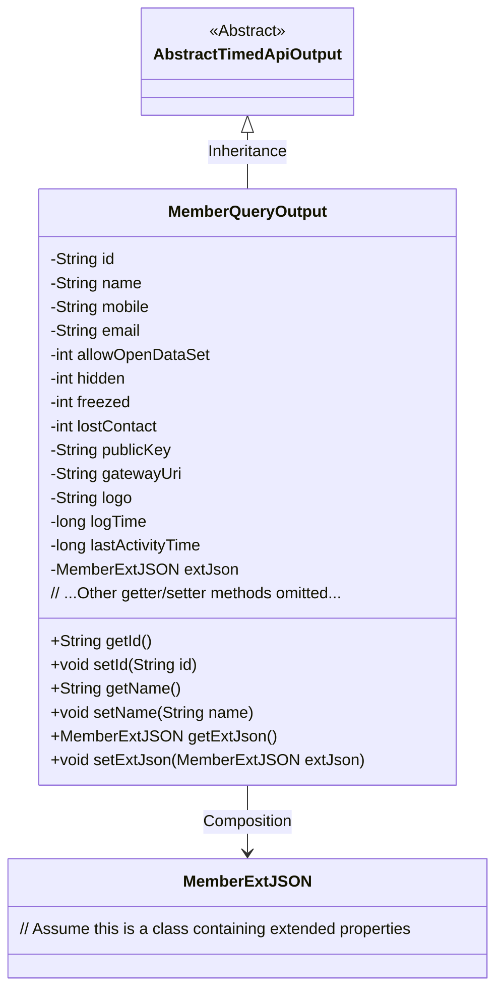

# Basic Information

|      |      |
|------|------|
| Name | MemberQueryOutput |
| Language | .java |
| Code Path | WeFe/union/union-service/src/main/java/com/welab/wefe/union/service/dto/member/MemberQueryOutput.java |
| Package Name | com.welab.wefe.union.service.dto.member |
| Dependencies | ['com.welab.wefe.common.data.mongodb.entity.union.ext.MemberExtJSON', 'com.welab.wefe.common.web.dto.AbstractTimedApiOutput'] |
| Brief Description | The MemberQueryOutput class inherits from AbstractTimedApiOutput and includes attributes such as member ID, name, contact information, status flag, public key, gateway URI, logo, and timestamps, along with corresponding getter and setter methods. |

# Description

The MemberQueryOutput class inherits from AbstractTimedApiOutput and is used to encapsulate member query results. It includes basic information such as member ID, name, phone number, and email, as well as status flags like allowed open datasets, hidden, frozen, and lost contact. It also contains extended information such as public keys, gateway URIs, and LOGO addresses, along with two timestamps for log time and last activity time. Finally, it supports additional extended attributes through the extJson field of type MemberExtJSON. All fields are accessed and modified via getter and setter methods.

# Class Summary

| Name   | Type  | Description |
|-------|------|-------------|
| MemberQueryOutput | class | The MemberQueryOutput class inherits from AbstractTimedApiOutput and includes attributes such as member ID, name, contact information, status flag, public key, gateway URI, logo, and timestamps, along with corresponding getter/setter methods. |

## Class MemberQueryOutput

|      |      |
|------|------|
| Access Modifier | public |
| Type | class |
| Name | MemberQueryOutput |
| Description | The MemberQueryOutput class inherits from AbstractTimedApiOutput and includes attributes such as member ID, name, contact information, status flag, public key, gateway URI, logo, and timestamps, along with corresponding getter/setter methods. |

### UML Class Diagram

Class diagram description: MemberQueryOutput inherits from AbstractTimedApiOutput and contains basic member attributes (e.g., id, name) and extended attributes MemberExtJSON. The class provides access control to private fields through getter/setter methods, where status attributes (e.g., hidden, freezed) are represented by int type, and time-related attributes use long type for storage. MemberExtJSON serves as an extended information container and forms a composition relationship with the main class.

### Internal Method Call Graph

```mermaid
graph TD
    A["Class MemberQueryOutput"]
    B["Inherits from: AbstractTimedApiOutput"]
    C["Property: String id"]
    D["Property: String name"]
    E["Property: String mobile"]
    F["Property: String email"]
    G["Property: int allowOpenDataSet"]
    H["Property: int hidden"]
    I["Property: int freezed"]
    J["Property: int lostContact"]
    K["Property: String publicKey"]
    L["Property: String gatewayUri"]
    M["Property: String logo"]
    N["Property: long logTime"]
    O["Property: long lastActivityTime"]
    P["Property: MemberExtJSON extJson"]
    Q["Method: String getId()"]
    R["Method: void setId(String id)"]
    S["Method: String getName()"]
    T["Method: void setName(String name)"]
    U["Method: String getMobile()"]
    V["Method: void setMobile(String mobile)"]
    W["Method: String getEmail()"]
    X["Method: void setEmail(String email)"]
    Y["Method: int getAllowOpenDataSet()"]
    Z["Method: void setAllowOpenDataSet(int allowOpenDataSet)"]
    AA["Method: int getHidden()"]
    AB["Method: void setHidden(int hidden)"]
    AC["Method: int getFreezed()"]
    AD["Method: void setFreezed(int freezed)"]
    AE["Method: int getLostContact()"]
    AF["Method: void setLostContact(int lostContact)"]
    AG["Method: String getPublicKey()"]
    AH["Method: void setPublicKey(String publicKey)"]
    AI["Method: String getGatewayUri()"]
    AJ["Method: void setGatewayUri(String gatewayUri)"]
    AK["Method: String getLogo()"]
    AL["Method: void setLogo(String logo)"]
    AM["Method: long getLogTime()"]
    AN["Method: void setLogTime(long logTime)"]
    AO["Method: long getLastActivityTime()"]
    AP["Method: void setLastActivityTime(long lastActivityTime)"]
    AQ["Method: MemberExtJSON getExtJson()"]
    AR["Method: void setExtJson(MemberExtJSON extJson)"]

    A --> B
    A --> C
    A --> D
    A --> E
    A --> F
    A --> G
    A --> H
    A --> I
    A --> J
    A --> K
    A --> L
    A --> M
    A --> N
    A --> O
    A --> P
    A --> Q
    A --> R
    A --> S
    A --> T
    A --> U
    A --> V
    A --> W
    A --> X
    A --> Y
    A --> Z
    A --> AA
    A --> AB
    A --> AC
    A --> AD
    A --> AE
    A --> AF
    A --> AG
    A --> AH
    A --> AI
    A --> AJ
    A --> AK
    A --> AL
    A --> AM
    A --> AN
    A --> AO
    A --> AP
    A --> AQ
    A --> AR
```

This flowchart illustrates the complete structure of the `MemberQueryOutput` class, including its inheritance relationship, 14 private properties, and corresponding getter/setter methods. As an API output model, this class encapsulates all fields of member query results (such as basic information, status flags, extended data, etc.) and inherits time-related functionality from `AbstractTimedApiOutput`. Each property strictly follows JavaBean specifications to provide access methods, ensuring data encapsulation.

### Field List

| Name  | Type  | Description |
|-------|-------|------|
| id | String | Private string type variable id. |
| mobile | String | Define a private string variable mobile. |
| lastActivityTime | long | Private long integer variable, recording the last activity time. |
| gatewayUri | String | The private string variable gatewayUri is used to store the gateway URI. |
| logTime | long | Private long integer variable logTime, used for recording time. |
| logo | String | Define a private string variable logo. |
| lostContact | int | Private integer variable, recording the number of lost contact occurrences. |
| extJson | MemberExtJSON | Member Extended JSON Data Object |
| publicKey | String | Declare a private string variable publicKey to store the public key. |
| freezed | int | Private integer variable `freezed`, used to indicate the frozen state. |
| email | String | Declare a private string variable email. |
| name | String | Declare a private string variable name. |
| allowOpenDataSet | int | Private integer variable used to control dataset access permissions. |
| hidden | int | The private integer variable hidden. |

### Method List

| Name  | Type  | Description |
|-------|-------|------|
| getFreezed | int | Methods to obtain the frozen status value, returning an integer-type variable `freezed`. |
| getId | String | Public method to obtain ID, returns a string-type id. |
| setName | void | The method to set the object name is to assign the parameter 'name' to the 'name' property of the object. |
| setId | void | Methods for setting object ID: Assign the parameter id to the object's id property. |
| getHidden | int | Get the value of the hidden variable. |
| setEmail | void | This is a Java method used to set the email property of an object. It takes a string parameter email and assigns it to the email field of the current object. |
| getLostContact | int | Get the integer value of lost contact count. |
| getAllowOpenDataSet | int | This is a Java method that returns the value of the integer variable allowOpenDataSet. |
| getPublicKey | String | Methods to obtain the public key, returning the publicKey variable. |
| getGatewayUri | String | This is a Java method that returns the value of the string-type member variable gatewayUri. |
| setFreezed | void | The method to set the frozen state takes an integer parameter `freezed` and assigns it to the class member variable `freezed`. |
| setAllowOpenDataSet | void | This method is used to set the maximum number of datasets allowed to be opened, with the parameter being the integer allowOpenDataSet. |
| getEmail | String | Methods for obtaining email strings. |
| setMobile | void | This is a Java method used to set the mobile property value of a class. The method takes a string parameter named mobile and assigns it to the member variable of the same name in the class. |
| getMobile | String | Methods to obtain the phone number, returning a string-type variable `mobile`. |
| getName | String | Methods to get the name, returning the value of the name variable of string type. |
| setPublicKey | void | The method to set the public key assigns the input string to the `publicKey` member variable of the class. |
| setHidden | void | The method to set the hidden state, with the parameter being an integer `hidden`, assigns the value to the `hidden` property of the current object. |
| setLastActivityTime | void | Method to set the last activity time, which assigns the parameter lastActivityTime to the class member variable of the same name. |
| getExtJson | MemberExtJSON | The method getExtJson returns the member extension JSON object extJson. |
| setExtJson | void | The method `setExtJson` is used to set the member extension JSON data, with the parameter of type `MemberExtJSON`, which is assigned to the `extJson` property of the current object. |
| getLogo | String | Methods to obtain the logo string. |
| setLostContact | void | Method for setting the lost contact status, with the parameter being an integer lostContact. |
| setGatewayUri | void | Methods for setting the gateway URI, assigning the input parameter to the class's gatewayUri member variable. |
| setLogo | void | Methods for setting the logo string. |
| getLogTime | long | Methods to obtain log time, returning a long integer value logTime. |
| setLogTime | void | The method to set the log time assigns the parameter logTime to the member variable logTime. |
| getLastActivityTime | long | Method to get the last activity time, returns a long integer value. |

