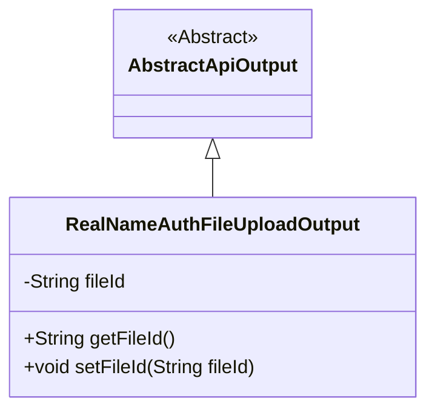
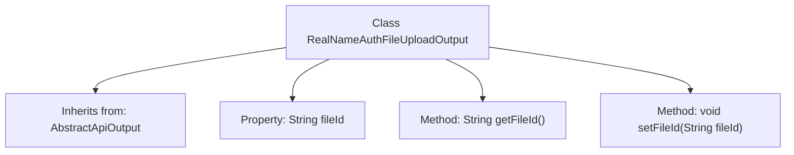

# Basic Information

|      |      |
|------|------|
| Name | RealNameAuthFileUploadOutput |
| Language | .java |
| Code Path | WeFe/union/union-service/src/main/java/com/welab/wefe/union/service/dto/member/RealNameAuthFileUploadOutput.java |
| Package Name | com.welab.wefe.union.service.dto.member |
| Dependencies | ['com.welab.wefe.common.web.dto.AbstractApiOutput'] |
| Brief Description | The RealNameAuthFileUploadOutput class extends AbstractApiOutput and includes the fileId field along with its getter and setter methods. |

# Description

RealNameAuthFileUploadOutput is a class that inherits from AbstractApiOutput, designed to handle the output results of real-name authentication file uploads. This class includes a private string property named fileId, which represents the unique identifier of the uploaded file. It provides getFileId and setFileId methods for retrieving and setting the value of this property.

# Class Summary

| Name   | Type  | Description |
|-------|------|-------------|
| RealNameAuthFileUploadOutput | class | The RealNameAuthFileUploadOutput class extends AbstractApiOutput, containing the fileId property and its getter/setter methods. |

## Class RealNameAuthFileUploadOutput

|      |      |
|------|------|
| Access Modifier | public |
| Type | class |
| Name | RealNameAuthFileUploadOutput |
| Description | The RealNameAuthFileUploadOutput class extends AbstractApiOutput, containing the fileId property and its getter/setter methods. |

### UML Class Diagram

Class Diagram Description: This diagram illustrates an inheritance relationship where the RealNameAuthFileUploadOutput class extends the abstract class AbstractApiOutput. The subclass contains a private field fileId and corresponding getter/setter methods, designed to handle the output after real-name authentication file uploads. This design demonstrates encapsulation of file identifier information and reuse of a foundational output structure.

### Internal Method Call Graph

This flowchart illustrates the structure of the RealNameAuthFileUploadOutput class, which inherits from the AbstractApiOutput class. It contains a private property fileId along with corresponding getter and setter methods. Through inheritance, this class incorporates the characteristics of its parent class while extending file ID management functionality for handling file upload outputs in real-name authentication scenarios.

### Field List

| Name  | Type  | Description |
|-------|-------|------|
| fileId | String | Declare a private string variable fileId. |

### Method List

| Name  | Type  | Description |
|-------|-------|------|
| getFileId | String | Methods to obtain the file ID, returning a fileId string. |
| setFileId | void | Method for setting the file ID: Assign the input parameter fileId to the fileId property of the current object. |

