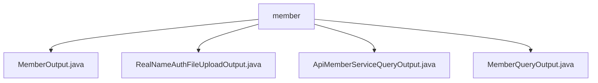

# Basic Information

|      |      |
|------|------|
| Name | member |
| Language | .java |
| Code Path | WeFe/union/union-service/src/main/java/com/welab/wefe/union/service/dto/member |
| Package Name | docs.union.union-service.src.main.java.com.welab.wefe.union.service.dto.member |
| Brief Description | MemberOutput is an empty-implemented API output subclass. RealNameAuthFileUploadOutput handles real-name authentication file uploads and includes a fileId attribute. ApiMemberServiceQueryOutput contains service-related attributes. MemberQueryOutput encapsulates member query results, including basic information and status identifiers. |

# Description

## Overview  
The core responsibility of this module is to encapsulate API response data related to member management, providing standardized output structures for different scenarios. The interface specifications uniformly inherit from `AbstractApiOutput` or its subclass `AbstractTimedApiOutput`, including basic fields and extension capabilities. Key data structures include `MemberOutput` (empty implementation), `RealNameAuthFileUploadOutput` (file ID), `ApiMemberServiceQueryOutput` (service information), and `MemberQueryOutput` (member details). External dependencies are limited to the Java standard library. For example, `RealNameAuthFileUploadOutput` identifies uploaded files via `fileId`, similar to a cloud storage callback credential.  

## Key Business Scenarios  
The module supports full lifecycle management of member information, including basic information queries (`MemberQueryOutput`), service status queries (`ApiMemberServiceQueryOutput`), and real-name authentication (`RealNameAuthFileUploadOutput`). The interaction model adopts standard Getter/Setter methods, with common fields like timestamps implemented through inheritance. A typical application is when querying member details, where `MemberQueryOutput` encapsulates 20+ fields such as ID, contact information, and status flags. API types cover data entity classes, with integration cases including file upload callbacks and service status monitoring. For example, the `extJson` field adopts a JSON extension pattern, resembling the open extension point design of microservices.

### Package Internal Structure View

This flowchart illustrates the structural relationships within the `member` directory of the `union-service` module in the WeFe project. The root node is the `member` folder, which contains four Java class files: `MemberOutput`, `RealNameAuthFileUploadOutput`, `ApiMemberServiceQueryOutput`, and `MemberQueryOutput`. These files are all Data Transfer Objects (DTOs) related to member services, used for handling the output and query functionalities of member information. The structure represents a typical DTO-layer file organization, with all files directly subordinate to the `member` directory.

# File List

| Name   | Type  | Description |
|-------|------|-------------|
| [MemberOutput.java](MemberOutput.md) | file | The MemberOutput class inherits from the AbstractApiOutput base class and is used to encapsulate API output data. |
| [RealNameAuthFileUploadOutput.java](RealNameAuthFileUploadOutput.md) | file | The RealNameAuthFileUploadOutput class extends AbstractApiOutput and includes the fileId field along with its getter and setter methods. |
| [ApiMemberServiceQueryOutput.java](ApiMemberServiceQueryOutput.md) | file | The `ApiMemberServiceQueryOutput` class extends `AbstractTimedApiOutput` and includes attributes such as service ID, member ID, name, base URL, API name, service type, query parameters, and service status, along with their corresponding getter and setter methods. |
| [MemberQueryOutput.java](MemberQueryOutput.md) | file | The MemberQueryOutput class inherits from AbstractTimedApiOutput and includes attributes such as member ID, name, contact information, status flag, public key, gateway URI, logo, and timestamps, along with corresponding getter and setter methods. |

