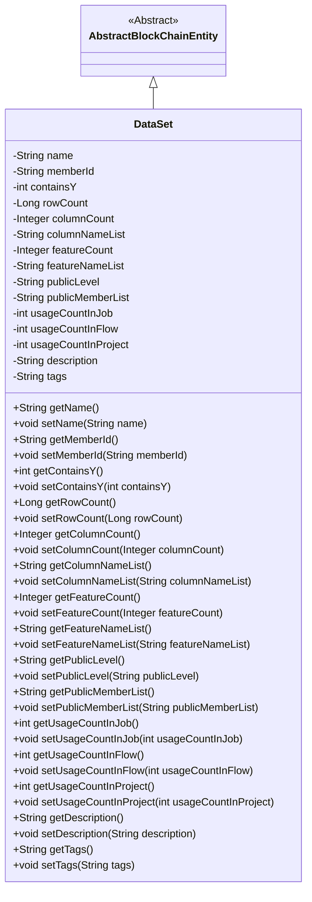

# Basic Information

|      |      |
|------|------|
| Name | DataSet |
| Language | .java |
| Code Path | WeFe/union/union-service/src/main/java/com/welab/wefe/union/service/entity/DataSet.java |
| Package Name | com.welab.wefe.union.service.entity |
| Dependencies | ['com.welab.wefe.common.data.mysql.entity.AbstractBlockChainEntity'] |
| Brief Description | The DataSet class inherits from AbstractBlockChainEntity and includes attributes such as name, member ID, row and column counts, features, public level, usage statistics, description, and tags, along with their corresponding getter and setter methods. |

# Description

The DataSet class inherits from AbstractBlockChainEntity and includes attributes such as dataset name, member ID, flag indicating whether it contains Y values, row count, column count, column name list, feature count, feature name list, public level, public member list, usage count in job workflow projects, description, and tags. Each attribute has corresponding getter and setter methods for access and modification.

# Class Summary

| Name   | Type  | Description |
|-------|------|-------------|
| DataSet | class | The DataSet class inherits from AbstractBlockChainEntity and includes attributes such as name, member ID, row and column counts, features, public level, usage statistics, description, and tags, along with their corresponding getter/setter methods. |

## Class DataSet

|      |      |
|------|------|
| Access Modifier | public |
| Type | class |
| Name | DataSet |
| Description | The DataSet class inherits from AbstractBlockChainEntity and includes attributes such as name, member ID, row and column counts, features, public level, usage statistics, description, and tags, along with their corresponding getter/setter methods. |

### UML Class Diagram

This code defines a DataSet class that inherits from the AbstractBlockChainEntity abstract class. The DataSet class includes multiple private fields to store various attributes of a dataset, such as name, member ID, row count, column count, feature count, etc., and provides public getter and setter methods for each field. This class is primarily used to manage the basic information and metadata of datasets, including dataset structure, usage statistics, and descriptive information. Through inheritance, the DataSet class acquires some fundamental characteristics of blockchain entities.

### Internal Method Call Graph

```mermaid
graph TD
    A["Class DataSet"]
    B["Inherits: AbstractBlockChainEntity"]
    C["Attribute: String name"]
    D["Attribute: String memberId"]
    E["Attribute: int containsY"]
    F["Attribute: Long rowCount"]
    G["Attribute: Integer columnCount"]
    H["Attribute: String columnNameList"]
    I["Attribute: Integer featureCount"]
    J["Attribute: String featureNameList"]
    K["Attribute: String publicLevel"]
    L["Attribute: String publicMemberList"]
    M["Attribute: int usageCountInJob"]
    N["Attribute: int usageCountInFlow"]
    O["Attribute: int usageCountInProject"]
    P["Attribute: String description"]
    Q["Attribute: String tags"]
    R["Method: getName/setName"]
    S["Method: getMemberId/setMemberId"]
    T["Method: getContainsY/setContainsY"]
    U["Method: getRowCount/setRowCount"]
    V["Method: getColumnCount/setColumnCount"]
    W["Method: getColumnNameList/setColumnNameList"]
    X["Method: getFeatureCount/setFeatureCount"]
    Y["Method: getFeatureNameList/setFeatureNameList"]
    Z["Method: getPublicLevel/setPublicLevel"]
    AA["Method: getPublicMemberList/setPublicMemberList"]
    AB["Method: getUsageCountInJob/setUsageCountInJob"]
    AC["Method: getUsageCountInFlow/setUsageCountInFlow"]
    AD["Method: getUsageCountInProject/setUsageCountInProject"]
    AE["Method: getDescription/setDescription"]
    AF["Method: getTags/setTags"]

    A --> B
    A --> C
    A --> D
    A --> E
    A --> F
    A --> G
    A --> H
    A --> I
    A --> J
    A --> K
    A --> L
    A --> M
    A --> N
    A --> O
    A --> P
    A --> Q
    A --> R
    A --> S
    A --> T
    A --> U
    A --> V
    A --> W
    A --> X
    A --> Y
    A --> Z
    A --> AA
    A --> AB
    A --> AC
    A --> AD
    A --> AE
    A --> AF
```

### Field List

| Name  | Type  | Description |
|-------|-------|------|
| name | String | Private string variable name |
| usageCountInProject | int | Project Internal Usage Counter |
| featureNameList | String | The private string variable featureNameList is used to store the list of feature names. |
| containsY | int | The private integer variable `containsY` is used to store Y-related states or values. |
| tags | String | Declare a private string variable tags. |
| featureCount | Integer | Private integer variable used to record the number of features. |
| rowCount | Long | The private long integer variable rowCount is used to record the number of rows. |
| columnNameList | String | The field columnNameList is used to store the string of column name list. |
| publicLevel | String | The private string variable publicLevel is used to store public level information. |
| usageCountInFlow | int | Private integer variable, recording the number of uses in the process. |
| usageCountInJob | int | Private integer variable, recording the number of uses within the job. |
| publicMemberList | String | The private string variable publicMemberList. |
| description | String | Private string type variable description. |
| columnCount | Integer | The private integer variable columnCount is used to record the number of columns. |
| memberId | String | Member ID string variable |

### Method List

| Name  | Type  | Description |
|-------|-------|------|
| setColumnCount | void | The method to set the number of columns involves assigning the input parameter `columnCount` to the class's member variable `columnCount`. |
| setPublicMemberList | void | The method to set the public member list assigns the input string to the class's publicMemberList variable. |
| setRowCount | void | The method `setRowCount` accepts a parameter `rowCount` of type `Long` and assigns it to the class member variable of the same name. |
| getFeatureCount | Integer | Methods to obtain the number of features, returns an integer value featureCount. |
| getUsageCountInProject | int | Method returns the number of times the item is used in the project. |
| setFeatureCount | void | Methods for setting the number of features, assigning the input parameter to the class variable featureCount. |
| setColumnNameList | void | Methods for setting the column name list, assigning the parameter columnNameList to the class member variable of the same name. |
| setTags | void | Set the label string. |
| setFeatureNameList | void | Method for setting the feature name list, which assigns the input string to the class member variable featureNameList. |
| getColumnNameList | String | Methods to obtain a list of column names, returning a list of column names of string type. |
| setUsageCountInFlow | void | Set the public method for the number of uses within the flow, with the parameter being the integer usageCountInFlow. |
| getUsageCountInJob | int | Get the usage count in the assignment. |
| getPublicLevel | String | The method getPublicLevel returns the string value of publicLevel. |
| getRowCount | Long | Methods to obtain the number of rows, returning the rowCount value. |
| setMemberId | void | The method to set the member ID assigns the passed string parameter to the class's member variable `memberId`. |
| getMemberId | String | The method to obtain the member ID, which returns a string-type memberId. |
| getName | String | The method returns the value of the name variable of type string. |
| getColumnCount | Integer | Public method to get the number of columns, returns the integer value of columnCount. |
| getFeatureNameList | String | Public method to obtain featureNameList. |
| setContainsY | void | The method to set the containsY property, with a parameter of type int. |
| setPublicLevel | void | Define the public method setPublicLevel to set the value of the member variable publicLevel. |
| getPublicMemberList | String | The method to obtain the public member list returns a string-type variable publicMemberList. |
| getTags | String | Methods to obtain tag strings. |
| setDescription | void | Method for setting object description information, which assigns the input parameters to internal variables. |
| getContainsY | int | The method getContainsY returns the value of the integer variable containsY. |
| getDescription | String | Methods to obtain descriptive information, returns a string-type description. |
| setName | void | The method to set the object name assigns the input parameter 'name' to the 'name' property of the object. |
| setUsageCountInProject | void | The method to set the usage count within the project, with the parameter being an integer `usageCountInProject`. |
| setUsageCountInJob | void | Set the usage count variable value in the assignment. |
| getUsageCountInFlow | int | Number of uses in the method return process. |

