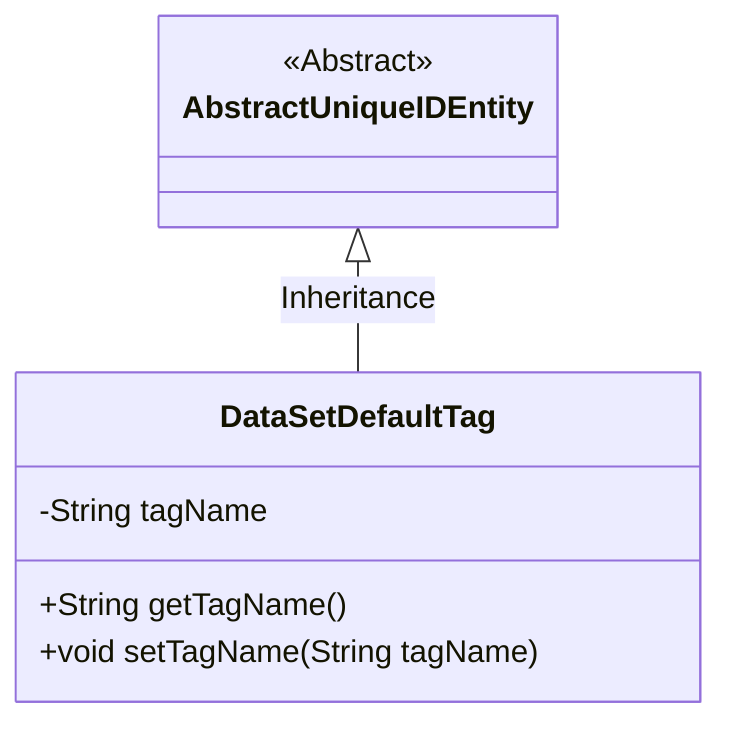
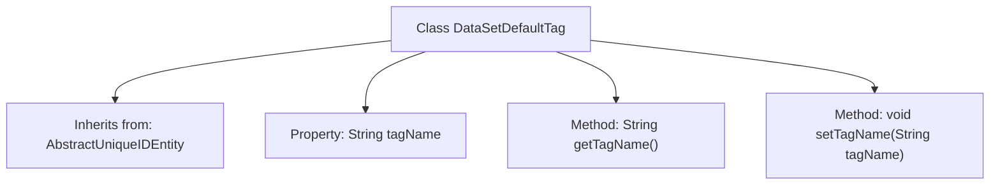

# Basic Information

|      |      |
|------|------|
| Name | DataSetDefaultTag |
| Language | .java |
| Code Path | WeFe/union/union-service/src/main/java/com/welab/wefe/union/service/entity/DataSetDefaultTag.java |
| Package Name | com.welab.wefe.union.service.entity |
| Dependencies | ['com.welab.wefe.common.data.mysql.entity.AbstractUniqueIDEntity'] |
| Brief Description | The DataSetDefaultTag class inherits from AbstractUniqueIDEntity and includes a private attribute tagName along with its getter and setter methods. |

# Description

The `DataSetDefaultTag` class is a Java class that inherits from `AbstractUniqueIDEntity`, used to represent default tags of a dataset. This class contains a private string attribute `tagName` for storing the tag name. It provides two public methods, `getTagName` and `setTagName`, for retrieving and setting the value of the `tagName` attribute, respectively. This class is primarily used to manage basic information of dataset tags, ensuring secure data access through encapsulated attributes.

# Class Summary

| Name   | Type  | Description |
|-------|------|-------------|
| DataSetDefaultTag | class | The DataSetDefaultTag class inherits from AbstractUniqueIDEntity and includes a private attribute tagName along with its getter and setter methods. |

## Class DataSetDefaultTag

|      |      |
|------|------|
| Access Modifier | public |
| Type | class |
| Name | DataSetDefaultTag |
| Description | The DataSetDefaultTag class inherits from AbstractUniqueIDEntity and includes a private attribute tagName along with its getter and setter methods. |

### UML Class Diagram

This class diagram illustrates the inheritance relationship where DataSetDefaultTag extends the abstract class AbstractUniqueIDEntity. DataSetDefaultTag contains a private field tagName along with its corresponding getter/setter methods, inheriting the unique identifier functionality from the parent class. This design encapsulates the fundamental attributes of data tags, achieving code reuse through inheritance, and is typically used in data tag management systems requiring unique identifiers.

### Internal Method Call Graph

This code defines a class named DataSetDefaultTag, which inherits from AbstractUniqueIDEntity. The class contains a private String property tagName, along with corresponding getter and setter methods. The getTagName method is used to retrieve the value of tagName, while the setTagName method is used to set the value of tagName. This class is primarily used for managing the names of default dataset tags, providing a secure access and modification mechanism for tag names through property encapsulation.

### Field List

| Name  | Type  | Description |
|-------|-------|------|
| tagName | String | Private string variable tagName. |

### Method List

| Name  | Type  | Description |
|-------|-------|------|
| setTagName | void | This is a Java method used to set the value of the tagName property of an object. The method takes a string parameter tagName and assigns it to the member variable of the same name in the current object. |
| getTagName | String | Methods to obtain the tag name, returning the tagName as a string type. |

