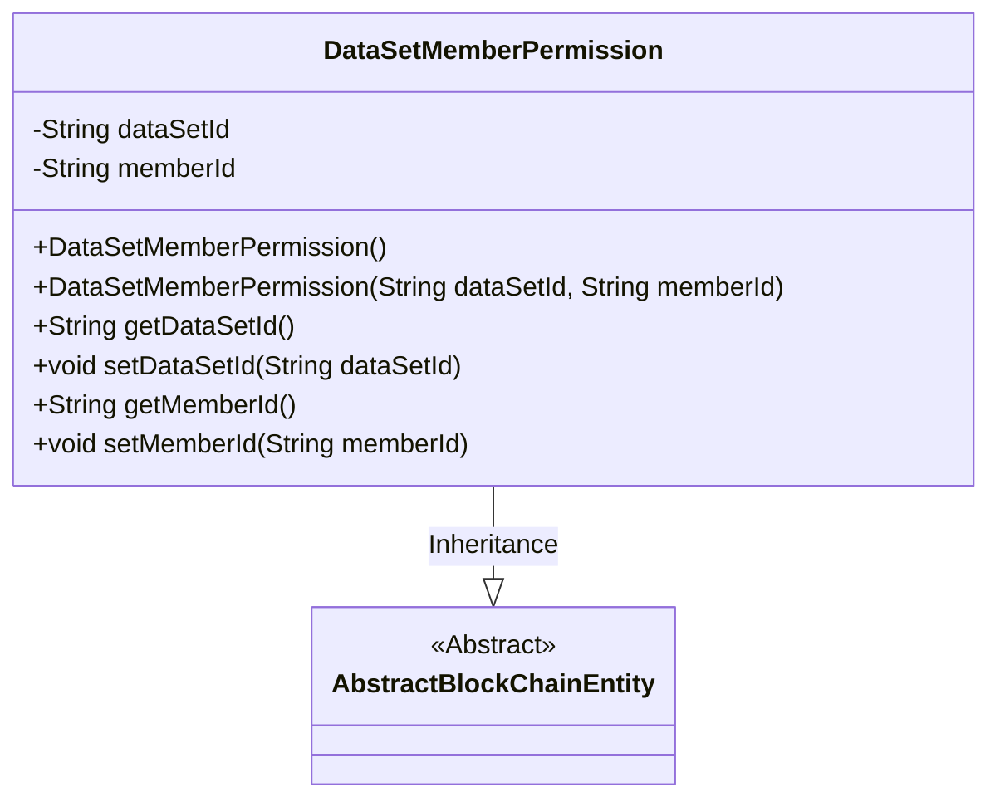
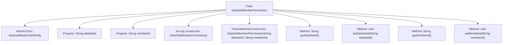

# Basic Information

|      |      |
|------|------|
| Name | DataSetMemberPermission |
| Language | .java |
| Code Path | WeFe/union/union-service/src/main/java/com/welab/wefe/union/service/entity/DataSetMemberPermission.java |
| Package Name | com.welab.wefe.union.service.entity |
| Dependencies | ['com.welab.wefe.common.data.mysql.entity.AbstractBlockChainEntity'] |
| Brief Description | The `DataSetMemberPermission` class inherits from `AbstractBlockChainEntity` and includes fields for dataset ID and member ID, providing constructors and getter/setter methods. |

# Description

The `DataSetMemberPermission` class inherits from `AbstractBlockChainEntity` and is used to represent dataset member permissions. This class includes two private string properties, `dataSetId` and `memberId`, which store the dataset ID and member ID, respectively. It provides a no-argument constructor and a parameterized constructor, supporting access and modification of these two properties through getter and setter methods.

# Class Summary

| Name   | Type  | Description |
|-------|------|-------------|
| DataSetMemberPermission | class | Dataset member permission class, containing dataset ID and member ID fields along with corresponding methods. |

## Class DataSetMemberPermission

|      |      |
|------|------|
| Access Modifier | public |
| Type | class |
| Name | DataSetMemberPermission |
| Description | Dataset member permission class, containing dataset ID and member ID fields along with corresponding methods. |

### UML Class Diagram

This class diagram illustrates the inheritance relationship where the DataSetMemberPermission class extends the AbstractBlockChainEntity abstract class. DataSetMemberPermission contains two private String attributes (dataSetId and memberId), provides a default constructor and a parameterized constructor, along with standard getter/setter methods. As a blockchain entity, it inherits core characteristics from its parent class and is specifically designed to manage permission relationships between datasets and members, embodying the "is-a" inheritance principle in object-oriented design.

### Internal Method Call Graph

This code defines a class named DataSetMemberPermission, which inherits from AbstractBlockChainEntity and is used to manage dataset member permissions. The class contains two private properties, dataSetId and memberId, representing the dataset ID and member ID respectively. It provides a no-argument constructor and a parameterized constructor, along with corresponding getter and setter methods for accessing and modifying these properties. The design of this class primarily serves to encapsulate data related to dataset member permissions, facilitating permission management and data operations within a blockchain system.

### Field List

| Name  | Type  | Description |
|-------|-------|------|
| dataSetId | String | The private string variable of the dataset ID. |
| memberId | String | Declare a private string-type variable memberId. |

### Method List

| Name  | Type  | Description |
|-------|-------|------|
| getDataSetId | String | Methods to obtain the dataset ID, returning the dataset ID as a string type. |
| getMemberId | String | This is a Java method that returns a member ID string. The method is named getMemberId, takes no parameters, and directly returns the value of the member variable memberId. |
| setDataSetId | void | The method for setting the dataset ID assigns the input parameter to the class member variable `dataSetId`. |
| setMemberId | void | Methods for setting member ID: Assign the input string to the class's member variable memberId. |

