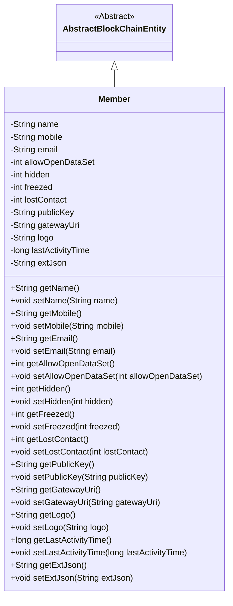

# Basic Information

|      |      |
|------|------|
| Name | Member |
| Language | .java |
| Code Path | WeFe/union/union-service/src/main/java/com/welab/wefe/union/service/entity/Member.java |
| Package Name | com.welab.wefe.union.service.entity |
| Dependencies | ['com.welab.wefe.common.data.mysql.entity.AbstractBlockChainEntity'] |
| Brief Description | Blockchain member class, including attributes such as name, contact information, status identifier, public key, gateway URI, last activity time, and corresponding methods. |

# Description

The code defines a class named `Member`, which inherits from `AbstractBlockChainEntity`. The class includes multiple private attributes, such as basic information like `name`, `mobile`, `email`, as well as status flags like `allowOpenDataSet`, `hidden`, `freezed`, and `lostContact`. Additionally, it contains blockchain-related attributes such as `publicKey`, `gatewayUri`, and `logo`, along with extended information like `lastActivityTime` and `extJson`. Each attribute has corresponding getter and setter methods for accessing and modifying its value.

# Class Summary

| Name   | Type  | Description |
|-------|------|-------------|
| Member | class | Blockchain member class, including name, contact information, status flag, public key, gateway URI, last activity time, and extended information. |

## Class Member

|      |      |
|------|------|
| Access Modifier | public |
| Type | class |
| Name | Member |
| Description | Blockchain member class, including name, contact information, status flag, public key, gateway URI, last activity time, and extended information. |

### UML Class Diagram

Class Diagram Description: The `Member` class inherits from the abstract class `AbstractBlockChainEntity` and includes multiple private attributes such as `name`, `mobile`, `email`, etc., along with their corresponding getter and setter methods. These attributes describe the basic information, status, and extended data of blockchain members, reflecting the core properties and behaviors of the member entity. The class diagram clearly illustrates the inheritance relationship and encapsulation characteristics of the attributes.

### Internal Method Call Graph

```mermaid
graph TD
    A["Class Member extends AbstractBlockChainEntity"]
    B["Property: String name"]
    C["Property: String mobile"]
    D["Property: String email"]
    E["Property: int allowOpenDataSet"]
    F["Property: int hidden"]
    G["Property: int freezed"]
    H["Property: int lostContact"]
    I["Property: String publicKey"]
    J["Property: String gatewayUri"]
    K["Property: String logo"]
    L["Property: long lastActivityTime"]
    M["Property: String extJson"]
    N["Method: getName/setName"]
    O["Method: getMobile/setMobile"]
    P["Method: getEmail/setEmail"]
    Q["Method: getAllowOpenDataSet/setAllowOpenDataSet"]
    R["Method: getHidden/setHidden"]
    S["Method: getFreezed/setFreezed"]
    T["Method: getLostContact/setLostContact"]
    U["Method: getPublicKey/setPublicKey"]
    V["Method: getGatewayUri/setGatewayUri"]
    W["Method: getLogo/setLogo"]
    X["Method: getLastActivityTime/setLastActivityTime"]
    Y["Method: getExtJson/setExtJson"]

    A --> B
    A --> C
    A --> D
    A --> E
    A --> F
    A --> G
    A --> H
    A --> I
    A --> J
    A --> K
    A --> L
    A --> M
    A --> N
    A --> O
    A --> P
    A --> Q
    A --> R
    A --> S
    A --> T
    A --> U
    A --> V
    A --> W
    A --> X
    A --> Y
```

This flowchart illustrates the complete structure of the Member class, which inherits from AbstractBlockChainEntity. It contains 12 private properties and corresponding getter/setter methods. The properties encompass primitive data types and String types, designed to store member names, contact information, status flags, cryptographic data, etc. Each property has strictly matched accessor methods, forming a standard JavaBean structure suitable for encapsulating member data in blockchain scenarios.

### Field List

| Name  | Type  | Description |
|-------|-------|------|
| name | String | private String variable name |
| extJson | String | Private string variable extJson |
| freezed | int | The variable `freezed` is a private integer type, used to mark the frozen state. |
| logo | String | The private string variable "logo" is used to store identification information. |
| mobile | String | Define a private string variable mobile. |
| lastActivityTime | long | Private long integer variable, recording the last activity time. |
| email | String | private String type variable email |
| gatewayUri | String | The private string variable gatewayUri is used to store the gateway URI address. |
| hidden | int | The private integer variable hidden. |
| allowOpenDataSet | int | Private integer variable used to control dataset access permissions. |
| publicKey | String | private String variable publicKey |
| lostContact | int | Private integer variable `lostContact`, used to record the number of times or state of lost connections. |

### Method List

| Name  | Type  | Description |
|-------|-------|------|
| setGatewayUri | void | The method to set the gateway URI assigns the parameter gatewayUri to the class member variable of the same name. |
| getLogo | String | Methods to obtain the logo string. |
| setLastActivityTime | void | Method to set the last activity time, assigning the parameter value to the class member variable lastActivityTime. |
| getLastActivityTime | long | Method to obtain the last activity time, returns the value of the variable lastActivityTime. |
| getName | String | This is a Java method that returns the value of the member variable "name" of type String. |
| setName | void | This is a Java method used to set the name property of an object. The method accepts a string parameter `name` and assigns it to the `name` field of the current object. |
| getGatewayUri | String | This is a Java method that returns the value of a string variable named gatewayUri. |
| getLostContact | int | The method to retrieve the number of lost contact attempts, returns the value of the lostContact variable. |
| setLogo | void | This is a Java method used to set the logo property of an object, which takes a string parameter logo and assigns it to the logo member variable of the object. |
| setHidden | void | Methods for setting hidden attributes, with the parameter being an integer `hidden`. |
| setAllowOpenDataSet | void | This method is used to set the maximum number of datasets allowed to be opened, with the parameter being an integer value. |
| getEmail | String | This is a Java method that returns the value of a string-type email variable. |
| getMobile | String | Methods to obtain a phone number, returning a string-type variable `mobile`. |
| setMobile | void | The method for setting the mobile number assigns the input parameter `mobile` to the `mobile` property of the current object. |
| getFreezed | int | Get the value of a freezed variable. |
| getHidden | int | Methods to obtain the hidden value, returns the integer variable `hidden`. |
| setPublicKey | void | The method to set the public key assigns the input string to the publicKey member variable of the class. |
| getAllowOpenDataSet | int | This is a Java method that returns the value of the integer variable allowOpenDataSet. |
| getExtJson | String | Methods to obtain the extJson string. |
| setLostContact | void | Methods to set the lost contact status, with the parameter as lostContact. |
| setEmail | void | This is a Java method used to set the email property of an object, which takes a string parameter email and assigns it to the email field of the current object. |
| getPublicKey | String | The method to obtain the public key returns the value of the publicKey variable. |
| setFreezed | void | Define the method setFreezed to set the value of the freezed variable. |
| setExtJson | void | This is a Java method used to set the extJson property value of an object. The method takes a string parameter extJson and assigns it to the property of the same name in the current object. |

