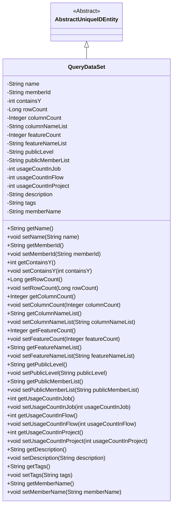

# Basic Information

|      |      |
|------|------|
| Name | QueryDataSet |
| Language | .java |
| Code Path | WeFe/union/union-service/src/main/java/com/welab/wefe/union/service/entity/QueryDataSet.java |
| Package Name | com.welab.wefe.union.service.entity |
| Dependencies | ['com.welab.wefe.common.data.mysql.entity.AbstractUniqueIDEntity'] |
| Brief Description | The QueryDataSet class includes attributes such as dataset name, member ID, row and column counts, feature list, public level, usage statistics, description, and labels, which are used to manage dataset metadata. |

# Description

The QueryDataSet class is an entity class that inherits from AbstractUniqueIDEntity, used to represent query datasets. This class includes multiple attributes, such as dataset name, member ID, whether it contains Y values, row count, column count, column name list, feature count, feature name list, public level, public member list, usage count in jobs, workflows, and projects, description, tags, and member name. Each attribute has corresponding getter and setter methods for retrieving and setting attribute values.

# Class Summary

| Name   | Type  | Description |
|-------|------|-------------|
| QueryDataSet | class | The QueryDataSet class contains attributes such as dataset name, member ID, row and column counts, feature information, access level, usage statistics, and descriptive labels, which are used for managing dataset metadata. |

## Class QueryDataSet

|      |      |
|------|------|
| Access Modifier | public |
| Type | class |
| Name | QueryDataSet |
| Description | The QueryDataSet class contains attributes such as dataset name, member ID, row and column counts, feature information, access level, usage statistics, and descriptive labels, which are used for managing dataset metadata. |

### UML Class Diagram

This code demonstrates a `QueryDataSet` class that inherits from `AbstractUniqueIDEntity`, primarily used for storing and managing dataset-related metadata. The class contains 15 private fields covering attributes such as dataset name, member ID, row/column statistics, feature information, public level, usage counts, etc., with corresponding getter and setter methods for each field. By inheriting, the class gains unique identifier functionality, making it suitable for modeling dataset metadata in data management systems.

### Internal Method Call Graph

```mermaid
graph TD
    A["Class QueryDataSet"]
    B["Inheritance: AbstractUniqueIDEntity"]
    C["Attribute: String name"]
    D["Attribute: String memberId"]
    E["Attribute: int containsY"]
    F["Attribute: Long rowCount"]
    G["Attribute: Integer columnCount"]
    H["Attribute: String columnNameList"]
    I["Attribute: Integer featureCount"]
    J["Attribute: String featureNameList"]
    K["Attribute: String publicLevel"]
    L["Attribute: String publicMemberList"]
    M["Attribute: int usageCountInJob"]
    N["Attribute: int usageCountInFlow"]
    O["Attribute: int usageCountInProject"]
    P["Attribute: String description"]
    Q["Attribute: String tags"]
    R["Attribute: String memberName"]
    S["Getter/Setter Methods: All attributes"]

    A --> B
    A --> C
    A --> D
    A --> E
    A --> F
    A --> G
    A --> H
    A --> I
    A --> J
    A --> K
    A --> L
    A --> M
    A --> N
    A --> O
    A --> P
    A --> Q
    A --> R
    A --> S
```

This code defines a Java class named QueryDataSet, which inherits from AbstractUniqueIDEntity. The class contains 16 private attributes covering various metadata of a dataset, such as name, member ID, row/column statistics, feature information, usage counts, and descriptions. Each attribute is accompanied by corresponding getter and setter methods for encapsulating attribute access and modification. This class is primarily used to represent structured information of query datasets, with attributes comprehensively describing the metadata characteristics and usage scenarios of datasets. The inheritance relationship indicates that this class may possess unique identification functionality defined by its parent class.

### Field List

| Name  | Type  | Description |
|-------|-------|------|
| usageCountInFlow | int | Private integer variable that records the number of uses in the process. |
| featureCount | Integer | Private integer variable of the class, recording the number of features. |
| containsY | int | The private integer variable containsY. |
| publicMemberList | String | The private string variable publicMemberList is used to store the public member list. |
| description | String | Private string type variable description. |
| memberName | String | The member variable memberName, of type String, with private access. |
| featureNameList | String | Private string variable used to store the list of feature names. |
| memberId | String | Member ID string variable |
| usageCountInProject | int | Project Internal Usage Counter |
| tags | String | Declare a private string variable tags. |
| columnCount | Integer | Private integer variable, recording the number of columns. |
| rowCount | Long | Private long integer variable used to record the number of lines. |
| columnNameList | String | The field columnNameList stores a list of column names, with the type being String. |
| name | String | private String variable name |
| usageCountInJob | int | Private integer variable, recording the number of uses in the job. |
| publicLevel | String | The private string variable publicLevel is used to store public level information. |

### Method List

| Name  | Type  | Description |
|-------|-------|------|
| setColumnNameList | void | Methods for setting the column name list, assigning the input parameter to the member variable columnNameList of the class. |
| getDescription | String | Methods for obtaining descriptive information, returning the value of the string-type description variable. |
| getPublicMemberList | String | The method to obtain the public member list returns a string-type variable publicMemberList. |
| getColumnCount | Integer | Methods to get the number of columns, returns an integer value columnCount. |
| setName | void | Methods for setting the object name, assigning the parameter `name` to the `name` property of the object. |
| getUsageCountInJob | int | Get the usage count in the current job. |
| getTags | String | Methods to obtain the tag string, directly return the value of the member variable tags. |
| setTags | void | Set the label string. |
| getMemberName | String | The method to obtain the member name returns the value of the member variable `memberName`. |
| setMemberName | void | Methods for setting member names, assigning input parameters to the member variables of the class. |
| setFeatureCount | void | Methods for setting the number of features, assigning the input parameter to the class variable featureCount. |
| setColumnCount | void | Method to set the number of columns, which accepts an integer parameter columnCount and assigns it to the class member variable columnCount. |
| getMemberId | String | The method to obtain the member ID, which returns a string-type memberId. |
| setUsageCountInFlow | void | Set the public method for the number of uses within the flow, with the parameter as an integer usageCountInFlow. |
| getColumnNameList | String | This method returns a list of column name strings. |
| getName | String | This is a Java method that returns the value of the private variable name. |
| setPublicLevel | void | Define the public method setPublicLevel to set the value of the member variable publicLevel. |
| setUsageCountInJob | void | This is a Java method used to set the usage count variable in a job. The method accepts an integer parameter and assigns it to the class member variable `usageCountInJob`. |
| setRowCount | void | The method to set the number of rows assigns the input long integer value to the rowCount property of the class. |
| getFeatureNameList | String | Method to obtain the list of feature names, returns a string-type featureNameList. |
| setPublicMemberList | void | Methods for setting public member lists, which assign input strings to the public member list variables of the class. |
| getUsageCountInFlow | int | Get the usage count in the process. |
| getRowCount | Long | The method returns the line count value. |
| setMemberId | void | The method to set the member ID assigns the input string to the class's member variable `memberId`. |
| setUsageCountInProject | void | Method to set the usage count within the project, with the parameter being usageCountInProject. |
| getUsageCountInProject | int | Method to obtain the integer value of usage count within a project. |
| getContainsY | int | Get the integer value of containsY. |
| setDescription | void | This is a Java method used to set the description property of an object. The method takes a string parameter named description and assigns it to the description member variable of the object. |
| setFeatureNameList | void | The method for setting the feature name list assigns the input string to the class member variable `featureNameList`. |
| getFeatureCount | Integer | Method to obtain the number of features, returns the integer variable featureCount. |
| setContainsY | void | The method to set the containsY property, with a parameter of type int. |
| getPublicLevel | String | Public method to obtain the publicLevel value. |

