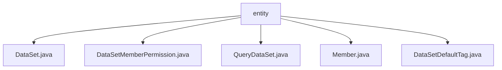

# Basic Information

|      |      |
|------|------|
| Name | entity |
| Language | .java |
| Code Path | WeFe/union/union-service/src/main/java/com/welab/wefe/union/service/entity |
| Package Name | docs.union.union-service.src.main.java.com.welab.wefe.union.service.entity |
| Brief Description | The DataSet class contains dataset attributes and access methods. The DataSetMemberPermission class manages dataset member permissions. The QueryDataSet class extends dataset query functionality. The Member class stores member information and status. The DataSetDefaultTag class handles dataset tags. |

# Description

## Overview  
The core responsibility of this module is to manage dataset metadata and member permissions in federated learning, functioning similarly to a data asset catalog service. The interface specification uniformly adopts the Getter/Setter pattern to access entity attributes. Key data structures include DataSet (basic dataset attributes), DataSetMemberPermission (member permission mappings), and Member (node member information). External dependencies involve the blockchain base entity AbstractBlockChainEntity. For example, DataSet contains machine learning features such as feature name lists, while DataSetDefaultTag implements tag management.

## Main Business Scenarios  
The module supports permission control and sharing processes for datasets in federated learning, employing an "application-authorization" interaction model. Typical applications include: 1) Members register node information via the Member entity; 2) DataSet and QueryDataSet enable dataset metadata queries; 3) DataSetMemberPermission controls cross-institution data access. For instance, the publicLevel field implements tiered disclosure, combined with the allowOpenDataSet flag to achieve dynamic authorization.

### Package Internal Structure View

This flowchart illustrates the file structure relationships within the entity directory of the union-service module in the WeFe project. The root node is the entity folder, which contains five Java entity class files: DataSet.java, DataSetMemberPermission.java, QueryDataSet.java, Member.java, and DataSetDefaultTag.java. These files belong to the data model layer and are used to define core data structures in the federation service, including business entities such as datasets, member permissions, and default tags.

# File List

| Name   | Type  | Description |
|-------|------|-------------|
| [DataSet.java](DataSet.md) | file | The DataSet class inherits from AbstractBlockChainEntity and includes attributes such as name, member ID, row and column counts, features, public level, usage statistics, description, and tags, along with their corresponding getter and setter methods. |
| [DataSetMemberPermission.java](DataSetMemberPermission.md) | file | The `DataSetMemberPermission` class extends `AbstractBlockChainEntity`, containing fields for dataset ID and member ID, and provides constructor methods along with getter/setter methods. |
| [QueryDataSet.java](QueryDataSet.md) | file | The QueryDataSet class includes attributes such as dataset name, member ID, row and column counts, feature list, public level, usage statistics, description, and labels, which are used to manage dataset metadata. |
| [Member.java](Member.md) | file | Blockchain member class, containing attributes such as name, contact information, status identifier, public key, gateway URI, last activity time, and corresponding methods. |
| [DataSetDefaultTag.java](DataSetDefaultTag.md) | file | The DataSetDefaultTag class inherits from AbstractUniqueIDEntity and includes a private property tagName along with its getter and setter methods. |

