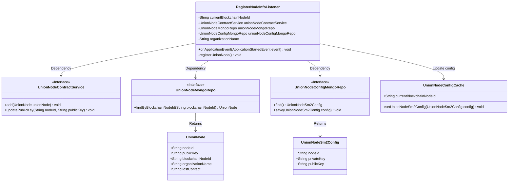
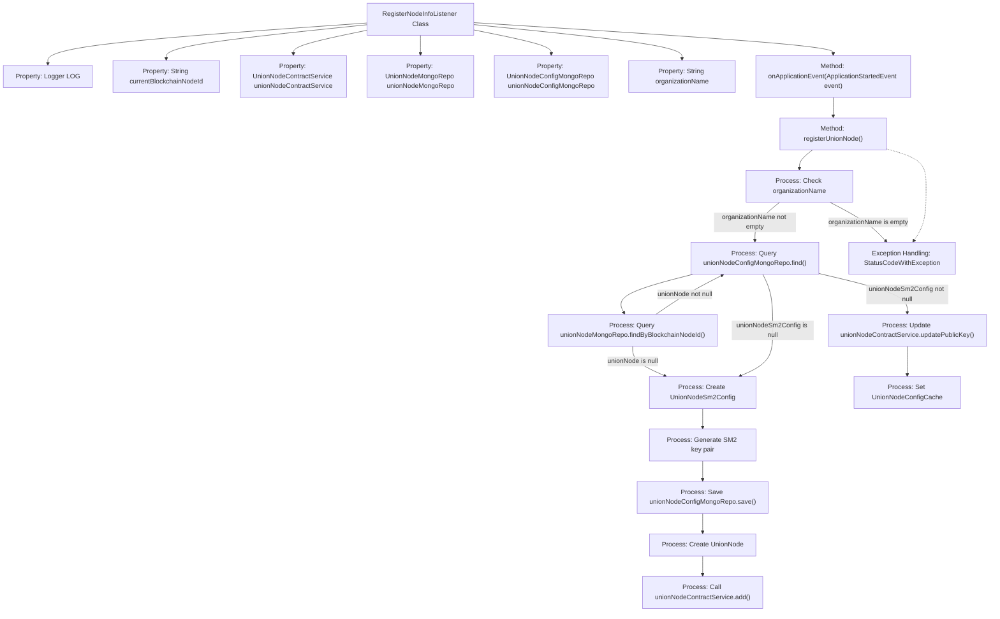

# Basic Information

|      |      |
|------|------|
| Name | RegisterNodeInfoListener |
| Language | .java |
| Code Path | WeFe/union/union-service/src/main/java/com/welab/wefe/union/service/listener/RegisterNodeInfoListener.java |
| Package Name | com.welab.wefe.union.service.listener |
| Dependencies | ['com.welab.wefe.common.data.mongodb.entity.union.UnionNode', 'com.welab.wefe.common.data.mongodb.entity.union.UnionNodeSm2Config', 'com.welab.wefe.common.data.mongodb.repo.UnionNodeConfigMongoRepo', 'com.welab.wefe.common.data.mongodb.repo.UnionNodeMongoRepo', 'com.welab.wefe.common.exception.StatusCodeWithException', 'com.welab.wefe.common.util.SM2Util', 'com.welab.wefe.common.util.StringUtil', 'com.welab.wefe.union.service.cache.UnionNodeConfigCache', 'com.welab.wefe.union.service.constant.UnionNodeConfigType', 'com.welab.wefe.union.service.service.contract.UnionNodeContractService', 'org.slf4j.Logger', 'org.slf4j.LoggerFactory', 'org.springframework.beans.factory.annotation.Autowired', 'org.springframework.beans.factory.annotation.Value', 'org.springframework.boot.context.event.ApplicationStartedEvent', 'org.springframework.context.ApplicationListener', 'org.springframework.stereotype.Component'] |
| Brief Description | The component class `RegisterNodeInfoListener` monitors application startup events and automatically registers node information to the blockchain. After checking the configuration, it generates or updates an SM2 key pair, saves it to MongoDB, and synchronizes the public key through the contract service. If the operation fails, the system exits. |

# Description

RegisterNodeInfoListener is a Spring component that listens for application startup events. It relies on multiple services and configurations, including node ID, contract service, Mongo repository, and organization name. Its primary function is to register consortium nodes upon application startup. If the organization name is not configured, it logs an error and exits. It checks whether node configuration exists in Mongo; if not, it generates an SM2 key pair and saves it. Depending on whether the node exists, it performs either an add or update operation, including key updates. Finally, it caches the node ID and configuration. In case of exceptions, it logs the error and exits.

# Class Summary

| Name   | Type  | Description |
|-------|------|-------------|
| RegisterNodeInfoListener | class | Register node listener, check configuration and register node information upon startup, generate SM2 key pair, update or save node data to blockchain and database. |

## Class RegisterNodeInfoListener

|      |      |
|------|------|
| Access Modifier | @Component;public |
| Type | class |
| Name | RegisterNodeInfoListener |
| Description | Register node listener, check configuration and register node information upon startup, generate SM2 key pair, update or save node data to blockchain and database. |

### UML Class Diagram

This diagram illustrates the RegisterNodeInfoListener class and its dependencies. As a Spring component, it listens for application startup events and accomplishes node registration by invoking interfaces such as UnionNodeContractService, UnionNodeMongoRepo, and UnionNodeConfigMongoRepo. Key processes include: checking configurations, generating/updating SM2 key pairs, saving node information to blockchain and database, and updating cached configurations. The diagram clearly presents dependency relationships between classes and interface implementation relationships.

### Internal Method Call Graph

This flowchart illustrates the main execution flow of the RegisterNodeInfoListener class. When the application started event is triggered, the registerUnionNode method is called. This method first checks the organization name configuration, then queries node configuration information. Based on the query results, it decides whether to create a new node or update an existing one, including operations such as generating SM2 key pairs, saving configurations, and calling contract services. Finally, it sets cache information and terminates the program in case of exceptions. The entire process demonstrates the complete logic of node registration and exception handling mechanisms.

### Field List

| Name  | Type  | Description |
|-------|-------|------|
| currentBlockchainNodeId | String | The code automatically injects the ID string of the current blockchain node via @Autowired. |
| unionNodeMongoRepo | UnionNodeMongoRepo | Use @Autowired to automatically inject the UnionNodeMongoRepo repository instance. |
| LOG = LoggerFactory.getLogger(RegisterNodeInfoListener.class) | Logger | Define a static log object LOG for the RegisterNodeInfoListener class to record log information. |
| unionNodeContractService | UnionNodeContractService | The code snippet uses @Autowired to automatically inject an instance of the UnionNodeContractService. |
| unionNodeConfigMongoRepo | UnionNodeConfigMongoRepo | Using @Autowired to automatically inject an instance of UnionNodeConfigMongoRepo. |
| organizationName | String | The code uses Spring's @Value annotation to inject the value of the organization.name property from the configuration file into the private variable organizationName. |

### Method List

| Name  | Type  | Description |
|-------|-------|------|
| onApplicationEvent | void | This code rewrites the Spring Boot application startup event handling method, calling the registerUnionNode() function for node registration during application startup. |
| registerUnionNode | void | Method for registering a consortium node: Check the organization name, query or generate an SM2 key pair, save the node configuration, and update the blockchain. Exit if failed. |

