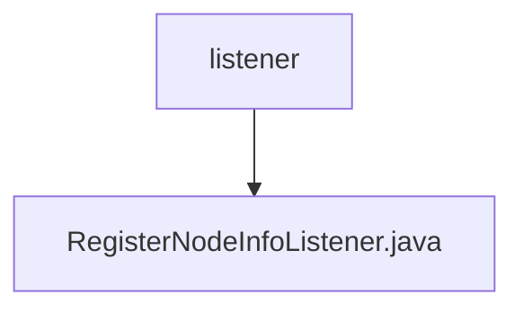

# Basic Information

|      |      |
|------|------|
| Name | listener |
| Language | .java |
| Code Path | WeFe/union/union-service/src/main/java/com/welab/wefe/union/service/listener |
| Package Name | docs.union.union-service.src.main.java.com.welab.wefe.union.service.listener |
| Brief Description | The component class RegisterNodeInfoListener monitors application startup events and automatically registers node information to the blockchain. After checking the configuration, it generates or updates an SM2 key pair, saves it to MongoDB, and synchronizes the public key through the contract service. If this process fails, the system will exit. |

# Description

RegisterNodeInfoListener is a Spring component that listens for application startup events. It relies on multiple services and configurations, including node ID, contract service, Mongo repository, and organization name. Its primary function is to register consortium nodes upon application startup. If the organization name is not configured, it logs an error and exits. It checks whether node configuration exists in Mongo; if not, it generates an SM2 key pair and saves it. Depending on whether the node exists, it performs either an add or update operation, including key updates. Finally, it caches the node ID and configuration. In case of exceptions, it logs the error and exits.

### Package Internal Structure View

This flowchart illustrates the directory structure of the listener in the union-service module of the WeFe project. The top-level node is the listener folder, which contains a specific listener implementation file, RegisterNodeInfoListener.java. This structure reflects a typical Java project listener layer design pattern, where listener classes are centrally managed in a specific directory.

# File List

| Name   | Type  | Description |
|-------|------|-------------|
| [RegisterNodeInfoListener.java](RegisterNodeInfoListener.md) | file | The component class RegisterNodeInfoListener monitors application startup events and automatically registers node information to the blockchain. After checking the configuration, it generates or updates an SM2 key pair, saves it to MongoDB, and synchronizes the public key through the contract service. If the operation fails, the system will exit. |

