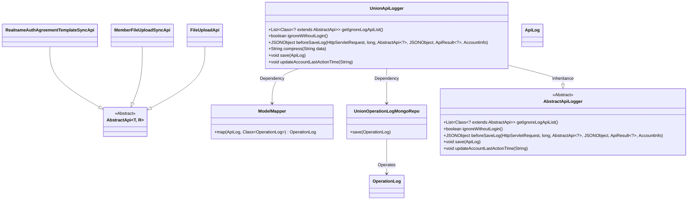
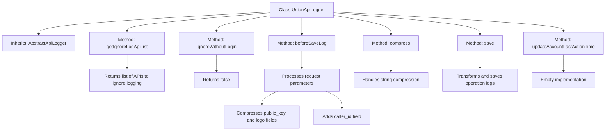

# Basic Information

|      |      |
|------|------|
| Name | UnionApiLogger |
| Language | .java |
| Code Path | WeFe/union/union-service/src/main/java/com/welab/wefe/union/service/operation/UnionApiLogger.java |
| Package Name | com.welab.wefe.union.service.operation |
| Dependencies | ['com.alibaba.fastjson.JSONObject', 'com.welab.wefe.common.data.mongodb.entity.common.OperationLog', 'com.welab.wefe.common.data.mongodb.repo.UnionOperationLogMongoRepo', 'com.welab.wefe.common.web.Launcher', 'com.welab.wefe.common.web.api.base.AbstractApi', 'com.welab.wefe.common.web.delegate.api_log.AbstractApiLogger', 'com.welab.wefe.common.web.delegate.api_log.ApiLog', 'com.welab.wefe.common.web.dto.ApiResult', 'com.welab.wefe.common.web.service.account.AccountInfo', 'com.welab.wefe.union.service.api.common.MemberFileUploadSyncApi', 'com.welab.wefe.union.service.api.common.RealnameAuthAgreementTemplateSyncApi', 'com.welab.wefe.union.service.api.member.FileUploadApi', 'com.welab.wefe.union.service.util.ModelMapper', 'org.springframework.stereotype.Component', 'javax.servlet.http.HttpServletRequest', 'java.util.Arrays', 'java.util.List'] |
| Brief Description | The UnionApiLogger class inherits from AbstractApiLogger and implements logging functionality. It excludes logs for specific APIs, processes request parameters such as compressed public keys and logos, adds caller IDs, and stores logs in MongoDB. |

# Description

UnionApiLogger is a component class that inherits from AbstractApiLogger, primarily used for API logging. It defines a list of APIs to exclude from logging, including file upload and synchronization-related APIs. This class implements logging logic, which involves compressing sensitive data (such as public keys and logos), extracting caller IDs, and saving logs to MongoDB. Additionally, it does not exclude unauthenticated requests but has not implemented the functionality to update the account's last operation time.

# Class Summary

| Name   | Type  | Description |
|-------|------|-------------|
| UnionApiLogger | class | The UnionApiLogger class inherits from AbstractApiLogger, overriding log processing methods including ignoring specific API logs, compressing sensitive data, and saving logs to MongoDB. |

## Class UnionApiLogger

|      |      |
|------|------|
| Access Modifier | @Component;public |
| Type | class |
| Name | UnionApiLogger |
| Description | The UnionApiLogger class inherits from AbstractApiLogger, overriding log processing methods including ignoring specific API logs, compressing sensitive data, and saving logs to MongoDB. |

### UML Class Diagram

Class Diagram Description:
UnionApiLogger is a concrete implementation of AbstractApiLogger, primarily used for API call logging. It overrides several parent class methods including retrieving the ignore-log API list, preprocessing log data, and saving logs. The class converts ApiLog to OperationLog via ModelMapper and persists data using UnionOperationLogMongoRepo. Additionally, it provides a compress method for sensitive data desensitization. The diagram also illustrates inheritance relationships with multiple API classes (e.g., FileUploadApi) and dependency relationships with utility classes (ModelMapper) and storage classes (UnionOperationLogMongoRepo).

### Internal Method Call Graph

This code defines a UnionApiLogger class that inherits from AbstractApiLogger, primarily used for API logging and processing. It implements several key methods: getIgnoreLogApiList returns a list of APIs to exclude from logging, beforeSaveLog processes request parameters and compresses sensitive data, the compress method desensitizes long strings, and the save method stores logs in MongoDB. The class also includes an empty implementation of updateAccountLastActionTime. Overall, it provides functionality for recording, processing, and storing API logs.

### Field List

| Name  | Type  | Description |
|-------|-------|------|

### Method List

| Name  | Type  | Description |
|-------|-------|------|
| getIgnoreLogApiList | List<Class<? extends AbstractApi>> | This method returns a list of API classes that ignore logging, including three types of APIs: file upload, member file synchronization, and real-name authentication protocol template synchronization. |
| compress | String | This method compresses the input string into a combination of the first 50 characters, 20 asterisks, and the last 50 characters, preserving the key information at both ends. |
| beforeSaveLog | JSONObject | The method processes the request parameters before saving the log, compresses the `public_key` and `logo` fields in the `data`, extracts the `caller_id` and updates it into the `data`, and finally returns the processed parameters. |
| save | void | This method maps the ApiLog object to OperationLog and saves it to MongoDB. |
| ignoreWithoutLogin | boolean | Method override, returning false indicates that unauthenticated requests will not be ignored. |
| updateAccountLastActionTime | void | Empty method, the functionality to update the account's last operation time has not been implemented. |

