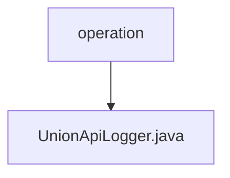

# Basic Information

|      |      |
|------|------|
| Name | operation |
| Language | .java |
| Code Path | WeFe/union/union-service/src/main/java/com/welab/wefe/union/service/operation |
| Package Name | docs.union.union-service.src.main.java.com.welab.wefe.union.service.operation |
| Brief Description | The `UnionApiLogger` class inherits from `AbstractApiLogger` and implements logging functionality. It excludes logs for specific APIs, processes request parameters such as compressed public keys and logos, adds caller IDs, and saves logs to MongoDB. |

# Description

UnionApiLogger is a component class that inherits from AbstractApiLogger, primarily used for API logging. It defines a list of APIs to exclude from logging, including file upload and synchronization-related APIs. This class implements the logging logic, which involves compressing sensitive data (such as public keys and logos), extracting caller IDs, and saving logs to MongoDB. Additionally, it does not exclude unauthenticated requests but has not implemented the functionality to update the last operation time of accounts.

### Package Internal Structure View

This flowchart illustrates the directory structure of the `operation` folder in the `union-service` module of the WeFe project. The parent node `operation` contains a child node `UnionApiLogger.java`, indicating that this Java file resides within the `operation` directory. This is a simple single-level directory structure that clearly demonstrates the hierarchical relationship between the file and its parent directory.

# File List

| Name   | Type  | Description |
|-------|------|-------------|
| [UnionApiLogger.java](UnionApiLogger.md) | file | The UnionApiLogger class inherits from AbstractApiLogger and implements logging functionality. It ignores logs for specific APIs, processes request parameters such as compressed public keys and logos, adds caller IDs, and saves logs to MongoDB. |

