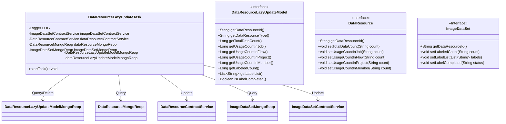
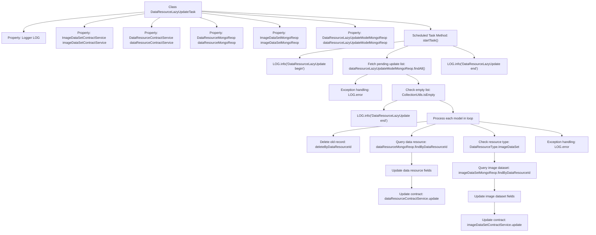

# Basic Information

|      |      |
|------|------|
| Name | DataResourceLazyUpdateTask |
| Language | .java |
| Code Path | WeFe/union/union-service/src/main/java/com/welab/wefe/union/service/scheduler/DataResourceLazyUpdateTask.java |
| Package Name | com.welab.wefe.union.service.scheduler |
| Dependencies | ['com.welab.wefe.common.data.mongodb.entity.union.DataResource', 'com.welab.wefe.common.data.mongodb.entity.union.DataResourceLazyUpdateModel', 'com.welab.wefe.common.data.mongodb.entity.union.ImageDataSet', 'com.welab.wefe.common.data.mongodb.repo.DataResourceLazyUpdateModelMongoReop', 'com.welab.wefe.common.data.mongodb.repo.DataResourceMongoReop', 'com.welab.wefe.common.data.mongodb.repo.ImageDataSetMongoReop', 'com.welab.wefe.common.wefe.enums.DataResourceType', 'com.welab.wefe.union.service.service.contract.DataResourceContractService', 'com.welab.wefe.union.service.service.contract.ImageDataSetContractService', 'org.apache.commons.collections4.CollectionUtils', 'org.slf4j.Logger', 'org.slf4j.LoggerFactory', 'org.springframework.beans.factory.annotation.Autowired', 'org.springframework.context.annotation.Configuration', 'org.springframework.scheduling.annotation.Scheduled', 'java.util.List'] |
| Brief Description | This is a scheduled task class designed to delay the updating of data resources and image dataset information. It reads pending update records from MongoDB, updates the usage statistics of data resources and the annotation information of image datasets, and finally deletes the processed records. The task executes every 30 seconds. |

# Description

This is a Java configuration class named `DataResourceLazyUpdateTask`, designed to perform delayed update tasks for data resources. The class executes the `startTask` method at scheduled intervals via the `@Scheduled` annotation, with an initial delay of 10 seconds and a fixed delay configurable (defaulting to 30 seconds). The task first queries a list of pending updates from MongoDB, then processes each record sequentially: deleting the original record, updating the total data volume and usage count of the data resource, and for image dataset types, additionally updating annotation-related fields. Detailed logs are recorded throughout the process, including start/end markers and error messages. Data operations are completed through multiple auto-injected services and a MongoDB repository.

# Class Summary

| Name   | Type  | Description |
|-------|------|-------------|
| DataResourceLazyUpdateTask | class | Scheduled task class, used for delayed updates of data resources and image dataset information, including total data count, usage frequency, and annotation status. |

## Class DataResourceLazyUpdateTask

|      |      |
|------|------|
| Access Modifier | @Configuration;public |
| Type | class |
| Name | DataResourceLazyUpdateTask |
| Description | Scheduled task class, used for delayed updates of data resources and image dataset information, including total data count, usage frequency, and annotation status. |

### UML Class Diagram

This code illustrates a Spring scheduled task class `DataResourceLazyUpdateTask` designed for lazy updating of data resource statistics. The class queries data through multiple MongoDB repository interfaces and utilizes contract services to update statistical fields (such as usage counts, labeled quantities, etc.) for both `DataResource` and `ImageDataSet`. The core workflow includes: retrieving pending update lists, processing resources individually, and updating primary resource and image dataset information. The class diagram clearly reflects the dependency relationships between the task class and various data access layer components, as well as the field structures of key interfaces.

### Internal Method Call Graph

This code represents a Spring scheduled task class designed for lazy updates of data resources and image dataset information. The flowchart illustrates the complete workflow from task initiation to completion: first retrieving the pending update list, then processing each data resource in a loop. After updating basic information, additional image-related fields are updated for image dataset types. The entire process includes exception handling and logging, utilizing multiple MongoDB repositories and contract services for data operations.

### Field List

| Name  | Type  | Description |
|-------|-------|------|
| dataResourceMongoReop | DataResourceMongoReop | Using @Autowired to automatically inject an instance of DataResourceMongoReop. |
| imageDataSetMongoReop | ImageDataSetMongoReop | Using @Autowired to automatically inject an instance of the ImageDataSetMongoReop repository. |
| LOG = LoggerFactory.getLogger(this.getClass()) | Logger | Declare a protected final log object LOG, initialized with the current class name. |
| dataResourceContractService | DataResourceContractService | Automatically inject data resource contract service instances. |
| imageDataSetContractService | ImageDataSetContractService | The code snippet uses @Autowired to automatically inject an instance of the ImageDataSetContractService. |
| dataResourceLazyUpdateModelMongoReop | DataResourceLazyUpdateModelMongoReop | Use @Autowired to automatically inject an instance of DataResourceLazyUpdateModelMongoReop. |

### Method List

| Name  | Type  | Description |
|-------|-------|------|
| startTask | void | Scheduled task, initial delay of 10 seconds, interval of 30 seconds, queries and updates data resource information, including statistical data and image dataset label information, logs exceptions when errors occur. |

