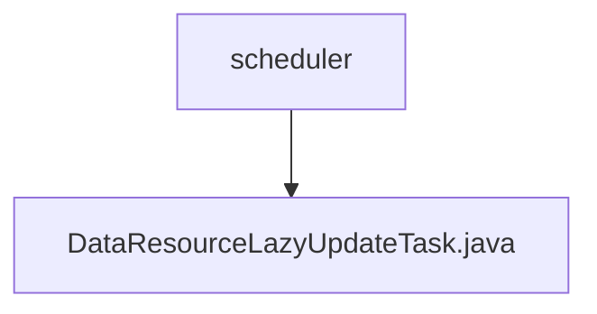

# Basic Information

|      |      |
|------|------|
| Name | scheduler |
| Language | .java |
| Code Path | WeFe/union/union-service/src/main/java/com/welab/wefe/union/service/scheduler |
| Package Name | docs.union.union-service.src.main.java.com.welab.wefe.union.service.scheduler |
| Brief Description | This is a scheduled task class designed for delayed updates of data resources and image dataset information. It reads pending update records from MongoDB, updates the usage statistics of data resources and annotation information of image datasets, and finally deletes the processed records. The task executes every 30 seconds. |

# Description

This is a Java configuration class named DataResourceLazyUpdateTask, designed to perform delayed update tasks for data resources. The class uses the @Scheduled annotation to execute the startTask method at fixed intervals, with an initial delay of 10 seconds and a fixed delay configurable (defaulting to 30 seconds). The task first queries a list of pending updates from MongoDB, then processes each entry sequentially: deleting the original record, updating the total data volume and usage count of the data resource, and if the type is an image dataset, also updating annotation-related fields. Detailed logs are recorded during processing, including start/end markers and error messages. Data operations are completed through multiple auto-injected services and Mongo repositories.

### Package Internal Structure View

This flowchart illustrates the scheduling task structure within the union-service module of the WeFe project. The root node is the scheduler directory, which contains a specific task implementation file, DataResourceLazyUpdateTask.java. This structure reflects a typical Java project task scheduling layer design, where the scheduler directory serves as a container, and concrete scheduled task classes act as its child nodes to implement specific business logic.

# File List

| Name   | Type  | Description |
|-------|------|-------------|
| [DataResourceLazyUpdateTask.java](DataResourceLazyUpdateTask.md) | file | This is a scheduled task class designed for delayed updates of data resources and image dataset information. It reads pending update records from MongoDB, updates the usage statistics of data resources and annotation information of image datasets, and finally deletes the processed records. The task executes every 30 seconds. |

