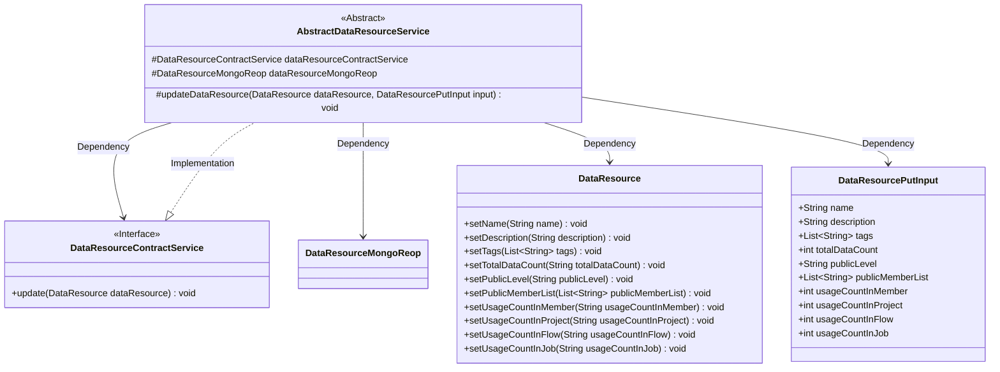
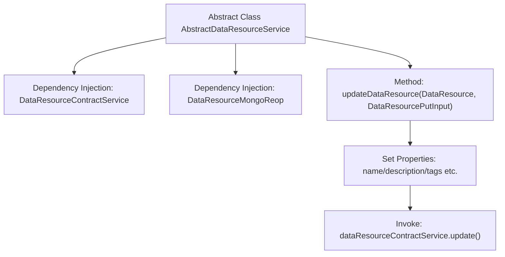

# Basic Information

|      |      |
|------|------|
| Name | AbstractDataResourceService |
| Language | .java |
| Code Path | WeFe/union/union-service/src/main/java/com/welab/wefe/union/service/service/AbstractDataResourceService.java |
| Package Name | com.welab.wefe.union.service.service |
| Dependencies | ['com.welab.wefe.common.data.mongodb.entity.union.DataResource', 'com.welab.wefe.common.data.mongodb.repo.DataResourceMongoReop', 'com.welab.wefe.common.exception.StatusCodeWithException', 'com.welab.wefe.union.service.dto.dataresource.DataResourcePutInput', 'com.welab.wefe.union.service.service.contract.DataResourceContractService', 'org.springframework.beans.factory.annotation.Autowired'] |
| Brief Description | The abstract class AbstractDataResourceService provides data resource update functionality, relying on ContractService and MongoReop. It updates the dataResource property through input parameters and invokes ContractService for updates. |

# Description

This is an abstract class AbstractDataResourceService, which includes two auto-injected dependencies: DataResourceContractService and DataResourceMongoReop. It provides a protected method updateDataResource for updating data resource objects. The method takes a DataResource object and a DataResourcePutInput input parameter, setting the attribute values from the input parameters—such as name, description, tags, total data volume, public level, public member list, and various usage counts—onto the data resource object. Finally, it performs the update operation via dataResourceContractService. This method may throw a StatusCodeWithException.

# Class Summary

| Name   | Type  | Description |
|-------|------|-------------|
| AbstractDataResourceService | class | The abstract class AbstractDataResourceService contains data resource update logic, which updates fields such as name and description through injected services and repository operations, then saves the changes. |

## Class AbstractDataResourceService

|      |      |
|------|------|
| Access Modifier | public abstract |
| Type | class |
| Name | AbstractDataResourceService |
| Description | The abstract class AbstractDataResourceService contains data resource update logic, which updates fields such as name and description through injected services and repository operations, then saves the changes. |

### UML Class Diagram

This class diagram illustrates an abstract class `AbstractDataResourceService` and its related dependencies. The class implements data resource update functionality through the `DataResourceContractService` interface and `DataResourceMongoReop` class. Its primary method `updateDataResource` accepts a `DataResource` object and `DataResourcePutInput` input parameters, updates resource attributes, and then invokes the contract service for persistence. The diagram clearly shows the protected fields of the abstract class, method visibility, and the dependency/implementation relationships between classes.

### Internal Method Call Graph

This flowchart illustrates the core structure of the abstract class AbstractDataResourceService, which includes two auto-injected service components and a key update method. The updateDataResource method first sets multiple property values of the DataResource object and finally completes the update operation through dataResourceContractService. The process clearly demonstrates the complete handling chain from parameter input to property setting and then to service invocation.

### Field List

| Name  | Type  | Description |
|-------|-------|------|
| dataResourceMongoReop | DataResourceMongoReop | Using @Autowired to automatically inject the DataResourceMongoReop data repository instance. |
| dataResourceContractService | DataResourceContractService | Automatically inject data resource contract service instances. |

### Method List

| Name  | Type  | Description |
|-------|-------|------|
| updateDataResource | void | Method for updating data resources: set the name, description, tags, total data volume, public level, list of public members, and various usage counts, then call the update service. |

