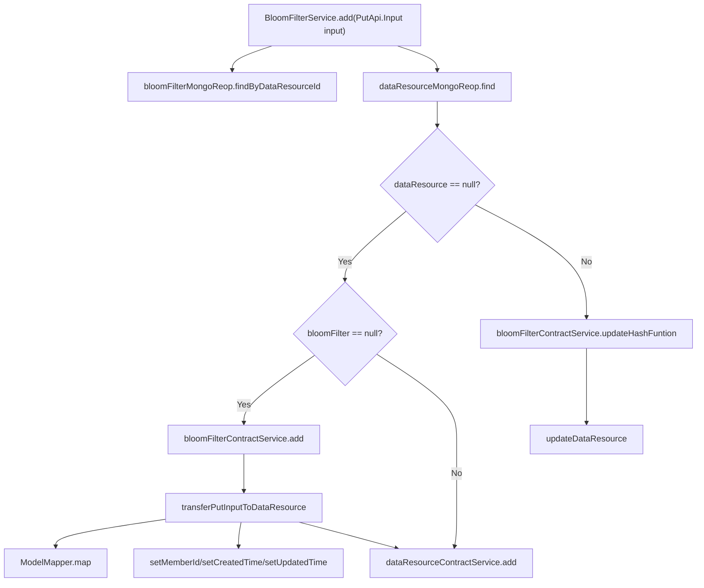

# Basic Information

|      |      |
|------|------|
| Name | BloomFilterService |
| Language | .java |
| Code Path | WeFe/union/union-service/src/main/java/com/welab/wefe/union/service/service/BloomFilterService.java |
| Package Name | com.welab.wefe.union.service.service |
| Dependencies | ['com.welab.wefe.common.data.mongodb.entity.union.BloomFilter', 'com.welab.wefe.common.data.mongodb.entity.union.DataResource', 'com.welab.wefe.common.data.mongodb.repo.BloomFilterMongoReop', 'com.welab.wefe.common.exception.StatusCodeWithException', 'com.welab.wefe.common.util.DateUtil', 'com.welab.wefe.union.service.api.dataresource.bloomfilter.PutApi', 'com.welab.wefe.union.service.service.contract.BloomFilterContractService', 'com.welab.wefe.union.service.util.ModelMapper', 'org.springframework.beans.factory.annotation.Autowired', 'org.springframework.stereotype.Service', 'java.util.Date'] |
| Brief Description | The BloomFilterService handles the addition and updating of data resources, checking whether the Bloom filter and data resources exist. If they do not exist, it creates them; if they exist, it updates the hash functions and data resources. |

# Description

BloomFilterService is a service class that inherits from AbstractDataResourceService. It handles Bloom filter-related operations by injecting BloomFilterContractService and BloomFilterMongoReop. The add method takes input parameters and checks whether the data resource exists. If the data resource does not exist and the Bloom filter also does not exist, it creates a new Bloom filter and data resource; if only the data resource is missing, it creates only the data resource. If the data resource already exists, it updates the Bloom filter's hash function and the data resource. The transferPutInputToDataResource method converts the input parameters into a DataResource object and sets the member ID, creation time, and update time.

# Class Summary

| Name   | Type  | Description |
|-------|------|-------------|
| BloomFilterService | class | The BloomFilterService handles the addition and updating of data resources, checking whether a resource exists. If it does not exist, it creates a BloomFilter and the data resource; if it exists, it updates the BloomFilter's hash functions and the data resource. |


## Class BloomFilterService

|      |      |
|------|------|
| Access Modifier | @Service;public |
| Type | class |
| Name | BloomFilterService |
| Description | The BloomFilterService handles the addition and updating of data resources, checking whether a resource exists. If it does not exist, it creates a BloomFilter and the data resource; if it exists, it updates the BloomFilter's hash functions and the data resource. |


### UML Class Diagram

```mermaid
classDiagram
    class AbstractDataResourceService {
        <<abstract>>
    }
    
    class BloomFilterService {
        -BloomFilterContractService bloomFilterContractService
        -BloomFilterMongoReop bloomFilterMongoReop
        +add(PutApi$Input input) void
        -transferPutInputToDataResource(PutApi$Input input) DataResource
    }
    
    class BloomFilterContractService {
        <<Interface>>
        +add(BloomFilter bloomFilter) void
        +updateHashFuntion(String dataResourceId, String hashFunction) void
    }
    
    class BloomFilterMongoReop {
        +findByDataResourceId(String dataResourceId) BloomFilter
    }
    
    class DataResource {
        -String memberId
        -String createdTime
        -String updatedTime
        +setMemberId(String memberId) void
        +setCreatedTime(String createdTime) void
        +setUpdatedTime(String updatedTime) void
    }
    
    class PutApi$Input {
        -String dataResourceId
        -String hashFunction
        -String curMemberId
        +getDataResourceId() String
        +getHashFunction() String
    }
    
    class BloomFilter {
        -String dataResourceId
        -String hashFunction
        +BloomFilter(String dataResourceId, String hashFunction)
    }
    
    AbstractDataResourceService <|-- BloomFilterService
    BloomFilterService --> BloomFilterContractService : Dependency
    BloomFilterService --> BloomFilterMongoReop : Dependency
    BloomFilterService --> DataResource : Creates
    BloomFilterService --> PutApi$Input : Processes Input
    BloomFilterContractService ..|> BloomFilter : Implements
```

This code demonstrates the implementation of a Bloom Filter Service (BloomFilterService), which inherits from the Abstract Data Resource Service (AbstractDataResourceService). Its primary functionality involves querying Bloom filters via BloomFilterMongoReop and determining whether to create or update data resources and Bloom filters based on input parameters. The class diagram clearly illustrates the dependency relationships between services, including interactions with the BloomFilterContractService interface, dependencies on the MongoDB repository BloomFilterMongoReop, and relationships with input/output data models (such as PutApi$Input and DataResource).


### Internal Method Call Graph



This code represents the core business logic of the BloomFilterService class, primarily handling the addition and updating of data resources. The flowchart clearly illustrates the complete execution path of the method: it first queries the BloomFilter and data resources, then determines subsequent operations based on whether the data resource exists. If the resource does not exist, it either creates a new resource or only adds the data resource depending on the BloomFilter's state; if it exists, it updates the hash function and modifies the resource. The helper method transferPutInputToDataResource is responsible for converting input parameters into data resource objects. The entire process demonstrates rigorous handling of data consistency and edge conditions.

### Field List

| Name  | Type  | Description |
|-------|-------|------|
| bloomFilterMongoReop | BloomFilterMongoReop | Use @Autowired to automatically inject the BloomFilterMongoReop instance. |
| bloomFilterContractService | BloomFilterContractService | Automatically inject the Bloom filter contract service instance. |

### Method List

| Name  | Type  | Description |
|-------|-------|------|
| transferPutInputToDataResource | DataResource | Convert the input object into a data resource object, then return it after setting the member ID, creation time, and update time. |
| add | void | The method `add` processes input data and checks the existence of resources. If the resources do not exist and there is no Bloom filter, both are created; if only the resources are missing, the resources are created. If the resources exist, the hash function of the Bloom filter is updated, and the resource data is updated. |


