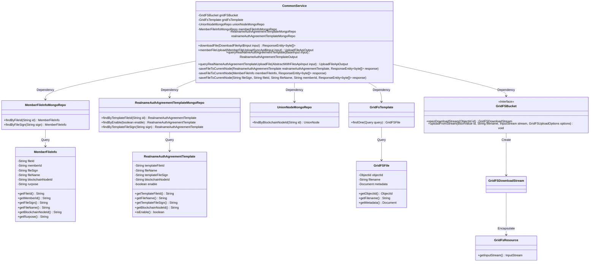

# Basic Information

|      |      |
|------|------|
| Name | CommonService |
| Language | .java |
| Code Path | WeFe/union/union-service/src/main/java/com/welab/wefe/union/service/service/CommonService.java |
| Package Name | com.welab.wefe.union.service.service |
| Dependencies | ['com.mongodb.client.gridfs.GridFSBucket', 'com.mongodb.client.gridfs.GridFSDownloadStream', 'com.mongodb.client.gridfs.model.GridFSFile', 'com.mongodb.client.gridfs.model.GridFSUploadOptions', 'com.welab.wefe.common.StatusCode', 'com.welab.wefe.common.data.mongodb.entity.union.MemberFileInfo', 'com.welab.wefe.common.data.mongodb.entity.union.RealnameAuthAgreementTemplate', 'com.welab.wefe.common.data.mongodb.entity.union.UnionNode', 'com.welab.wefe.common.data.mongodb.repo.MemberFileInfoMongoRepo', 'com.welab.wefe.common.data.mongodb.repo.RealnameAuthAgreementTemplateMongoRepo', 'com.welab.wefe.common.data.mongodb.repo.UnionNodeMongoRepo', 'com.welab.wefe.common.data.mongodb.util.QueryBuilder', 'com.welab.wefe.common.exception.StatusCodeWithException', 'com.welab.wefe.common.util.JObject', 'com.welab.wefe.common.util.Md5', 'com.welab.wefe.common.util.ThreadUtil', 'com.welab.wefe.common.util.UrlUtil', 'com.welab.wefe.common.web.dto.AbstractWithFilesApiInput', 'com.welab.wefe.common.web.dto.UploadFileApiOutput', 'com.welab.wefe.common.wefe.enums.FileRurpose', 'com.welab.wefe.union.service.api.common.DownloadFileApi', 'com.welab.wefe.union.service.api.common.MemberFileUploadSyncApi', 'com.welab.wefe.union.service.dto.base.BaseInput', 'com.welab.wefe.union.service.dto.common.RealnameAuthAgreementTemplateOutput', 'org.apache.commons.io.IOUtils', 'org.bson.BsonObjectId', 'org.bson.BsonValue', 'org.bson.Document', 'org.bson.types.ObjectId', 'org.springframework.beans.factory.annotation.Autowired', 'org.springframework.data.mongodb.gridfs.GridFsResource', 'org.springframework.data.mongodb.gridfs.GridFsTemplate', 'org.springframework.http', 'org.springframework.stereotype.Service', 'org.springframework.web.client.RestTemplate', 'java.io.ByteArrayInputStream', 'java.net.URLEncoder'] |
| Brief Description | The CommonService class provides file download, upload, and real-name authentication template query functionalities. It utilizes GridFS for file storage, supports cross-node downloads and local storage, and includes permission checks and exception handling. |

# Description

CommonService is a Spring service class primarily designed for file management and download functionalities. It relies on GridFSBucket, GridFsTemplate, and multiple MongoDB repositories for file operations. Key features include: checking permissions during file downloads, retrieving files from other nodes and saving them to the current node if they do not exist; verifying signatures and storing member-uploaded files in GridFS; querying information about real-name authentication agreement template files; and handling the upload of real-name authentication agreement template files. Additionally, it includes private methods for saving files to the current node. All operations incorporate exception handling and status code validation.

# Class Summary

| Name   | Type  | Description |
|-------|------|-------------|
| CommonService | class | The CommonService class provides file download, upload, and real-name authentication template query functionalities. It utilizes MongoDB for file information storage and supports cross-node file synchronization and permission verification. |

## Class CommonService

|      |      |
|------|------|
| Access Modifier | @Service;public |
| Type | class |
| Name | CommonService |
| Description | The CommonService class provides file download, upload, and real-name authentication template query functionalities. It utilizes MongoDB for file information storage and supports cross-node file synchronization and permission verification. |

### UML Class Diagram

This class diagram illustrates the core structure of CommonService and its dependencies. CommonService accesses data through multiple MongoDB repositories (MemberFileInfoMongoRepo, RealnameAuthAgreementTemplateMongoRepo, etc.) and utilizes GridFsTemplate and GridFSBucket for file storage operations. It handles business logic such as file downloading, uploading, and querying, involving entity classes like MemberFileInfo and RealnameAuthAgreementTemplate, and interacts with MongoDB's GridFS system through GridFSFile and GridFsResource. The diagram clearly presents the collaboration between the service layer, data access layer, and storage infrastructure.

### Internal Method Call Graph

```mermaid
graph TD
    A["CommonService Class"]
    B["Property: GridFSBucket gridFSBucket"]
    C["Property: GridFsTemplate gridFsTemplate"]
    D["Property: UnionNodeMongoRepo unionNodeMongoRepo"]
    E["Property: MemberFileInfoMongoRepo memberFileInfoMongoRepo"]
    F["Property: RealnameAuthAgreementTemplateMongoRepo realnameAuthAgreementTemplateMongoRepo"]
    G["Method: downloadFile"]
    H["Method: memberFileUpload"]
    I["Method: queryRealNameAuthAgreementTemplate"]
    J["Method: queryRealNameAuthAgreementTemplateUploadFile"]
    K["Private Method: saveFileToCurrentNode (3 overloads)"]

    A --> B
    A --> C
    A --> D
    A --> E
    A --> F
    A --> G
    A --> H
    A --> I
    A --> J
    A -.-> K
    G --> L["Query memberFileInfo/realnameAuthTemplate"]
    G --> M["Validate file permissions"]
    G --> N["Retrieve file locally/remotely"]
    G --> O["Build response headers"]
    H --> P["Calculate file signature"]
    H --> Q["Query/upload GridFS"]
    J --> R["Template file processing flow"]
    K --> S["Save file to current node"]
```

Flowchart Description:
This flowchart illustrates the core structure and method invocation relationships of the CommonService class. The class contains 5 auto-wired MongoDB repository properties and 4 public business methods. The downloadFile method implements file download logic (including permission validation and cross-node retrieval), memberFileUpload handles member file uploads, while the two query methods manage real-name authentication template queries. The private method saveFileToCurrentNode's three overloads implement saving file streams to the current node's GridFS storage. All methods interact with MongoDB repositories and involve critical processes such as exception handling and response construction.

### Field List

| Name  | Type  | Description |
|-------|-------|------|
| realnameAuthAgreementTemplateMongoRepo | RealnameAuthAgreementTemplateMongoRepo | Use @Autowired to automatically inject the MongoDB repository instance of the real-name authentication protocol template. |
| gridFsTemplate | GridFsTemplate | Automatically inject MongoDB file storage operation tools using Spring's GridFsTemplate. |
| memberFileInfoMongoRepo | MemberFileInfoMongoRepo | Using @Autowired to automatically inject the MemberFileInfoMongoRepo dependency. |
| unionNodeMongoRepo | UnionNodeMongoRepo | Using @Autowired to automatically inject an instance of UnionNodeMongoRepo. |
| gridFSBucket | GridFSBucket | Using @Autowired to automatically inject a GridFSBucket instance. |

### Method List

| Name  | Type  | Description |
|-------|-------|------|
| memberFileUpload | UploadFileApiOutput | Implement a method for member file upload functionality, which verifies files using MD5 signature checks. If the file does not exist, it is stored in GridFS and returns the file ID, throwing a status code error in case of exceptions. |
| downloadFile | ResponseEntity<byte[]> | Method to download a file: first check file permissions, fetch from node if not available locally, then return the file stream or an error. |
| queryRealNameAuthAgreementTemplate | RealnameAuthAgreementTemplateOutput | Query the real-name authentication agreement template and return the template file ID and file name in the enabled status. |
| queryRealNameAuthAgreementTemplateUploadFile | UploadFileApiOutput | Query the real-name authentication protocol template upload file, check if the file exists via MD5 signature, and upload it to GridFS while returning the file ID if it does not exist. Throw a status code error in case of exceptions. |
| saveFileToCurrentNode | void | The method saves the real-name authentication protocol template file to the current node, calls an internal method, and passes the file signature, ID, name, and response data. |
| saveFileToCurrentNode | void | Save the member file information to the current node, including file signature, ID, name, and member ID. |
| saveFileToCurrentNode | void | The method `saveFileToCurrentNode` saves the file to the current node, sets the metadata, and uploads it to GridFS storage. Parameters include the file identifier, ID, name, member ID, and response body. It processes the file content using `BsonObjectId` and `ByteArrayInputStream`. |

