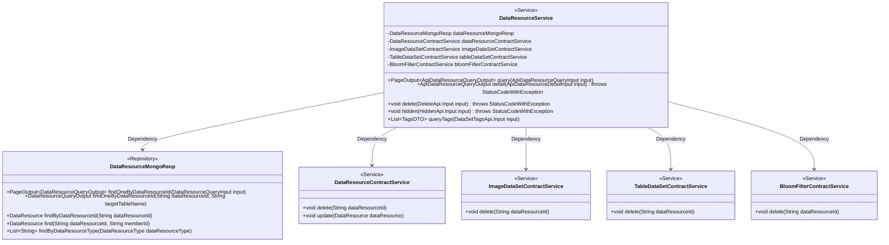
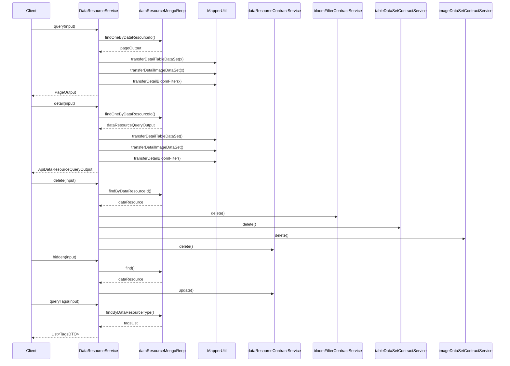

# Basic Information

|      |      |
|------|------|
| Name | DataResourceService |
| Language | .java |
| Code Path | WeFe/union/union-service/src/main/java/com/welab/wefe/union/service/service/DataResourceService.java |
| Package Name | com.welab.wefe.union.service.service |
| Dependencies | ['com.welab.wefe.common.StatusCode', 'com.welab.wefe.common.data.mongodb.constant.MongodbTable', 'com.welab.wefe.common.data.mongodb.dto.PageOutput', 'com.welab.wefe.common.data.mongodb.dto.dataresource.DataResourceQueryOutput', 'com.welab.wefe.common.data.mongodb.entity.union.DataResource', 'com.welab.wefe.common.data.mongodb.repo.DataResourceMongoReop', 'com.welab.wefe.common.exception.StatusCodeWithException', 'com.welab.wefe.common.wefe.enums.DataResourcePublicLevel', 'com.welab.wefe.common.wefe.enums.DataResourceType', 'com.welab.wefe.union.service.api.dataresource.DataSetTagsApi', 'com.welab.wefe.union.service.api.dataresource.DeleteApi', 'com.welab.wefe.union.service.api.dataresource.HiddenApi', 'com.welab.wefe.union.service.dto.dataresource.ApiDataResourceDetailInput', 'com.welab.wefe.union.service.dto.dataresource.ApiDataResourceQueryInput', 'com.welab.wefe.union.service.dto.dataresource.ApiDataResourceQueryOutput', 'com.welab.wefe.union.service.dto.dataresource.TagsDTO', 'com.welab.wefe.union.service.service.contract.BloomFilterContractService', 'com.welab.wefe.union.service.service.contract.DataResourceContractService', 'com.welab.wefe.union.service.service.contract.ImageDataSetContractService', 'com.welab.wefe.union.service.service.contract.TableDataSetContractService', 'com.welab.wefe.union.service.util.MapperUtil', 'org.springframework.beans.factory.annotation.Autowired', 'org.springframework.stereotype.Service', 'java.util', 'java.util.stream.Collectors'] |
| Brief Description | The DataResourceService provides data resource management functionalities, including paginated queries, detail retrieval, deletion, hiding, and tag queries. It supports table datasets, image datasets, and Bloom filter types, operating data through MongoDB and contract services. |

# Description

The DataResourceService is a Spring service class that provides data resource management functionalities. It depends on multiple service classes such as DataResourceMongoRepo and various ContractServices. Key features include: paginated querying of data resources, returning different outputs based on resource types (tabular datasets, image datasets, Bloom filters); querying resource details with type-specific logic; deleting resources after permission validation; hiding resources by setting visibility to private; and querying tags, which are counted and returned in a popularity-sorted list. The methods incorporate type checking, permission validation, and exception handling logic.

# Class Summary

| Name   | Type  | Description |
|-------|------|-------------|
| DataResourceService | class | The DataResourceService offers functionalities for paginated querying, details retrieval, deletion, hiding, and tag querying of data resources. It supports processing different types of resources, including tables, images, and Bloom filters. |

## Class DataResourceService

|      |      |
|------|------|
| Access Modifier | @Service;public |
| Type | class |
| Name | DataResourceService |
| Description | The DataResourceService offers functionalities for paginated querying, details retrieval, deletion, hiding, and tag querying of data resources. It supports processing different types of resources, including tables, images, and Bloom filters. |

### UML Class Diagram

This code implements a data resource service class with functionalities such as paginated query, detail query, deletion, hiding, and tag query. The class diagram illustrates the dependency relationships between DataResourceService and multiple Repository and Service components. Through generic parameters and exception handling, it enables operations on different types of data resources. The core business logic includes branching processing based on resource types and invoking corresponding underlying services to complete data operations.

### Internal Method Call Graph

```mermaid
graph TD
    A["Class DataResourceService"]
    B["Attribute: DataResourceMongoReop dataResourceMongoReop"]
    C["Attribute: DataResourceContractService dataResourceContractService"]
    D["Attribute: ImageDataSetContractService imageDataSetContractService"]
    E["Attribute: TableDataSetContractService tableDataSetContractService"]
    F["Attribute: BloomFilterContractService bloomFilterContractService"]
    G["Method: PageOutput<ApiDataResourceQueryOutput> query(ApiDataResourceQueryInput input)"]
    H["Method: ApiDataResourceQueryOutput detail(ApiDataResourceDetailInput input)"]
    I["Method: void delete(DeleteApi.Input input)"]
    J["Method: void hidden(HiddenApi.Input input)"]
    K["Method: List<TagsDTO> queryTags(DataSetTagsApi.Input input)"]

    A --> B
    A --> C
    A --> D
    A --> E
    A --> F
    A --> G
    A --> H
    A --> I
    A --> J
    A --> K
```

### Field List

| Name  | Type  | Description |
|-------|-------|------|
| bloomFilterContractService | BloomFilterContractService | Automatically inject the Bloom filter contract service instance. |
| dataResourceMongoReop | DataResourceMongoReop | Use @Autowired to automatically inject the DataResourceMongoReop data resource MongoDB repository. |
| tableDataSetContractService | TableDataSetContractService | Use @Autowired to automatically inject the TableDataSetContractService service instance. |
| dataResourceContractService | DataResourceContractService | Automatically inject the DataResourceContractService instance. |
| imageDataSetContractService | ImageDataSetContractService | The code snippet uses @Autowired to automatically inject an instance of the ImageDataSetContractService. |

### Method List

| Name  | Type  | Description |
|-------|-------|------|
| hidden | void | Hide the API method to check if a data resource exists. If it exists, set its visibility level to "private" and update it; otherwise, throw a "resource not found" exception. |
| query | PageOutput<ApiDataResourceQueryOutput> | This method queries data resources based on input parameters and converts the output results by type. It returns a PageOutput object containing pagination information and the converted list. |
| detail | ApiDataResourceQueryOutput | Query the MongoDB table based on the input data type, return the corresponding resource details, return null if no results are found, and throw an error for exceptions. |
| delete | void | This method deletes data resources based on the input parameters. It first checks whether the resource exists and verifies user permissions, then invokes different services to delete the resource according to its type, and finally removes the resource record uniformly. Exceptions are thrown if the resource does not exist, lacks permissions, or has an invalid type. |
| queryTags | List<TagsDTO> | This method queries tags based on the input type, counts the occurrences of each tag, sorts them in descending order, and returns a list of tags along with their counts. |

