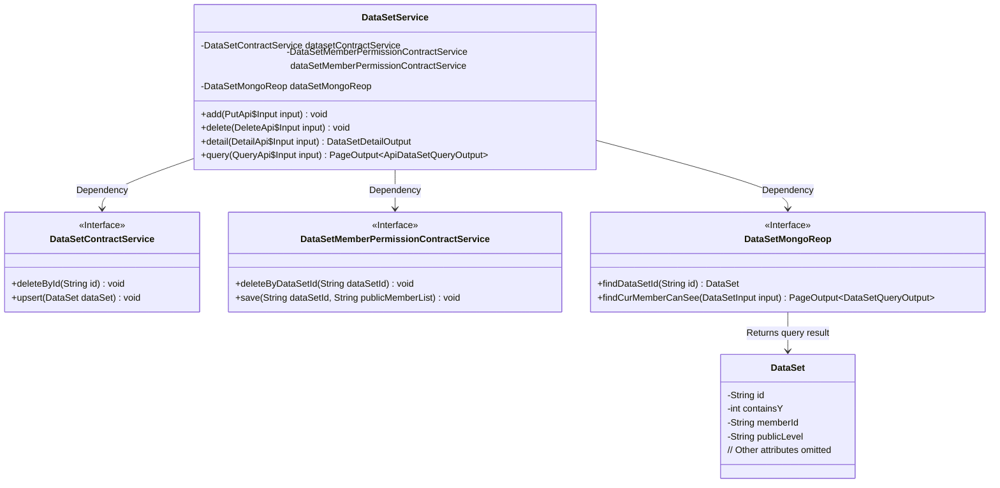

# Basic Information

|      |      |
|------|------|
| Name | DataSetService |
| Language | .java |
| Code Path | WeFe/union/union-service/src/main/java/com/welab/wefe/union/service/service/DataSetService.java |
| Package Name | com.welab.wefe.union.service.service |
| Dependencies | ['com.welab.wefe.common.StatusCode', 'com.welab.wefe.common.data.mongodb.dto.PageOutput', 'com.welab.wefe.common.data.mongodb.dto.dataset.DataSetQueryOutput', 'com.welab.wefe.common.data.mongodb.entity.union.DataSet', 'com.welab.wefe.common.data.mongodb.repo.DataSetMongoReop', 'com.welab.wefe.common.exception.StatusCodeWithException', 'com.welab.wefe.common.wefe.enums.DataResourcePublicLevel', 'com.welab.wefe.union.service.api.dataresource.dataset.nomal.DeleteApi', 'com.welab.wefe.union.service.api.dataresource.dataset.nomal.DetailApi', 'com.welab.wefe.union.service.api.dataresource.dataset.nomal.PutApi', 'com.welab.wefe.union.service.api.dataresource.dataset.nomal.QueryApi', 'com.welab.wefe.union.service.dto.dataresource.dataset.table.ApiDataSetQueryOutput', 'com.welab.wefe.union.service.dto.dataresource.dataset.table.DataSetDetailOutput', 'com.welab.wefe.union.service.service.contract.DataSetContractService', 'com.welab.wefe.union.service.service.contract.DataSetMemberPermissionContractService', 'com.welab.wefe.union.service.util.MapperUtil', 'org.springframework.beans.BeanUtils', 'org.springframework.beans.factory.annotation.Autowired', 'org.springframework.stereotype.Service', 'java.util.List', 'java.util.stream.Collectors'] |
| Brief Description | The DataSetService provides dataset operation functionalities, including adding, deleting, querying details, and paginated queries. During addition, permissions are handled based on the public level. Deletion involves synchronous cleanup of associated data, and queries support both detailed and paginated retrieval. |

# Description

The DataSetService is a service class that provides dataset-related operations. It depends on multiple service classes such as DataSetContractService and DataSetMongoReop. Its main functionalities include: handling permissions based on the public level when adding a dataset, deleting datasets and their permissions, querying dataset details, and paginating the list of datasets visible to the current user. The public level supports three modes: private (only oneself), public, and specified members. Errors will be thrown in exceptional cases. The query functionality supports pagination and result transformation.

# Class Summary

| Name   | Type  | Description |
|-------|------|-------------|
| DataSetService | class | The DataSetService class provides dataset operation functionalities, including adding, deleting, querying details, and paginated queries. During addition, it handles permissions based on the public level. Deletion involves clearing related data. Querying details returns dataset information, while paginated queries support filtering and output transformation. |

## Class DataSetService

|      |      |
|------|------|
| Access Modifier | @Service;public |
| Type | class |
| Name | DataSetService |
| Description | The DataSetService class provides dataset operation functionalities, including adding, deleting, querying details, and paginated queries. During addition, it handles permissions based on the public level. Deletion involves clearing related data. Querying details returns dataset information, while paginated queries support filtering and output transformation. |

### UML Class Diagram

This code demonstrates a dataset service class (DataSetService) that integrates three core service interfaces through dependency injection: DataSetContractService, DataSetMemberPermissionContractService, and DataSetMongoReop. The class provides functionalities for adding, deleting, querying details, and paginated querying of datasets, implementing data permission management logic for different public levels (OnlyMyself/Public/PublicWithMemberList). The service persists data via MongoDB and uses DTO objects for data transfer between different layers.

### Internal Method Call Graph

```mermaid
graph TD
    A["Class DataSetService"]
    B["Dependency Injection: DataSetContractService"]
    C["Dependency Injection: DataSetMemberPermissionContractService"]
    D["Dependency Injection: DataSetMongoReop"]
    E["Method: add(PutApi.Input input)"]
    F["Method: delete(DeleteApi.Input input)"]
    G["Method: detail(DetailApi.Input input)"]
    H["Method: query(QueryApi.Input input)"]
    I["Create DataSet object and copy properties"]
    J["Set containsY and memberId"]
    K["Check publicLevel and handle permissions"]
    L["Call dataSetContractService.upsert"]
    M["Call datasetContractService.deleteById"]
    N["Call dataSetMemberPermissionContractService.deleteByDataSetId"]
    O["Call dataSetMongoReop.findDataSetId"]
    P["Call MapperUtil.transferDataSetDetail"]
    Q["Call dataSetMongoReop.findCurMemberCanSee"]
    R["Convert query results and return PageOutput"]

    A --> B
    A --> C
    A --> D
    A --> E
    A --> F
    A --> G
    A --> H
    E --> I
    E --> J
    E --> K
    E --> L
    F --> M
    F --> N
    G --> O
    G --> P
    H --> Q
    H --> R
```

This code implements the DataSetService class, primarily containing four core methods: add() for adding datasets with permission control for different public levels, delete() for removing datasets and related permissions, detail() for retrieving dataset details, and query() for paginated queries of datasets visible to the current user. The flowchart clearly illustrates the class structure, dependency relationships, and method call chains, particularly highlighting the branch logic in add() for handling three public levels (OnlyMyself/Public/PublicWithMemberList), as well as the invocation relationships between methods and underlying services (ContractService and MongoReop).

### Field List

| Name  | Type  | Description |
|-------|-------|------|
| dataSetMemberPermissionContractService | DataSetMemberPermissionContractService | The code snippet uses the @Autowired annotation to automatically inject an instance of the DataSetMemberPermissionContractService. |
| dataSetContractService | DataSetContractService | Using @Autowired to automatically inject an instance of the DataSetContractService. |
| dataSetMongoReop | DataSetMongoReop | Use @Autowired to automatically inject the MongoDB repository for the DataSetMongoReop dataset. |
| datasetContractService | DataSetContractService | Using @Autowired to automatically inject an instance of the DataSetContractService. |

### Method List

| Name  | Type  | Description |
|-------|-------|------|
| delete | void | Delete the dataset and its member permissions, calling two service methods based on the input ID to complete the operation. |
| detail | DataSetDetailOutput | This method queries the dataset based on the input ID. If the entry exists, it converts it to detailed output; otherwise, it returns null. |
| query | PageOutput<ApiDataSetQueryOutput> | Query method: Retrieve datasets visible to the current user based on input parameters, transform the results, and return paginated output. |
| add | void | The method `add` receives an input object, copies its attributes to the `DataSet`, and sets the included Y-values and member IDs. It handles permissions based on the disclosure level: when the level is private or public, it removes permissions and sets the level; when disclosing to specified members, it saves permissions and sets the level; invalid levels throw an exception. Finally, it updates the `DataSet`. |

