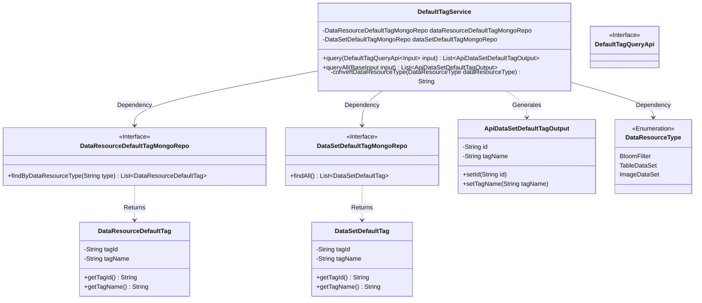
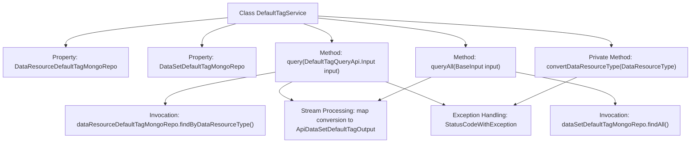

# Basic Information

|      |      |
|------|------|
| Name | DefaultTagService |
| Language | .java |
| Code Path | WeFe/union/union-service/src/main/java/com/welab/wefe/union/service/service/DefaultTagService.java |
| Package Name | com.welab.wefe.union.service.service |
| Dependencies | ['com.welab.wefe.common.data.mongodb.entity.union.DataResourceDefaultTag', 'com.welab.wefe.common.data.mongodb.entity.union.DataSetDefaultTag', 'com.welab.wefe.common.data.mongodb.repo.DataResourceDefaultTagMongoRepo', 'com.welab.wefe.common.data.mongodb.repo.DataSetDefaultTagMongoRepo', 'com.welab.wefe.common.exception.StatusCodeWithException', 'com.welab.wefe.common.wefe.enums.DataResourceType', 'com.welab.wefe.union.service.api.dataresource.DefaultTagQueryApi', 'com.welab.wefe.union.service.dto.base.BaseInput', 'com.welab.wefe.union.service.dto.dataresource.dataset.table.ApiDataSetDefaultTagOutput', 'org.springframework.beans.factory.annotation.Autowired', 'org.springframework.stereotype.Service', 'java.util.List', 'java.util.stream.Collectors'] |
| Brief Description | The DefaultTagService class retrieves default tag data through a MongoDB repository, providing methods to query tags by resource type or fetch all tags, while converting results into a unified output format. It includes type conversion logic to handle exceptional cases. |

# Description

The DefaultTagService is a Spring service class that includes two MongoDB repository dependency injections. It provides two query methods: the query method retrieves the corresponding tag list based on the input parameter's data resource type and converts it into a unified output format; the queryAll method queries all dataset tags and converts their format. The private convertDataResourceType method handles the data resource type conversion logic, performing unified processing for specific types, and throws an exception for unsupported enum values.

# Class Summary

| Name   | Type  | Description |
|-------|------|-------------|
| DefaultTagService | class | The DefaultTagService class provides functionality for querying default tags, including two methods: query filters tags by resource type, while queryAll returns all tags, both converted to ApiDataSetDefaultTagOutput. The convertDataResourceType method handles resource type conversion. |

## Class DefaultTagService

|      |      |
|------|------|
| Access Modifier | @Service;public |
| Type | class |
| Name | DefaultTagService |
| Description | The DefaultTagService class provides functionality for querying default tags, including two methods: query filters tags by resource type, while queryAll returns all tags, both converted to ApiDataSetDefaultTagOutput. The convertDataResourceType method handles resource type conversion. |

### UML Class Diagram

This code describes a tag service class `DefaultTagService` that queries different types of tag data through two MongoDB repository interfaces (`DataResourceDefaultTagMongoRepo` and `DataSetDefaultTagMongoRepo`) and converts them into a unified output format `ApiDataSetDefaultTagOutput`. The service class contains two main query methods: `query` filters tags based on resource type, while `queryAll` retrieves all tags. The `query` method involves enumeration type conversion logic, which may throw exceptions if not handled properly. The overall architecture adopts the repository pattern for data access and utilizes stream processing for data transformation.

### Internal Method Call Graph

This code flowchart illustrates the core structure and invocation relationships of the DefaultTagService class. The class provides data query capabilities through two MongoDB repositories (dataResourceDefaultTagMongoRepo and dataSetDefaultTagMongoRepo), containing two main methods: query and queryAll, both involving data conversion and stream processing. The private method convertDataResourceType handles resource type conversion and may throw exceptions. The overall process clearly demonstrates the processing chain from data query to result transformation, reflecting the typical design pattern of Spring service-layer components.

### Field List

| Name  | Type  | Description |
|-------|-------|------|
| dataResourceDefaultTagMongoRepo | DataResourceDefaultTagMongoRepo | Using @Autowired to automatically inject an instance of DataResourceDefaultTagMongoRepo. |
| dataSetDefaultTagMongoRepo | DataSetDefaultTagMongoRepo | Using @Autowired to automatically inject an instance of DataSetDefaultTagMongoRepo. |

### Method List

| Name  | Type  | Description |
|-------|-------|------|
| query | List<ApiDataSetDefaultTagOutput> | This method queries the default tag list of data resources based on input parameters, converts it into the specified output format, and returns the result. During processing, a StatusCodeWithException may be thrown. |
| queryAll | List<ApiDataSetDefaultTagOutput> | Query all default dataset labels and return a list containing label IDs and names. |
| convertDataResourceType | String | This method converts the DataResourceType enumeration into a string, where BloomFilter and TableDataSet uniformly return TableDataSet, ImageDataSet returns itself, and other types throw an exception. |

