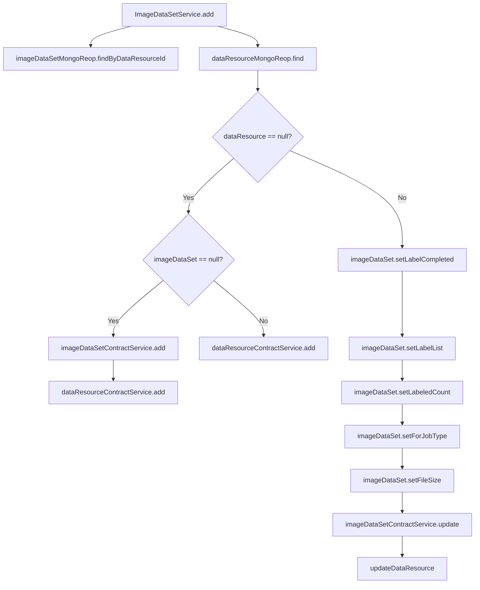

# Basic Information

|      |      |
|------|------|
| Name | ImageDataSetService |
| Language | .java |
| Code Path | WeFe/union/union-service/src/main/java/com/welab/wefe/union/service/service/ImageDataSetService.java |
| Package Name | com.welab.wefe.union.service.service |
| Dependencies | ['com.welab.wefe.common.data.mongodb.entity.union.DataResource', 'com.welab.wefe.common.data.mongodb.entity.union.ImageDataSet', 'com.welab.wefe.common.data.mongodb.repo.ImageDataSetMongoReop', 'com.welab.wefe.common.exception.StatusCodeWithException', 'com.welab.wefe.union.service.api.dataresource.dataset.image.PutApi', 'com.welab.wefe.union.service.service.contract.ImageDataSetContractService', 'com.welab.wefe.union.service.util.MapperUtil', 'org.springframework.beans.factory.annotation.Autowired', 'org.springframework.stereotype.Service'] |
| Brief Description | The ImageDataSetService class handles image dataset operations, including addition and update logic. It determines whether to perform an addition or update operation by checking the existence of data resources, involving the storage and modification of ImageDataSet and DataResource. |

# Description

The code defines a service class named ImageDataSetService, which inherits from AbstractDataResourceService. It handles image dataset operations by autowiring the dependent ImageDataSetContractService and ImageDataSetMongoReop components. The main method `add` accepts input parameters, first queries existing datasets and data resources, creates new records if they don't exist, otherwise updates fields like label completion status, label list, annotation count, job type, and file size in existing records, while synchronizing updates to data resources. The entire process includes data validation and conversion logic.

# Class Summary

| Name   | Type  | Description |
|-------|------|-------------|
| ImageDataSetService | class | ImageDataSetService handles image dataset operations, including adding and updating datasets and associated resources, involving MongoDB storage and contract service invocation. |


## Class ImageDataSetService

|      |      |
|------|------|
| Access Modifier | @Service;public |
| Type | class |
| Name | ImageDataSetService |
| Description | ImageDataSetService handles image dataset operations, including adding and updating datasets and associated resources, involving MongoDB storage and contract service invocation. |


### UML Class Diagram

```mermaid
classDiagram
    class ImageDataSetService {
        -ImageDataSetContractService imageDataSetContractService
        -ImageDataSetMongoReop imageDataSetMongoReop
        +add(PutApi$Input input) void
    }
    class AbstractDataResourceService {
        <<Abstract>>
    }
    class ImageDataSetContractService {
        <<Interface>>
        +add(ImageDataSet imageDataSet) void
        +update(ImageDataSet imageDataSet) void
    }
    class ImageDataSetMongoReop {
        +findByDataResourceId(String dataResourceId) ImageDataSet
    }
    class DataResource {
        // Data resource entity class
    }
    class PutApi$Input {
        // Input parameter nested class
    }
    class MapperUtil {
        <<Utility>>
        +transferPutInputToImageDataSet(PutApi$Input input) ImageDataSet
        +transferPutInputToDataResource(PutApi$Input input) DataResource
    }

    ImageDataSetService --> ImageDataSetContractService : Dependency
    ImageDataSetService --> ImageDataSetMongoReop : Dependency
    ImageDataSetService --|> AbstractDataResourceService : Inheritance
    ImageDataSetContractService ..|> ImageDataSetContractService : Implementation
    ImageDataSetService --> MapperUtil : Invokes utility class
    ImageDataSetService --> PutApi$Input : Processes input
    ImageDataSetService --> DataResource : Manages data entity
```

This class diagram illustrates the core structure and dependencies of ImageDataSetService. The service inherits from AbstractDataResourceService, primarily relying on the ImageDataSetContractService interface and ImageDataSetMongoReop repository class, with object conversion handled by the MapperUtil utility class. The core method add() accepts PutApi$Input parameters, performing create or update operations based on data resource existence. It involves coordinated processing of ImageDataSet and DataResource entities, demonstrating capabilities for image dataset modification logic and state management.


### Internal Method Call Graph



This code represents the `add` method in the `ImageDataSetService` class, primarily handling the logic for adding and updating image datasets. It first queries `imageDataSet` and `dataResource` by `dataResourceId`, then branches based on whether `dataResource` exists. If it does not exist, different add methods are called depending on the existence of `imageDataSet`; if it exists, multiple properties of `imageDataSet` are updated followed by an update method call. The entire process includes data querying, conditional checks, data transformation, and persistence operations.

### Field List

| Name  | Type  | Description |
|-------|-------|------|
| imageDataSetMongoReop | ImageDataSetMongoReop | Using @Autowired to automatically inject an instance of ImageDataSetMongoReop. |
| imageDataSetContractService | ImageDataSetContractService | Using @Autowired to automatically inject an instance of the ImageDataSetContractService. |

### Method List

| Name  | Type  | Description |
|-------|-------|------|
| add | void | The method processes image datasets and data resources based on input parameters. If the data resource does not exist, it creates a new dataset or resource; if it exists, it updates the dataset labels, size, and other information, and updates the data resource. |


