# Basic Information

|      |      |
|------|------|
| Name | MemberService |
| Language | .java |
| Code Path | WeFe/union/union-service/src/main/java/com/welab/wefe/union/service/service/MemberService.java |
| Package Name | com.welab.wefe.union.service.service |
| Dependencies | ['com.alibaba.fastjson.JSON', 'com.mongodb.client.gridfs.GridFSBucket', 'com.mongodb.client.gridfs.model.GridFSFile', 'com.mongodb.client.gridfs.model.GridFSUploadOptions', 'com.welab.wefe.common.StatusCode', 'com.welab.wefe.common.constant.SecretKeyType', 'com.welab.wefe.common.data.mongodb.dto.PageOutput', 'com.welab.wefe.common.data.mongodb.dto.member.MemberAuthQueryOutput', 'com.welab.wefe.common.data.mongodb.dto.member.RealnameAuthInfoQueryOutput', 'com.welab.wefe.common.data.mongodb.entity.union.MemberFileInfo', 'com.welab.wefe.common.data.mongodb.entity.union.UnionNode', 'com.welab.wefe.common.data.mongodb.entity.union.ext.MemberExtJSON', 'com.welab.wefe.common.data.mongodb.entity.union.ext.RealnameAuthFileInfo', 'com.welab.wefe.common.data.mongodb.repo.MemberAuthTypeMongoRepo', 'com.welab.wefe.common.data.mongodb.repo.MemberMongoReop', 'com.welab.wefe.common.data.mongodb.repo.UnionNodeMongoRepo', 'com.welab.wefe.common.data.mongodb.util.QueryBuilder', 'com.welab.wefe.common.exception.StatusCodeWithException', 'com.welab.wefe.common.util.DateUtil', 'com.welab.wefe.common.util.JObject', 'com.welab.wefe.common.util.Md5', 'com.welab.wefe.common.util.StringUtil', 'com.welab.wefe.common.web.dto.UploadFileApiOutput', 'com.welab.wefe.common.wefe.enums.FileRurpose', 'com.welab.wefe.union.service.api.member', 'com.welab.wefe.union.service.cache.UnionNodeConfigCache', 'com.welab.wefe.union.service.constant.CertStatusEnums', 'com.welab.wefe.union.service.dto.base.BaseInput', 'com.welab.wefe.union.service.dto.member.MemberQueryOutput', 'com.welab.wefe.union.service.entity.Member', 'com.welab.wefe.union.service.service.contract.MemberContractService', 'com.welab.wefe.union.service.service.contract.MemberFileInfoContractService', 'com.welab.wefe.union.service.task.UploadFileSyncToUnionTask', 'com.welab.wefe.union.service.util.FileCheckerUtil', 'com.welab.wefe.union.service.util.MapperUtil', 'org.apache.http.entity.ContentType', 'org.apache.http.entity.mime.content.InputStreamBody', 'org.bson.Document', 'org.slf4j.Logger', 'org.slf4j.LoggerFactory', 'org.springframework.beans.factory.annotation.Autowired', 'org.springframework.data.mongodb.gridfs.GridFsTemplate', 'org.springframework.stereotype.Service', 'org.springframework.util.MultiValueMap', 'org.springframework.web.multipart.MultipartFile', 'java.io.IOException', 'java.util', 'java.util.stream.Collectors'] |
| Brief Description | The MemberService class provides member management functionalities, including adding, querying, and updating member information, real-name authentication, and file uploads. It relies on multiple services and repositories to handle member data, file storage, and blockchain synchronization. |

# Description

The code defines a Spring service class named `MemberService`, primarily used for managing member information. It includes functionalities such as adding members, querying member lists, paginated queries, real-name authentication, and file uploads. The service leverages multiple auto-injected dependency components like `MemberContractService` and `GridFsTemplate` to achieve data storage and operations. Key methods involve CRUD operations for member information, supporting file uploads and real-name authentication workflows, with storage involving MongoDB and blockchain. Exception handling is implemented through `StatusCodeWithException` to capture and log errors.

# Class Summary

| Name   | Type  | Description |
|-------|------|-------------|
| MemberService | class | The MemberService class provides member management functionalities, including adding, querying, and updating member information, real-name authentication, and file uploads. It relies on multiple services such as MemberContractService and MongoDB storage. It supports paginated queries, field filtering, and file synchronization to other nodes. |

## Class MemberService

|      |      |
|------|------|
| Access Modifier | @Service;public |
| Type | class |
| Name | MemberService |
| Description | The MemberService class provides member management functionalities, including adding, querying, and updating member information, real-name authentication, and file uploads. It relies on multiple services such as MemberContractService and MongoDB storage. It supports paginated queries, field filtering, and file synchronization to other nodes. |

### UML Class Diagram

```mermaid
classDiagram
    class MemberService {
        -Logger LOG
        -MemberContractService memberContractService
        -UnionNodeMongoRepo unionNodeMongoRepo
        -GridFsTemplate gridFsTemplate
        -GridFSBucket gridFSBucket
        -MemberFileInfoContractService memberFileInfoContractService
        -MemberMongoReop memberMongoReop
        -MemberAuthTypeMongoRepo memberAuthTypeMongoRepo
        +add(AddApi$Input input) void
        +queryAll(QueryAllApi$Input input) List~MemberQueryOutput~
        +query(QueryApi$Input input) PageOutput~MemberQueryOutput~
        +queryMap(BaseInput input) Map~String, JObject~
        +queryAllAuthType(BaseInput input) List~MemberAuthQueryOutput~
        +realNameAuth(RealnameAuthApi$Input input) void
        +fileUpload(FileUploadApi$Input input) UploadFileApiOutput
        +queryRealNameAuthInfo(RealnameAuthInfoQueryApi$Input input) RealnameAuthInfoQueryOutput
        +update(UpdateApi$Input input) void
        -putUpdateField(UpdateApi$Input input) Member
        -saveFileInfoToBlockchain(String memberId, String fileId, String fileName, String fileSign, long fileSize, String purpose, String filePublicLevel, String describe) void
        -buildFileStreamBodyMap(MultiValueMap~String, MultipartFile~ files) Map~String, InputStreamBody~
        -syncDataToOtherUnionNode(String memberId, Map~String, InputStreamBody~ fileStreamBodyMap) void
        -apply(com.welab.wefe.common.data.mongodb.entity.union.Member member) JObject
    }

    class MemberContractService {
        <<Interface>>
        +add(Member member) void
        +updateExtJson(String curMemberId, MemberExtJSON extJSON) void
        +queryAll(String id) List~Member~
        +upsert(Member member) void
    }

    class UnionNodeMongoRepo {
        <<Interface>>
        +findExcludeCurrentNode(String currentNodeId) List~UnionNode~
    }

    class GridFsTemplate {
        <<Interface>>
        +findOne(QueryBuilder query) GridFSFile
    }

    class GridFSBucket {
        <<Interface>>
        +uploadFromStream(String filename, InputStream stream, GridFSUploadOptions options) ObjectId
    }

    class MemberFileInfoContractService {
        <<Interface>>
        +add(MemberFileInfo memberFileInfo) void
    }

    class MemberMongoReop {
        <<Interface>>
        +find(String id) List~com.welab.wefe.common.data.mongodb.entity.union.Member~
        +query(int pageIndex, int pageSize, String id, String name) PageOutput~com.welab.wefe.common.data.mongodb.entity.union.Member~
        +findMemberId(String memberId) com.welab.wefe.common.data.mongodb.entity.union.Member
    }

    class MemberAuthTypeMongoRepo {
        <<Interface>>
        +findList() List~MemberAuthType~
    }

    MemberService --> MemberContractService : Dependency
    MemberService --> UnionNodeMongoRepo : Dependency
    MemberService --> GridFsTemplate : Dependency
    MemberService --> GridFSBucket : Dependency
    MemberService --> MemberFileInfoContractService : Dependency
    MemberService --> MemberMongoReop : Dependency
    MemberService --> MemberAuthTypeMongoRepo : Dependency
```

This class diagram illustrates the core structure and dependencies of MemberService. MemberService is a Spring service class that provides various member management functionalities, including adding members, querying member information, real-name authentication, file uploading, etc. It depends on multiple interface services, such as MemberContractService for member contract operations, UnionNodeMongoRepo for federation node data access, GridFsTemplate and GridFSBucket for file storage operations, etc. The class diagram clearly shows these dependencies, as well as the various public and private methods provided by MemberService.

### Internal Method Call Graph

This flowchart demonstrates the complete structure of the MemberService class, including 8 auto-injected properties and 12 main methods. The sequence diagram highlights the invocation processes of four core methods: add(), queryAll(), query(), and fileUpload(), showcasing interactions with components like memberContractService and memberMongoReop. The fileUpload method incorporates complex logic such as file existence checking, upload processing, and blockchain storage, reflecting a comprehensive file management workflow.

### Field List

| Name  | Type  | Description |
|-------|-------|------|
| unionNodeMongoRepo | UnionNodeMongoRepo | Using @Autowired to automatically inject the UnionNodeMongoRepo instance. |
| gridFSBucket | GridFSBucket | Using @Autowired to automatically inject the GridFSBucket object. |
| memberContractService | MemberContractService | Using @Autowired to automatically inject an instance of MemberContractService. |
| LOG = LoggerFactory.getLogger(this.getClass()) | Logger | Declare a protected final logger object, initialized with the current class name. |
| memberMongoReop | MemberMongoReop | Use @Autowired to automatically inject the MemberMongoReop member variable. |
| memberAuthTypeMongoRepo | MemberAuthTypeMongoRepo | Using @Autowired to automatically inject the MemberAuthTypeMongoRepo member variable. |
| gridFsTemplate | GridFsTemplate | Use the @Autowired annotation to automatically inject the GridFsTemplate object. |
| memberFileInfoContractService | MemberFileInfoContractService | Automatically inject member file information contract service instance. |

### Method List

| Name  | Type  | Description |
|-------|-------|------|
| queryAllAuthType | List<MemberAuthQueryOutput> | Query all member authentication types, returning a list containing type IDs, names, and statuses. |
| add | void | The method `add` accepts input parameters, creates a Member object, and sets attributes including ID, name, phone number, etc., while handling exception status codes. |
| queryMap | Map<String, JObject> | This method queries the MongoDB member list and converts it into a Map, where the key is the member ID and the value is the processed JObject. |
| queryAll | List<MemberQueryOutput> | The method `queryAll` queries the member list based on the input parameter `input`. If `input` does not contain `logo`, the `logo` field is cleared. Finally, the results are converted into a list of `MemberQueryOutput` and returned. |
| saveFileInfoToBlockchain | void | The method stores file information in the blockchain, including member ID, file ID, name, signature, size, purpose, public level, and description. |
| fileUpload | UploadFileApiOutput | File upload method: validate file type and purpose, calculate MD5 signature, check for duplicates, then store in GridFS and blockchain, returning the file ID. Handle exceptions and synchronize data to other nodes. |
| update | void | Method for updating member information: Process input parameters, update member fields and save, log exceptions and throw system error status when caught. |
| realNameAuth | void | The method `realNameAuth` handles real-name authentication, sets user extended information, verifies file existence, and finally updates user data. |
| putUpdateField | Member | The method updates member information based on input, including name, phone number, hidden status, etc., and sets the last update time. |
| queryRealNameAuthInfo | RealnameAuthInfoQueryOutput | Query the real-name authentication information of a member, including the authentication type, review comments, certificate content, and file list. If the member does not exist or the query fails, an exception will be thrown. |
| query | PageOutput<MemberQueryOutput> | This method retrieves member information through MongoDB paginated queries, converts the results, and returns them. In case of exceptions, it logs the error and throws a system exception. |
| buildFileStreamBodyMap | Map<String, InputStreamBody> | Convert a MultipartFile map to an InputStreamBody map, handle file streams and content types, and throw errors on exceptions. |
| syncDataToOtherUnionNode | void | Synchronize data to other alliance nodes: Iterate through the non-current node list and initiate a file upload synchronization task for each node, including the member ID and file stream data. |
| apply | JObject | Convert the Member object into a JObject, including the fields name, hidden, freezed, and lostContact. |

