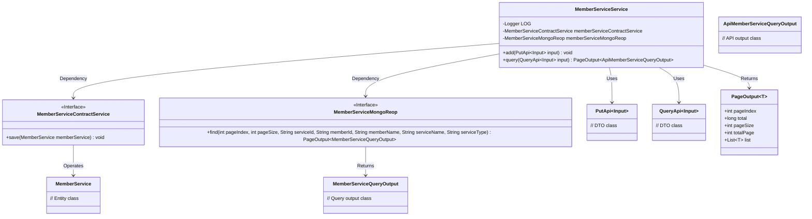
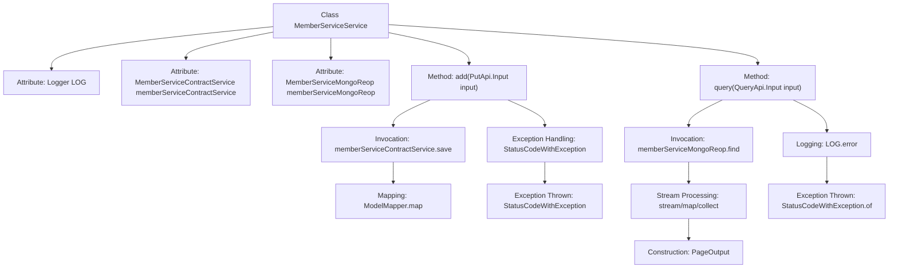

# Basic Information

|      |      |
|------|------|
| Name | MemberServiceService |
| Language | .java |
| Code Path | WeFe/union/union-service/src/main/java/com/welab/wefe/union/service/service/MemberServiceService.java |
| Package Name | com.welab.wefe.union.service.service |
| Dependencies | ['com.welab.wefe.common.StatusCode', 'com.welab.wefe.common.data.mongodb.dto.PageOutput', 'com.welab.wefe.common.data.mongodb.dto.member.MemberServiceQueryOutput', 'com.welab.wefe.common.data.mongodb.entity.union.MemberService', 'com.welab.wefe.common.data.mongodb.repo.MemberServiceMongoReop', 'com.welab.wefe.common.exception.StatusCodeWithException', 'com.welab.wefe.union.service.api.service.PutApi', 'com.welab.wefe.union.service.api.service.QueryApi', 'com.welab.wefe.union.service.dto.member.ApiMemberServiceQueryOutput', 'com.welab.wefe.union.service.service.contract.MemberServiceContractService', 'com.welab.wefe.union.service.util.MapperUtil', 'com.welab.wefe.union.service.util.ModelMapper', 'org.slf4j.Logger', 'org.slf4j.LoggerFactory', 'org.springframework.beans.factory.annotation.Autowired', 'org.springframework.stereotype.Service', 'java.util.List', 'java.util.stream.Collectors'] |
| Brief Description | The MemberServiceService class provides member service addition and paginated query functionalities, relies on ContractService and MongoReop, handles exceptions, and logs them. |

# Description

This is a Spring service class named MemberServiceService, containing two core methods. The add method takes input parameters, saves the mapped MemberService object via memberServiceContractService, and throws a status code exception in case of errors. The query method performs paginated queries through memberServiceMongoReop, with parameters including page number, page size, and multiple filter conditions. The query results are converted into an ApiMemberServiceQueryOutput list before returning the paginated object, while logging error details and throwing a system error status code when exceptions occur. The class injects two dependency services: MemberServiceContractService and MemberServiceMongoReop.

# Class Summary

| Name   | Type  | Description |
|-------|------|-------------|
| MemberServiceService | class | The `MemberServiceService` class provides functionality for adding and querying member services. The addition feature calls `ContractService` to save data, while the query feature retrieves data in paginated form via `MongoReop` and converts it for output. System errors are thrown in case of exceptions. |

## Class MemberServiceService

|      |      |
|------|------|
| Access Modifier | @Service;public |
| Type | class |
| Name | MemberServiceService |
| Description | The `MemberServiceService` class provides functionality for adding and querying member services. The addition feature calls `ContractService` to save data, while the query feature retrieves data in paginated form via `MongoReop` and converts it for output. System errors are thrown in case of exceptions. |

### UML Class Diagram

Class diagram description: MemberServiceService is a service class that depends on two interfaces, MemberServiceContractService and MemberServiceMongoReop, for saving member services and paginated querying of member service information respectively. It provides two main methods, add and query, which process input parameters and return paginated results. The diagram includes relevant DTO classes and output classes, illustrating the dependency relationships between the service class and other components.

### Internal Method Call Graph

This code represents the implementation of the MemberServiceService class, primarily containing two core methods: add and query. The add method is used to save member service information by invoking the save method of memberServiceContractService, while handling potential exceptions. The query method performs paginated queries for member information by retrieving data through the find method of memberServiceMongoReop, processing it via streams, and returning paginated results. It also captures and logs exceptions during the query process. Both methods incorporate exception handling and logging to ensure system stability and traceability.

### Field List

| Name  | Type  | Description |
|-------|-------|------|
| memberServiceMongoReop | MemberServiceMongoReop | Using @Autowired to automatically inject an instance of MemberServiceMongoReop. |
| memberServiceContractService | MemberServiceContractService | Using @Autowired to automatically inject the MemberServiceContractService instance. |
| LOG = LoggerFactory.getLogger(MemberServiceService.class) | Logger | The class `MemberServiceService` defines a static immutable logger `LOG`. |

### Method List

| Name  | Type  | Description |
|-------|-------|------|
| query | PageOutput<ApiMemberServiceQueryOutput> | This method queries member service information by input parameters with pagination, then returns the converted results. In case of exceptions, it logs the error and throws a system error prompt. |
| add | void | The method takes an input object, invokes the service to save the mapped member service data. If successful, it saves the data; if failed, it throws the original exception or a system error exception. |

