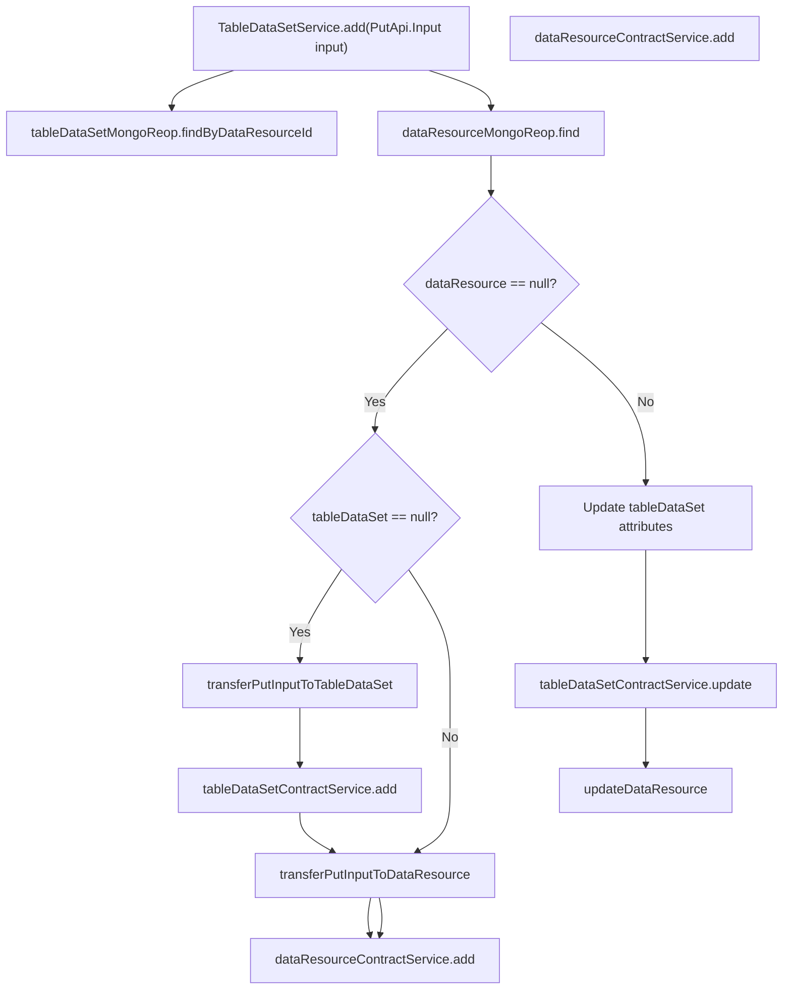
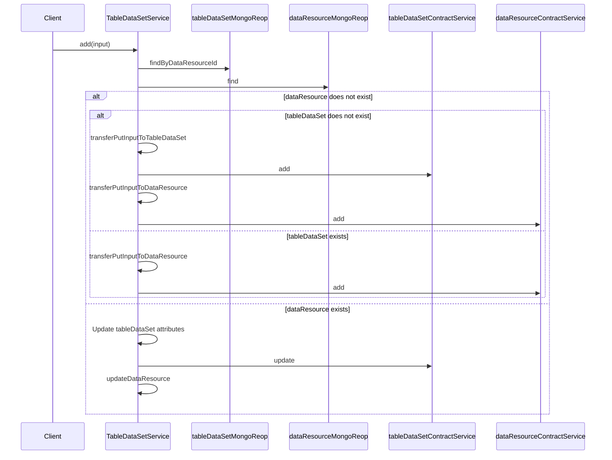

# Basic Information

|      |      |
|------|------|
| Name | TableDataSetService |
| Language | .java |
| Code Path | WeFe/union/union-service/src/main/java/com/welab/wefe/union/service/service/TableDataSetService.java |
| Package Name | com.welab.wefe.union.service.service |
| Dependencies | ['com.welab.wefe.common.data.mongodb.entity.union.DataResource', 'com.welab.wefe.common.data.mongodb.entity.union.TableDataSet', 'com.welab.wefe.common.data.mongodb.repo.TableDataSetMongoReop', 'com.welab.wefe.common.exception.StatusCodeWithException', 'com.welab.wefe.common.util.DateUtil', 'com.welab.wefe.union.service.api.dataresource.dataset.table.PutApi', 'com.welab.wefe.union.service.service.contract.TableDataSetContractService', 'com.welab.wefe.union.service.util.ModelMapper', 'org.springframework.beans.factory.annotation.Autowired', 'org.springframework.stereotype.Service'] |
| Brief Description | The TableDataSetService handles the addition and updating of data resources. After checking data existence, it performs insert or update operations via ContractService and MongoRepo, including field conversion logic. |

# Description

The code defines a TableDataSetService class, which inherits from AbstractDataResourceService and is used to handle the addition and modification operations of table datasets. By injecting dependencies such as TableDataSetContractService and TableDataSetMongoReop, it implements the creation or updating of data resources. The main logic includes: checking whether the data resource exists based on input parameters, creating a new dataset and resource record if it does not exist; if it exists, updating attributes of the existing dataset such as included Y values, column count, column name list, feature count, and feature name list, while synchronously updating the data resource. Helper methods are responsible for mapping input parameters to DataResource and TableDataSet objects and setting fields such as creation time and update time.

# Class Summary

| Name   | Type  | Description |
|-------|------|-------------|
| TableDataSetService | class | TableDataSetService handles the addition and updating of data resources. It checks whether the data exists based on the input, creates a TableDataSet and DataResource if they do not exist, or updates the TableDataSet fields and DataResource if they exist. It includes data transformation methods. |


## Class TableDataSetService

|      |      |
|------|------|
| Access Modifier | @Service;public |
| Type | class |
| Name | TableDataSetService |
| Description | TableDataSetService handles the addition and updating of data resources. It checks whether the data exists based on the input, creates a TableDataSet and DataResource if they do not exist, or updates the TableDataSet fields and DataResource if they exist. It includes data transformation methods. |


### UML Class Diagram

```mermaid
classDiagram
    class TableDataSetService {
        -TableDataSetContractService tableDataSetContractService
        -TableDataSetMongoReop tableDataSetMongoReop
        +add(PutApi$Input input) void
        -transferPutInputToDataResource(PutApi$Input input) DataResource
        -transferPutInputToTableDataSet(PutApi$Input input) TableDataSet
    }

    class AbstractDataResourceService {
        <<Abstract>>
    }

    class TableDataSetContractService {
        <<Interface>>
        +add(TableDataSet tableDataSet) void
        +update(TableDataSet tableDataSet) void
    }

    class TableDataSetMongoReop {
        +findByDataResourceId(String dataResourceId) TableDataSet
    }

    class PutApi$Input {
        +getDataResourceId() String
        +getCurMemberId() String
        +isContainsY() boolean
        +getColumnCount() int
        +getColumnNameList() List~String~
        +getFeatureCount() int
        +getFeatureNameList() List~String~
    }

    class TableDataSet {
        +setContainsY(String containsY) void
        +setColumnCount(String columnCount) void
        +setColumnNameList(List~String~ columnNameList) void
        +setFeatureCount(String featureCount) void
        +setFeatureNameList(List~String~ featureNameList) void
    }

    class DataResource {
        +setMemberId(String memberId) void
    }

    TableDataSetService --|> AbstractDataResourceService : Inheritance
    TableDataSetService --> TableDataSetContractService : Dependency
    TableDataSetService --> TableDataSetMongoReop : Dependency
    TableDataSetService --> PutApi$Input : Uses
    TableDataSetService --> TableDataSet : Operates
    TableDataSetService --> DataResource : Operates
```

This code demonstrates a table dataset service class (TableDataSetService) that inherits from the abstract data resource service class (AbstractDataResourceService). Its primary functionality involves handling the addition and update operations of table datasets. The class utilizes the TableDataSetContractService interface and TableDataSetMongoReop class through dependency injection, providing methods to convert input parameters into TableDataSet and DataResource objects, and executing add or update operations based on different conditions. The overall design reflects a layered architecture philosophy, where the service layer handles business logic processing while being decoupled from the data access layer and contract service layer.


### Internal Method Call Graph





This code implements the add method in the TableDataSetService class, primarily handling the logic for adding and updating data resources. When the input data resource does not exist, it creates new records based on whether the tableDataSet exists; when the data resource already exists, it updates the existing records. The flowchart clearly illustrates the conditional branches and corresponding operation paths, while the sequence diagram details the interaction sequence between components. The method involves multiple database operations and business logic processing to ensure data consistency and integrity.

### Field List

| Name  | Type  | Description |
|-------|-------|------|
| tableDataSetContractService | TableDataSetContractService | Automatically inject the TableDataSetContractService service instance. |
| tableDataSetMongoReop | TableDataSetMongoReop | Use @Autowired to automatically inject the MongoDB repository instance of TableDataSetMongoReop. |

### Method List

| Name  | Type  | Description |
|-------|-------|------|
| add | void | The method `add` handles the addition or update of data resources: it checks whether the resource exists, creates a table dataset and data resource if it does not exist; otherwise, it updates the table dataset fields and the data resource. |
| transferPutInputToTableDataSet | TableDataSet | Convert PutApi.Input to TableDataSet, set containsY to 1 or 0, and add the current time as the creation and update time. |
| transferPutInputToDataResource | DataResource | Convert the input object into a data resource object, set the member ID, and return it. |


