# Basic Information

|      |      |
|------|------|
| Name | service |
| Language | .java |
| Code Path | WeFe/union/union-service/src/main/java/com/welab/wefe/union/service/service |
| Package Name | docs.union.union-service.src.main.java.com.welab.wefe.union.service.service |
| Brief Description | The blockchain data management service module enables data CRUD operations and permission management through smart contracts, supporting multi-party collaboration in federated learning. It incorporates key structures such as data resources and Bloom filters, relying on encryption components and MongoDB. The module provides functionalities like health checks, member management, and dataset operations, covering the entire lifecycle and fine-grained control. |

# Description

## Overview  
This module is a collection of blockchain data management services, with its core responsibility being the full lifecycle management and health checks of data resources through smart contracts, functioning similarly to a distributed database middleware. The interface specifications include transaction receipt parsing templates (e.g., validation methods derived from AbstractContractService) and unified inspection patterns (e.g., the AbstractCheckpoint base class). Key data structures include DataResource (containing ID/member ID/tags), BloomFilter (containing hash functions), and service type enumerations (MongodbService/BlockChainService). External dependencies include the CryptoSuite encryption component, TransactionDecoderService, and MongoDB storage drivers. For example, ImageDataSetService stores image metadata via MongoDB, while BlockChainCheckpoint verifies node liveliness.

## Primary Business Scenarios  
The module supports multi-party data collaboration in federated learning scenarios, with typical workflows including: 1) member registration validation (MemberService); 2) dataset permission management (DataSetService); 3) resource metadata operations (DataResourceService). The interaction model adopts a "local validation + on-chain operation" two-phase approach, such as validating member IDs before updating Bloom filters. Functional completeness is reflected in fine-grained control (e.g., three levels of publicity) and health check mechanisms (similar to probes). API types encompass basic CRUD operations (e.g., table column updates) and extended functionalities (e.g., file downloads). Integration examples include real-name authentication processes and data resource linkage.

### Package Internal Structure View

```mermaid
graph TD
    service --> contract
    service --> ImageDataSetService.java
    service --> DefaultTagService.java
    service --> available
    service --> MemberServiceService.java
    service --> AbstractDataResourceService.java
    service --> BloomFilterService.java
    service --> MemberService.java
    service --> DataSetService.java
    service --> DataResourceService.java
    service --> TableDataSetService.java
    service --> CommonService.java
    contract --> MemberFileInfoContractService.java
    contract --> BloomFilterContractService.java
    contract --> DataResourceContractService.java
    contract --> DataSetContractService.java
    contract --> AbstractContractService.java
    contract --> ImageDataSetContractService.java
    contract --> MemberServiceContractService.java
    contract --> DataSetMemberPermissionContractService.java
    contract --> TableDataSetContractService.java
    contract --> UnionNodeContractService.java
    contract --> MemberContractService.java
    available --> checkpoint
    checkpoint --> MongoCheckpoint.java
    checkpoint --> BlockChainCheckpoint.java
```

This flowchart illustrates the service layer structure of the WeFe federated service project, including the main service directory and its subdirectories contract and available. The contract directory contains 13 contract service implementation classes, while the available directory includes a checkpoint subdirectory with two checkpoint implementation classes. The main directory also directly contains 9 independent service classes, presenting a clear multi-level service architecture overall.

# File List

| Name   | Type  | Description |
|-------|------|-------------|
| [ImageDataSetService.java](ImageDataSetService.md) | file | The ImageDataSetService class handles image dataset operations, including addition and update logic. It determines whether to perform an addition or update operation by checking the existence of data resources, involving the storage and modification of ImageDataSet and DataResource. |
| [DefaultTagService.java](DefaultTagService.md) | file | The DefaultTagService class retrieves default tag data through a MongoDB repository, providing methods to query tags by resource type or fetch all tags, and converts the results into a unified output format. It includes type conversion logic to handle exceptional cases. |
| [MemberServiceService.java](MemberServiceService.md) | file | The MemberServiceService class provides member service addition and paginated query functionalities, relies on ContractService and MongoReop, handles exceptions, and logs them. |
| [AbstractDataResourceService.java](AbstractDataResourceService.md) | file | The abstract class AbstractDataResourceService provides data resource update functionality, relying on ContractService and MongoReop, updating the dataResource property through input parameters and invoking ContractService for updates. |
| [BloomFilterService.java](BloomFilterService.md) | file | The BloomFilterService handles the addition and updating of data resources, checking whether the Bloom filter and data resources exist. If they do not exist, it creates them; if they exist, it updates the hash functions and data resources. |
| [MemberService.java](MemberService.md) | file | The MemberService class provides member management functionalities, including adding, querying, and updating member information, real-name authentication, and file uploads. It relies on multiple services and repositories to handle member data, file storage, and blockchain synchronization. |
| [DataSetService.java](DataSetService.md) | file | The DataSetService provides dataset operation functionalities, including adding, deleting, querying details, and paginated queries. During addition, permissions are handled based on the public level. Deletion involves synchronous cleanup of associated data, and queries support both detailed and paginated retrieval. |
| [DataResourceService.java](DataResourceService.md) | file | The DataResourceService provides data resource management functionalities, including paginated queries, detail retrieval, deletion, hiding, and tag queries. It supports table datasets, image datasets, and Bloom filter types, operating data through MongoDB and contract services. |
| [TableDataSetService.java](TableDataSetService.md) | file | The TableDataSetService handles the addition and updating of data resources. After checking data existence, it performs insert or update operations via ContractService and MongoRepo, including field conversion logic. |
| [CommonService.java](CommonService.md) | file | The CommonService class provides file download, upload, and real-name authentication template query functionalities. It utilizes GridFS for file storage, supports cross-node downloads and local storage, and includes permission checks and exception handling. |
| [available](available/_module.md) | package | MongoCheckpoint checks the status of MongoDB service by verifying the connection through existsByMemberId. BlockChainCheckpoint checks the status of blockchain service by validating member existence via isExist. Neither has configurable values, with the core logic centered on existence verification. |
| [contract](contract/_module.md) | package | Multiple service classes inherit from AbstractContractService to handle blockchain transactions. The functionalities include member file management, Bloom filter operations, data resource CRUD operations, dataset permission management, node management, etc. Each service class interacts through smart contracts, involving parameter generation, transaction receipt processing, and exception handling. |

