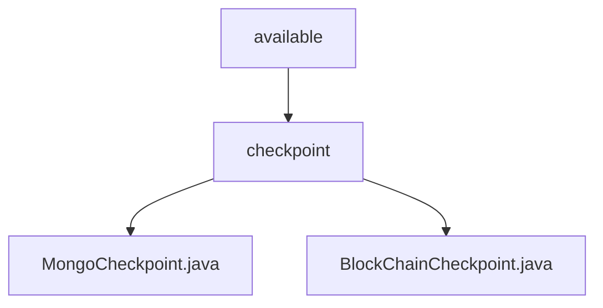

# Basic Information

|      |      |
|------|------|
| Name | available |
| Language | .java |
| Code Path | WeFe/union/union-service/src/main/java/com/welab/wefe/union/service/service/available |
| Package Name | docs.union.union-service.src.main.java.com.welab.wefe.union.service.service.available |
| Brief Description | MongoCheckpoint checks the status of MongoDB service by verifying the connection through existsByMemberId. BlockChainCheckpoint checks the status of blockchain service by validating member existence via isExist. Neither has configurable values, with the core logic centered on existence verification. |

# Description

## Overview  
The core responsibility of this module is to provide health check capabilities for multiple types of services, including operational status verification for MongoDB and blockchain services. The interface specifications uniformly inherit from the AbstractCheckpoint base class, performing existence checks by injecting specific components (such as MemberMongoReop or MemberContractService). Key data structures include service type enums (MongodbService/BlockChainService) and member ID parameters. External dependencies involve MongoDB drivers and blockchain contract services. For example, MongoCheckpoint verifies connections via existsByMemberId, while BlockChainCheckpoint calls isExist to confirm member existence.  

## Primary Business Scenarios  
The module adopts a unified check pattern: initialize service type → inject dependency components → execute atomic validation (similar to a probe mechanism). The complete business process includes two scenarios: database connection testing and on-chain contract queries. Typical applications include service pre-checks during alliance node startup. All API types are parameterless check interfaces, with integration cases covering MongoDB connection pool health monitoring and blockchain node liveliness verification. Examples include verifying blockchain service availability through member ID queries or checking MongoDB collection accessibility.

### Package Internal Structure View

This flowchart illustrates the class structure related to checkpoints in the available service under the union-service module of the WeFe project. The parent node "available" contains the subdirectory "checkpoint," which in turn includes two Java class files: MongoCheckpoint and BlockChainCheckpoint, corresponding to different types of checkpoint implementations. The entire structure clearly reflects the hierarchical organization of checkpoint-related code.

# File List

| Name   | Type  | Description |
|-------|------|-------------|
| [checkpoint](checkpoint/_module.md) | package | MongoCheckpoint checks the status of the MongoDB service by verifying the connection through existsByMemberId. BlockChainCheckpoint checks the status of the blockchain service by validating member existence via isExist. Neither has configurable values, with the core logic centered on existence verification. |

