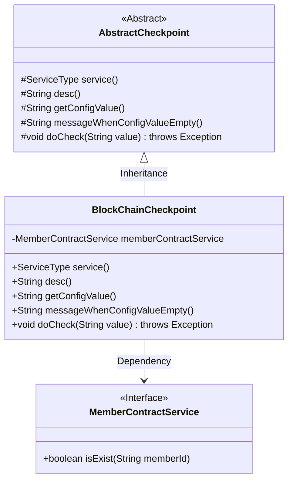
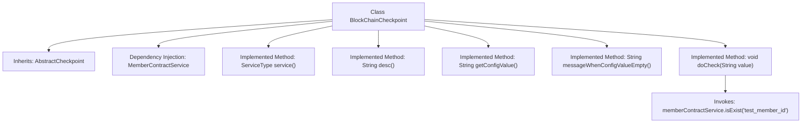

# Basic Information

|      |      |
|------|------|
| Name | BlockChainCheckpoint |
| Language | .java |
| Code Path | WeFe/union/union-service/src/main/java/com/welab/wefe/union/service/service/available/checkpoint/BlockChainCheckpoint.java |
| Package Name | com.welab.wefe.union.service.service.available.checkpoint |
| Dependencies | ['com.welab.wefe.common.wefe.checkpoint.AbstractCheckpoint', 'com.welab.wefe.common.wefe.enums.ServiceType', 'com.welab.wefe.union.service.service.contract.MemberContractService', 'org.springframework.beans.factory.annotation.Autowired', 'org.springframework.stereotype.Service'] |
| Brief Description | The BlockChainCheckpoint class inherits from AbstractCheckpoint, checks the operational status of the blockchain service, and verifies member existence through the memberContractService. |

# Description

BlockChainCheckpoint is a service class that inherits from AbstractCheckpoint, used to check the operational status of blockchain services. It verifies the existence of a test member ID through the isExist method of MemberContractService. The service type is BlockChainService, described as checking whether the blockchain service is running properly. The class does not have specific configuration values or null value prompt messages configured, and its core check logic only includes member existence verification.

# Class Summary

| Name   | Type  | Description |
|-------|------|-------------|
| BlockChainCheckpoint | class | The BlockChainCheckpoint class inherits from AbstractCheckpoint, checks the blockchain service status, and verifies member existence through the memberContractService. |

## Class BlockChainCheckpoint

|      |      |
|------|------|
| Access Modifier | @Service;public |
| Type | class |
| Name | BlockChainCheckpoint |
| Description | The BlockChainCheckpoint class inherits from AbstractCheckpoint, checks the blockchain service status, and verifies member existence through the memberContractService. |

### UML Class Diagram

This class diagram illustrates the core structure of the blockchain checkpoint service. BlockChainCheckpoint inherits from the abstract class AbstractCheckpoint, implementing five protected abstract methods. The doCheck method validates member existence through the dependency-injected MemberContractService interface. MemberContractService exists independently as an interface, embodying the Dependency Inversion Principle. The overall design aligns with typical Spring service component patterns, utilizing inheritance to implement the Template Method pattern and interface dependencies to achieve loose coupling.

### Internal Method Call Graph

This flowchart illustrates the structure of the BlockChainCheckpoint class and its inheritance relationship with the parent class AbstractCheckpoint. As a Spring service component, it injects MemberContractService via @Autowired and implements 5 abstract methods. The core validation logic resides in the doCheck method, which verifies blockchain service status by calling memberContractService.isExist(). All configuration-related methods return null, indicating this class primarily relies on external service calls rather than configuration checks.

### Field List

| Name  | Type  | Description |
|-------|-------|------|
| memberContractService | MemberContractService | The code snippet uses the @Autowired annotation to automatically inject an instance of MemberContractService. |

### Method List

| Name  | Type  | Description |
|-------|-------|------|
| doCheck | void | Check if the member ID exists by calling the isExist method of memberContractService to verify "test_member_id". |
| messageWhenConfigValueEmpty | String | Java method override, returning a null value indicates the prompt message when the configuration value is empty. |
| service | ServiceType | This method overrides the parent class method and returns the service type as blockchain service. |
| desc | String | Check the running status of the blockchain service |
| getConfigValue | String | This is a Java method override that returns null as the configuration value. |

